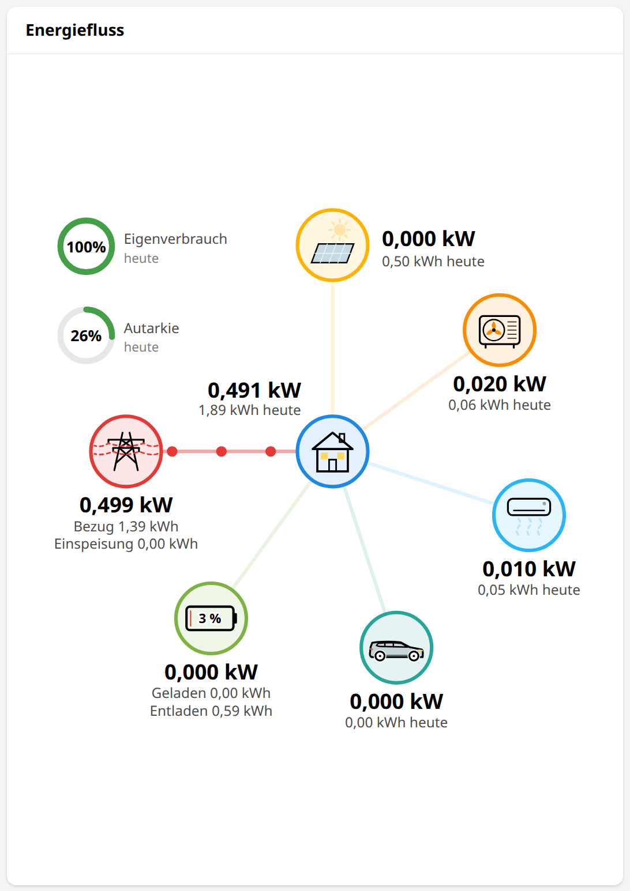

# openHAB Widgets

MainUI widgets from my openHAB 5 installation: the cards of an energy and home dashboard, and a set of cards for every
metered plug, a popup for any item, the tile their values stand in, and a slider, a switch pill and a switch row for
settings. The UI
texts are German, numbers use a decimal comma. No widget names an item: every item comes in as a
prop, so the widgets work with any item names.


| Dark mode | Phone |
|---|---|
|  |  |

## Installing a widget

In MainUI open *Developer Tools → Widgets*, create a widget and replace its code with the content of a `.yml` file from
this repository. Use it on a layout page as a component `widget:<uid>` with its props, for example:

```yaml
- component: widget:plug-card
  config:
    prefix: coffee_machine
    title: Kaffeemaschine
    icon: material:coffee
    color: "#8d6e63"
```

The widgets rely on MainUI of openHAB 5 (SVG and CSS in card content, `:has()` for hover highlights, aggregate chart
series). Values are shown through the items' state descriptions, so units and number formats come from the items.

## Plug cards

Four cards for a metered plug, built from one item prefix: `<prefix>_power`, `_switch`, `_energy_today`,
`_energy_total`, `_voltage`, `_current`, `_power_factor`, `_apparent_power` and `_reactive_power`, as a Tasmota plug
provides them. On a device page they stand two by two. `plug-card` also covers devices that are not plugs: give it
the device's `title`, hide the switch with `controllable: false`, or take the switch from another item with `switch`.
Every value tile carries a large pale icon of what it shows.


### `plug-card`

Now: power, on/off pill, energy today and total.

| Prop | Description | Type | Default |
|---|---|---|---|
| `prefix` | Name prefix of the plug's items: `<prefix>_power`, _switch, _energy_today, _energy_total, _voltage, _current, _power_factor, _apparent_power, _reactive_power | TEXT |  |
| `title` | Card title, the device's name where the card is not a plug | TEXT | `Steckdose` |
| `icon` | Device icon, e.g. material:coffee | TEXT | `material:power` |
| `color` | Device colour as #rrggbb | TEXT | `#8d6e63` |
| `controllable` | Show the plug's switch | BOOLEAN | `true` |
| `note` | Small print under the energies, hidden when empty | TEXT |  |
| `switch` | The switch's item where it is not `<prefix>_switch`, e.g. a shared meter's | Item |  |

### `plug-power-card`

Power over the day.

| Prop | Description | Type | Default |
|---|---|---|---|
| `prefix` | Name prefix of the plug's items: `<prefix>_power`, _switch, _energy_today, _energy_total, _voltage, _current, _power_factor, _apparent_power, _reactive_power | TEXT |  |
| `color` | Device colour as #rrggbb | TEXT | `#8d6e63` |

### `plug-energy-days-card`

Energy per day of the month.

| Prop | Description | Type | Default |
|---|---|---|---|
| `prefix` | Name prefix of the plug's items: `<prefix>_power`, _switch, _energy_today, _energy_total, _voltage, _current, _power_factor, _apparent_power, _reactive_power | TEXT |  |
| `color` | Device colour as #rrggbb | TEXT | `#8d6e63` |

### `plug-electric-card`

Voltage, current, power factor, apparent and reactive power.

| Prop | Description | Type | Default |
|---|---|---|---|
| `prefix` | Name prefix of the plug's items: `<prefix>_power`, _switch, _energy_today, _energy_total, _voltage, _current, _power_factor, _apparent_power, _reactive_power | TEXT |  |
| `title` | Card title | TEXT | `Elektrisch` |

## Item popup: `item-popup`

The popup every tile of my device pages opens, in place of the analyzer: the item's value large and its course over
the day with arrows for earlier days, as a line for measurements or as a band of states for switches, texts and
numbers with state options (labelled from the `states` prop), or the value alone for dates. Open it from any link
with `action: popup`, `actionModal: widget:item-popup` and its props in `actionModalConfig`:

```yaml
action: popup
actionModal: widget:item-popup
actionModalConfig:
  item: coffee_machine_energy_today
  title: Energie heute
  kind: number
```


| Prop | Description | Type | Default |
|---|---|---|---|
| `item` | The item to show | Item |  |
| `title` | Title of the popup, the tile's | TEXT |  |
| `color` | Colour of the course as #rrggbb | TEXT | `#5c6bc0` |
| `kind` | number: its course as a line; state: a band of its states; none: only the value | TEXT | `number` |
| `states` | value=label pairs, comma-separated, for the band of states | TEXT |  |

## Value tile: `value-tile`

The tile every value of my popups, device pages, plug cards and heat pump card stands in: a title, the value, and a
large pale icon in the lower right corner, behind them. Pass the value as an expression; it is evaluated where the
tile is placed. With `item` a tap opens the item popup. The tile's lengths are em of its font size, 14 px unless
`fontSize` sets another, so `fontSize: 1.1em` makes it a tenth larger and lets it grow with a card that scales its
font. `wrap` lets a long text wrap across the whole row of a grid.

```yaml
component: widget:value-tile
config:
  title: Vorlauf
  value: =items.espaltherma_leaving_water_temp_after_buh.displayState
  icon: material:thermostat
  color: "#e57373"
  item: espaltherma_leaving_water_temp_after_buh
```


| Prop | Description | Type | Default |
|---|---|---|---|
| `title` | Title above the value | TEXT |  |
| `value` | The text to show, usually an expression on an item | TEXT |  |
| `icon` | The pale icon, e.g. material:thermostat | TEXT | `material:info` |
| `color` | Colour of the value and the icon as #rrggbb; empty: the text colour | TEXT |  |
| `iconColor` | Colour of the icon where the value keeps the text colour, as #rrggbb | TEXT |  |
| `item` | The item whose popup a tap opens; empty: no tap | Item |  |
| `action` | popup: the item popup (widget item-popup); options: the item's command options | TEXT | `popup` |
| `kind` | What the item popup shows: number, state or none | TEXT | `number` |
| `states` | value=label pairs, comma-separated, for the item popup's band of states | TEXT |  |
| `wrap` | A long text wraps across the whole row of the grid instead of being cut | BOOLEAN |  |
| `fontSize` | The tile's base size, e.g. 1.1em to grow with its card; default 14px | TEXT |  |

## Slider: `pill-slider`

A setting as a wide pill slider in the device colour, for setpoints, offsets, powers and timers: a gradient fills the
bar up to the value, the white knob stays inside the bar at both ends, and the value is sent once on release. Only the
knob can be dragged, so scrolling across a slider on a phone leaves it alone. Above the
bar an icon in a tinted circle (for a timer, `ring: true`, a ring around a timer icon that empties as the item runs
down to 0), the title with a line of context and the value large on the right; `marks` puts labels below the bar.
`value` and `context` are expressions, evaluated where the slider is placed. The slider is only built once the item
has a numeric state, because MainUI's slider starts at its minimum and a touch ending on it sends its value.

```yaml
component: widget:pill-slider
config:
  item: faikout_perfera_temperature_setpoint
  color: "#29b6f6"
  min: 18
  max: 32
  step: 0.5
  unit: °C
  title: Soll
  icon: material:device_thermostat
  value: =items.faikout_perfera_temperature_setpoint.displayState
  context: ="Raum " + items.faikout_perfera_temperature.displayState
  marks: 18=18 °C;22=22;26=26;32=32 °C
```


| Prop | Description | Type | Default |
|---|---|---|---|
| `item` | The number item the slider sets | Item |  |
| `color` | Device colour as #rrggbb | TEXT | `#78909c` |
| `min` | The slider's lowest value | DECIMAL | `0` |
| `max` | The slider's highest value | DECIMAL | `100` |
| `step` | The slider's step | DECIMAL | `1` |
| `unit` | Unit on the label while dragging and of the command sent; must be the item's own (a difference in K sent to a °C item is taken as an absolute temperature) | TEXT |  |
| `title` | Title above the slider | TEXT |  |
| `icon` | The badge's icon, e.g. material:thermostat | TEXT | `material:tune` |
| `ring` | A ring around a timer icon instead of the icon, emptying as the item runs down to 0 | BOOLEAN |  |
| `value` | The value to show, usually an expression on the item | TEXT |  |
| `valueColor` | Colour of the value where it is not the device colour; empty: the text colour | TEXT |  |
| `context` | A line under the title saying what the setting does, usually an expression | TEXT |  |
| `marks` | value=label pairs below the bar, separated by semicolons, e.g. 0=0;60=1 h;120=2 h | TEXT |  |
| `opacity` | e.g. 0.6 while the device is off | TEXT |  |
| `row` | A row of a page's or popup's controls, with their divider | BOOLEAN |  |

## Switch pill: `pill-switch`

A switch for switches that stand side by side: a pill 34 px high in which a white knob with the power symbol slides
to the right while the pill fills with the card's colour, the name in the part the knob leaves free. Every pill has
the same sizes; put several in a grid and keep the names short where the pills are narrow. A tap anywhere on the pill
switches the item.

```yaml
component: widget:pill-switch
config:
  item: pyaltherma_climate_control_power
  title: Heizung
  color: "#fb8c00"
```


| Prop | Description | Type | Default |
|---|---|---|---|
| `item` | The switch item | Item |  |
| `title` | Name of the switch, in the pill | TEXT |  |
| `color` | The card's colour as #rrggbb, of the pill while on | TEXT | `#78909c` |

## Switch row: `switch-row`

A switch in a list of switches: its icon in a circle tinted in the card's colour while on, the name, *An* or *Aus*, and
a switch drawn in the card's colour, a track that fills while on and a white knob that slides over. A tap anywhere
on the row switches the item.

```yaml
component: widget:switch-row
config:
  item: faikout_perfera_streamer_mode
  title: Streamer
  icon: material:air
  color: "#29b6f6"
```


| Prop | Description | Type | Default |
|---|---|---|---|
| `item` | The switch item | Item |  |
| `title` | Name of the switch | TEXT |  |
| `icon` | The icon, e.g. material:eco | TEXT | `material:power_settings_new` |
| `color` | The card's colour as #rrggbb, of the switch while on | TEXT | `#78909c` |

## Dashboard cards

The cards of my overview page. Each takes the items it shows as props; the prop names say what an item is. Some
elements open popup pages of my installation when tapped (`page:flow_*`, `page:hp_*`, `page:appliance_*`); they are
not part of this repository.

### Controls: `controls-card`

Heat pump panel with Smart Grid mode, three switch pills for heating, hot water and the hot-water automation, a DHW boost action pill and sliders for the DHW setpoint and the leaving water offset; air conditioner panel with an on/off pill, mode, fan, a boost action pill, a setpoint slider and a timer slider (mode, fan and sliders stay usable while the unit is off); ventilation level and timer slider; and tiles that toggle plugs and show their power. The sliders and pills are instances of `pill-slider` and `pill-switch`, which have to be installed too.


<details>
<summary>31 props</summary>

| Prop | Item | Item type |
|---|---|---|
| `heatpumpPower` | ESPAltherma Elektrische Leistung | Number:Power |
| `heatpumpDhwTankTemp` | ESPAltherma Warmwasserspeicher Temperatur | Number:Temperature |
| `heatpumpSmartGrid` | ESPAltherma Smart Grid | String |
| `heatpumpClimateControlPower` | Pyaltherma Heizung Ein/Aus | Switch |
| `heatpumpDhwPower` | Pyaltherma Warmwasser Ein/Aus | Switch |
| `heatpumpDhwManagement` | Wärmepumpe Warmwasser-Automatik | Switch |
| `heatpumpDhwBoost` | Pyaltherma Warmwasser-Boost | Switch |
| `heatpumpDhwTempHeating` | Pyaltherma Warmwasser Solltemperatur | Number:Temperature |
| `heatpumpLeavingWaterTempOffsetHeating` | Pyaltherma Vorlauf-Offset Heizen | Number:Temperature |
| `heatpumpLeavingWaterSetpoint` | ESPAltherma Vorlauf Sollwert | Number:Temperature |
| `acSwitch` | Faikout Perfera Schalter | Switch |
| `acTemperature` | Faikout Perfera Temperatur | Number:Temperature |
| `acMode` | Faikout Perfera Modus | String |
| `acFan` | Faikout Perfera Lüfter | String |
| `acPowerful` | Faikout Perfera Powerful | Switch |
| `acTemperatureSetpoint` | Faikout Perfera Solltemperatur | Number:Temperature |
| `acTimer` | Klimaanlage Timer | Number:Time |
| `ventilationPower` | Lüftung Leistung | Number:Power |
| `ventilationLevel` | ESPLyfterl Stufe | String |
| `ventilationTimer` | Lüftung Timer | Number:Time |
| `ventilationManagement` | Lüftung Automatik | Group |
| `coffeeMachineSwitch` | Kaffeemaschine Schalter | Switch |
| `coffeeMachinePower` | Kaffeemaschine Leistung | Number:Power |
| `bicycleBatteriesSwitch` | Fahrradakkus Schalter | Switch |
| `bicycleBatteriesPower` | Fahrradakkus Leistung | Number:Power |
| `office1Switch` | Büro 1 Schalter | Switch |
| `office1Power` | Büro 1 Leistung | Number:Power |
| `office2Switch` | Büro 2 Schalter | Switch |
| `office2Power` | Büro 2 Leistung | Number:Power |
| `terraceLightSwitch` | Terrassenlicht Schalter | Switch |
| `terraceLightPower` | Terrassenlicht Leistung | Number:Power |

</details>

### Energy flow: `energy-flow-card`

A regular star around the house: PV, heat pump, air conditioner, E-Car, battery and grid, each with its power and today's energy. Dots run along the lines in the direction of the flow at four speeds and slide under the node rims; the icons move with the power (sun rays, fan, air streams, pylon dashes, a pulsing bolt over the charging car, the battery filled to its state of charge). Rings for today's self-consumption and self-sufficiency sit in the free corner.




<details>
<summary>19 props</summary>

| Prop | Item | Item type |
|---|---|---|
| `pvPower` | Wechselrichter Eingangsleistung | Number:Power |
| `gridPower` | Stromzähler Wirkleistung | Number:Power |
| `heatpumpPower` | ESPAltherma Elektrische Leistung | Number:Power |
| `acSwitch` | Faikout Perfera Schalter | Switch |
| `acUnitPower` | Klimaanlage Geräteleistung | Number:Power |
| `ecarPower` | E-Auto Leistung | Number:Power |
| `batteryPower` | Batteriespeicher Leistung | Number:Power |
| `homePower` | Haus Leistung | Number:Power |
| `batterySoc` | Batteriespeicher Ladestand | Number:Dimensionless |
| `pvEnergyToday` | Wechselrichter Ertrag heute | Number:Energy |
| `pvSelfUseToday` | Photovoltaik Eigenverbrauch heute | Number:Energy |
| `homeEnergyToday` | Haus Energie heute | Number:Energy |
| `gridImportToday` | Stromzähler Bezug heute | Number:Energy |
| `gridExportToday` | Stromzähler Einspeisung heute | Number:Energy |
| `heatpumpEnergyToday` | ESPAltherma Energie heute | Number:Energy |
| `acUnitEnergyToday` | Klimaanlage Geräteenergie heute | Number:Energy |
| `ecarEnergyToday` | E-Auto Energie heute | Number:Energy |
| `batteryChargeToday` | Batteriespeicher Ladung heute | Number:Energy |
| `batteryDischargeToday` | Batteriespeicher Entladung heute | Number:Energy |

</details>

### Appliances: `appliances-card`

Washing machines, dryer and dishwasher, each drawn inside a ring filled with the program progress; drums and paddles turn and the spray arm sprays while they run, with a pill for the remaining time.


<details>
<summary>20 props</summary>

| Prop | Item | Item type |
|---|---|---|
| `washer1ProgramProgress` | Miele Waschmaschine WWG360 Fortschritt | Number:Dimensionless |
| `washer1OperationState` | Miele Waschmaschine WWG360 Status | String |
| `washer1ProgramRemainingTime` | Miele Waschmaschine WWG360 Restzeit | Number |
| `washer1ActiveProgram` | Miele Waschmaschine WWG360 Programm | String |
| `washer1ProgramPhase` | Miele Waschmaschine WWG360 Programmphase | String |
| `washer1ProgramFinishedTime` | Miele Waschmaschine WWG360 Fertig um | DateTime |
| `washingMachine2Power` | Waschmaschine 2 Leistung | Number:Power |
| `washingMachine2Finished` | Waschmaschine 2 Fertig | Switch |
| `dryerProgramProgress` | Miele Wäschetrockner TWC560WP Fortschritt | Number:Dimensionless |
| `dryerOperationState` | Miele Wäschetrockner TWC560WP Status | String |
| `dryerProgramRemainingTime` | Miele Wäschetrockner TWC560WP Restzeit | Number |
| `dryerActiveProgram` | Miele Wäschetrockner TWC560WP Programm | String |
| `dryerProgramPhase` | Miele Wäschetrockner TWC560WP Programmphase | String |
| `dryerProgramFinishedTime` | Miele Wäschetrockner TWC560WP Fertig um | DateTime |
| `dishwasherProgramProgress` | Miele Geschirrspüler G7465 Fortschritt | Number:Dimensionless |
| `dishwasherOperationState` | Miele Geschirrspüler G7465 Status | String |
| `dishwasherProgramRemainingTime` | Miele Geschirrspüler G7465 Restzeit | Number |
| `dishwasherActiveProgram` | Miele Geschirrspüler G7465 Programm | String |
| `dishwasherProgramPhase` | Miele Geschirrspüler G7465 Programmphase | String |
| `dishwasherProgramFinishedTime` | Miele Geschirrspüler G7465 Fertig um | DateTime |

</details>

### Electricity price: `electricity-price-card`

The all-in price, the cheapest and priciest hour, and the prices 12 hours back and 36 hours ahead, coloured green, orange and red by price.


<details>
<summary>6 props</summary>

| Prop | Item | Item type |
|---|---|---|
| `priceTotalGross` | Strompreis gesamt brutto | Number:EnergyPrice |
| `priceCheapestHour` | Günstigste Stunde | DateTime |
| `pricePriciestHour` | Teuerste Stunde | DateTime |
| `priceTotalNet` | Strompreis gesamt netto | Number:EnergyPrice |
| `priceMarketGross` | Strompreis Markt brutto | Number:EnergyPrice |
| `priceMarketNet` | Strompreis Markt netto | Number:EnergyPrice |

</details>

### Heat pump: `heatpump-card`

A section through the house: outdoor unit on the roof, wall unit, three-way valve and DHW tank in the basement, floor heating and radiators on their levels, with the flow animated along the pipes as the valve decides. Beside it the power, today's energies split into space heating, DHW and standby, and daily COPs. The drawing scales so its circles come out as large as the energy flow's. On a wide screen the figures beside it take the room the drawing leaves and grow with it, up to one and a half times their size.


<details>
<summary>28 props</summary>

| Prop | Item | Item type |
|---|---|---|
| `heatpumpDhwTankTemp` | ESPAltherma Warmwasserspeicher Temperatur | Number:Temperature |
| `heatpumpInvFrequency` | ESPAltherma Verdichterfrequenz | Number:Frequency |
| `heatpumpWaterPumpOperation` | ESPAltherma Umwälzpumpe | Switch |
| `heatpumpFlowSensor` | ESPAltherma Durchfluss | Number:VolumetricFlowRate |
| `heatpumpValve` | ESPAltherma 3-Wege-Ventil | String |
| `heatpumpPower` | ESPAltherma Elektrische Leistung | Number:Power |
| `heatpumpBuhStep1Mode` | ESPAltherma Heizstab Stufe 1 | Switch |
| `heatpumpBuhStep2Mode` | ESPAltherma Heizstab Stufe 2 | Switch |
| `heatpumpBshMode` | ESPAltherma Zusatzheizung Speicher | Switch |
| `heatpumpExtAmbientTemp` | ESPAltherma Außentemperatur | Number:Temperature |
| `heatpumpDefrostOperaton` | ESPAltherma Abtauen | Switch |
| `acTemperature` | Faikout Perfera Temperatur | Number:Temperature |
| `heatpumpIndoorAmbientTemp` | ESPAltherma Raumtemperatur | Number:Temperature |
| `heatpumpLeavingWaterTempAfterBuh` | ESPAltherma Vorlauftemperatur nach Heizstab | Number:Temperature |
| `heatpumpInletWaterTemp` | ESPAltherma Rücklauftemperatur | Number:Temperature |
| `heatpumpDhwSetpoint` | ESPAltherma Warmwasser Sollwert | Number:Temperature |
| `heatpumpHeatPower` | ESPAltherma Heizleistung | Number:Power |
| `heatpumpCop` | ESPAltherma COP | Number |
| `heatpumpEnergyToday` | ESPAltherma Energie heute | Number:Energy |
| `heatpumpEnergySpaceToday` | ESPAltherma Energie Heizung heute | Number:Energy |
| `heatpumpEnergyDhwToday` | ESPAltherma Energie Warmwasser heute | Number:Energy |
| `heatpumpEnergyStandbyToday` | ESPAltherma Energie Standby heute | Number:Energy |
| `heatpumpHeatingEnergyToday` | ESPAltherma Heizenergie heute | Number:Energy |
| `heatpumpHeatingEnergySpaceToday` | ESPAltherma Heizenergie Heizung heute | Number:Energy |
| `heatpumpHeatingEnergyDhwToday` | ESPAltherma Heizenergie Warmwasser heute | Number:Energy |
| `heatpumpDcopSpace` | ESPAltherma Tages-COP Heizung | Number |
| `heatpumpDcopDhw` | ESPAltherma Tages-COP Warmwasser | Number |
| `heatpumpDcop` | ESPAltherma Tages-COP | Number |

</details>

### Consumption today: `consumption-card`

Today's consumption as one bar split by source (PV, grid) and by consumer, with a legend in two columns; hovering a part lifts it everywhere.


<details>
<summary>20 props</summary>

| Prop | Item | Item type |
|---|---|---|
| `homeEnergyToday` | Haus Energie heute | Number:Energy |
| `pvSelfUseToday` | Photovoltaik Eigenverbrauch heute | Number:Energy |
| `gridImportToday` | Stromzähler Bezug heute | Number:Energy |
| `heatpumpEnergyToday` | ESPAltherma Energie heute | Number:Energy |
| `ecarEnergyToday` | E-Auto Energie heute | Number:Energy |
| `acUnitEnergyToday` | Klimaanlage Geräteenergie heute | Number:Energy |
| `office1EnergyToday` | Büro 1 Energie heute | Number:Energy |
| `office2EnergyToday` | Büro 2 Energie heute | Number:Energy |
| `networkEnergyToday` | Netzwerk Energie heute | Number:Energy |
| `ventilationEnergyToday` | Lüftung Energie heute | Number:Energy |
| `refrigeratorEnergyToday` | Kühlschrank Energie heute | Number:Energy |
| `coffeeMachineEnergyToday` | Kaffeemaschine Energie heute | Number:Energy |
| `livingRoomEntertainmentEnergyToday` | Wohnzimmer Medien Energie heute | Number:Energy |
| `dishwasherEnergyToday` | Geschirrspüler Energie heute | Number:Energy |
| `washingMachine1EnergyToday` | Waschmaschine 1 Energie heute | Number:Energy |
| `washingMachine2EnergyToday` | Waschmaschine 2 Energie heute | Number:Energy |
| `tumbleDryerEnergyToday` | Wäschetrockner Energie heute | Number:Energy |
| `terraceLightEnergyToday` | Terrassenlicht Energie heute | Number:Energy |
| `bicycleBatteriesEnergyToday` | Fahrradakkus Energie heute | Number:Energy |
| `acMeterEnergyToday` | Klimaanlage Energie heute | Number:Energy |

</details>

### Energy per day: `energy-days-card`

The month's daily home consumption as stacked bars: from PV and from the grid, with PV production beside it.


<details>
<summary>3 props</summary>

| Prop | Item | Item type |
|---|---|---|
| `dailySelfUse` | Energie täglich Eigenverbrauch | Number:Energy |
| `dailyGridImport` | Energie täglich Netzbezug | Number:Energy |
| `dailyPv` | Energie täglich PV | Number:Energy |

</details>

### PV production per day: `pv-days-card`

A calendar heatmap of the daily PV yield.


<details>
<summary>1 props</summary>

| Prop | Item | Item type |
|---|---|---|
| `dailyPv` | Energie täglich PV | Number:Energy |

</details>

### Temperatures: `temperatures-card`

Indoor and outdoor temperature now, the day's minimum and maximum, and the last day as a chart from 15-minute means.


<details>
<summary>4 props</summary>

| Prop | Item | Item type |
|---|---|---|
| `heatpumpIndoorAmbientTemp` | ESPAltherma Raumtemperatur | Number:Temperature |
| `heatpumpExtAmbientTemp` | ESPAltherma Außentemperatur | Number:Temperature |
| `temperatureIndoor15min` | Temperatur innen 15 min | Number:Temperature |
| `temperatureOutdoor15min` | Temperatur außen 15 min | Number:Temperature |

</details>

## About these widgets

The widgets are generated from Python by the script that builds my whole MainUI, which keeps the cards of the
dashboard and the device pages consistent; that is why their YAML is dense and machine-formatted. The widgets in this
repository are exported from that script unchanged.
