# openHAB Widgets

MainUI widgets from my openHAB 5 installation: the cards of an energy and home dashboard and the parts they are built
from, which work on their own too: the quick popups they open, pills, bars and sliders, the nodes and lines of the
energy flow, appliance icons and tiles, a weather drawing; besides them a set of cards for every metered plug, a popup
for any item and the tile their values stand in. The UI texts are English, numbers use a decimal point; my own
installation runs the same widgets in German, as the generator builds them, and
[`scripts/openhab-ui/i18n/en.py`](scripts/openhab-ui/i18n/en.py) translates them for this repository. No widget
names an item: every item comes in as a prop, so the widgets work with any item names.

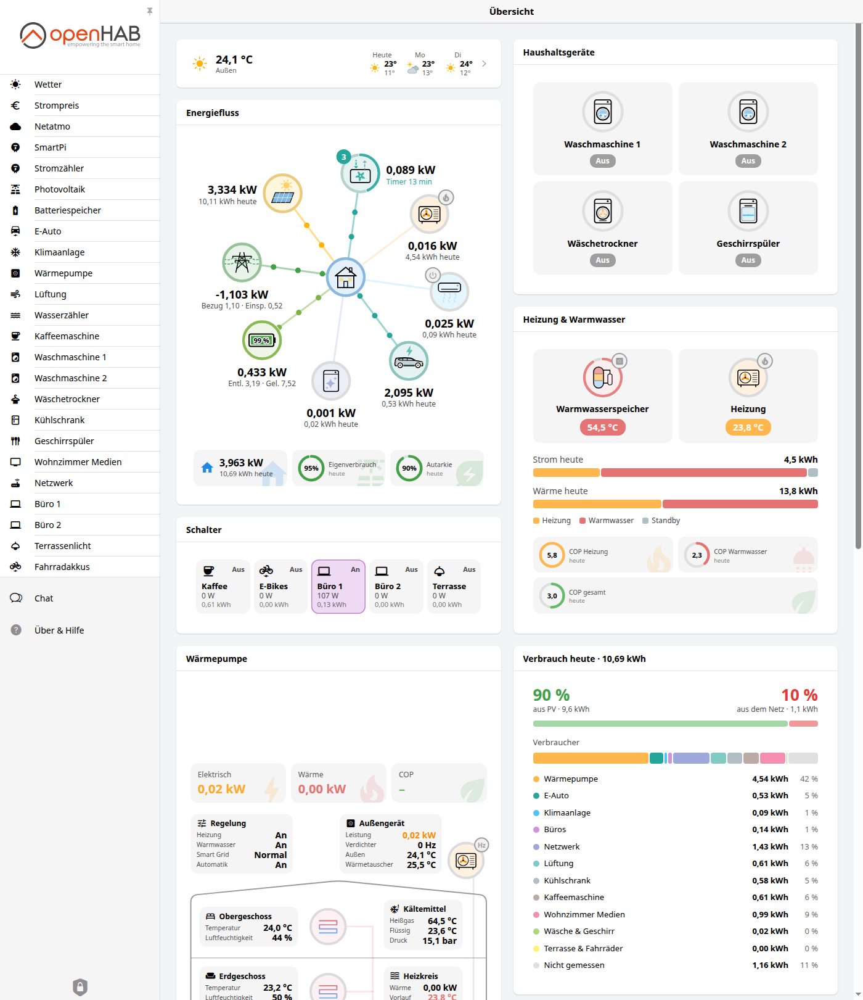

| Dark mode | Phone |
|---|---|
| 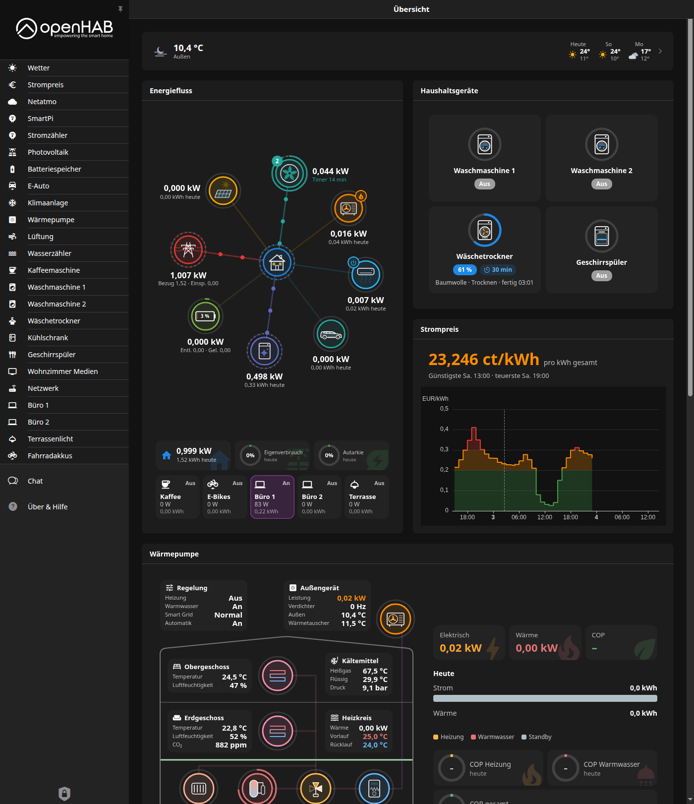 | 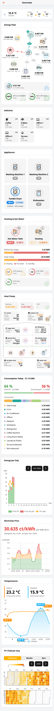 |

## Installing a widget

In MainUI open *Developer Tools → Widgets*, create a widget and replace its code with the content of a `.yml` file from
this repository. Use it on a layout page as a component `widget:<uid>` with its props, for example:

```yaml
- component: widget:plug-card
  config:
    prefix: coffee_machine
    title: Coffee Machine
    icon: material:coffee
    color: "#8d6e63"
```

Many widgets place other widgets of this repository; install those too, under the same uids. Every section below
names the widgets one needs, directly or through the widgets it places.

The widgets rely on MainUI of openHAB 5 (SVG and CSS in card content, `:has()` for hover highlights, `color-mix()`,
aggregate chart series, `oh-context` variables). Values are shown through the items' state descriptions, so units and
number formats come from the items.

| Widget | Needs |
|---|---|
| `appliance-icon` | – |
| `appliance-tile` | `appliance-icon` |
| `appliances-card` | `appliance-icon`, `appliance-tile` |
| `boost-pill` | – |
| `consumption-card` | – |
| `electricity-price-card` | – |
| `energy-days-card` | – |
| `energy-flow-card` | `flow-link`, `flow-node` |
| `flow-link` | – |
| `flow-node` | – |
| `ground-floor-quick` | – |
| `heating-card` | `flow-node` |
| `heatpump-card` | `boost-pill`, `flow-node`, `ground-floor-quick`, `heatpump-circuit-quick`, `heatpump-control-quick`, `heatpump-cop-quick`, `heatpump-electric-quick`, `heatpump-heat-quick`, `heatpump-indoor-quick`, `heatpump-outdoor-quick`, `heatpump-refrigerant-quick`, `heatpump-tank-quick`, `heatpump-valve-quick`, `item-popup`, `pill-slider`, `pill-switch`, `state-bar`, `upper-floor-quick`, `value-tile` |
| `heatpump-circuit-quick` | `pill-slider` |
| `heatpump-control-quick` | `boost-pill`, `pill-slider`, `pill-switch`, `state-bar` |
| `heatpump-cop-quick` | – |
| `heatpump-electric-quick` | – |
| `heatpump-heat-quick` | – |
| `heatpump-indoor-quick` | – |
| `heatpump-outdoor-quick` | – |
| `heatpump-refrigerant-quick` | – |
| `heatpump-tank-quick` | – |
| `heatpump-valve-quick` | – |
| `item-popup` | – |
| `pill-slider` | – |
| `pill-switch` | – |
| `plug-card` | `appliance-icon`, `flow-node`, `item-popup`, `power-pill` |
| `plug-electric-card` | `item-popup` |
| `plug-energy-days-card` | – |
| `plug-power-card` | – |
| `power-pill` | – |
| `pv-days-card` | – |
| `state-bar` | – |
| `switch-row` | – |
| `switch-tile` | – |
| `switches-card` | `switch-tile` |
| `temperatures-card` | – |
| `upper-floor-quick` | – |
| `value-tile` | `item-popup` |
| `weather-card` | `weather-icon` |
| `weather-day` | `weather-icon` |
| `weather-icon` | – |

## Dashboard cards

The cards of my overview page. Each takes the items it shows as props; the prop names say what an item is. Most
elements open a page of my installation as a popup when tapped: the page of their device (`page:heatpump`,
`page:weather` …), or for the energy flow's house and appliances a popup of its own (`page:flow_home`,
`page:flow_appliances`). The pages are not part of this repository; the quick popups the heat pump card opens are
(see [Quick popups](#quick-popups)).

### Weather: `weather-card`

A slim bar across the top: the present weather drawn in the style of the energy flow (`weather-icon`: sun or moon,
clear, behind one or two clouds or veil streaks, clouds with rain, snow, a bolt or fog, the sun peeking out for showers,
gently animated), the outdoor temperature from a local sensor, and today and the next two days, each with its weather
drawn beside its maximum over its minimum. While an official warning of GeoSphere Austria is in effect or begins within
24 hours, it is teased beside the temperature: a disc in its level's colour (yellow, orange, red) with an exclamation
mark and a ring pulsing out of it, on a wider screen in a pill with the warning's short text (*Thunderstorm until
20:00*). On a phone the gaps narrow, and below 380 px the chevron goes, so the bar keeps its fit. A tap opens the
weather page of my installation as a popup (see [Weather](#weather)). Its items come from two rules,
`scripts/openhab-ui/applied/weather_forecast_rule.js`, which reads Open-Meteo's GeoSphere AROME Austria model, and
`weather_warnings_rule.js`, which reads GeoSphere Austria's warnings and sends a broadcast notification when their level
rises to orange or red.

Needs `weather-icon`.

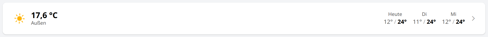

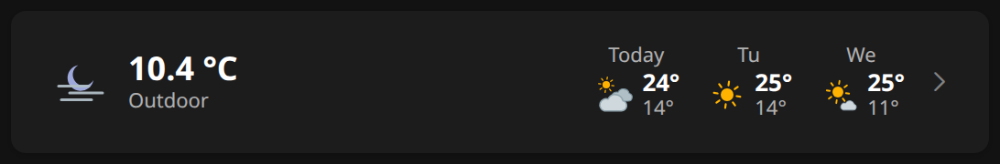

<details>
<summary>12 props</summary>

| Prop | Item | Item type |
|---|---|---|
| `weatherSymbol` | Weather Current | String |
| `weatherIsDay` | Weather Day | Switch |
| `heatpumpExtAmbientTemp` | ESPAltherma External Ambient Temperature | Number:Temperature |
| `weatherWarningLevel` | Weather Warning Level | Number |
| `weatherWarningText` | Weather Warning | String |
| `weatherDaily` | Weather Daily Forecast | String |
| `weatherDay0Max` | Weather Today Max. | Number:Temperature |
| `weatherDay0Min` | Weather Today Min. | Number:Temperature |
| `weatherDay1Max` | Weather Tomorrow Max. | Number:Temperature |
| `weatherDay1Min` | Weather Tomorrow Min. | Number:Temperature |
| `weatherDay2Max` | Weather Day After Tomorrow Max. | Number:Temperature |
| `weatherDay2Min` | Weather Day After Tomorrow Min. | Number:Temperature |

</details>

### Energy flow: `energy-flow-card`

A regular star around the house: PV, heat pump, air conditioner, E-Car, the household appliances together, ventilation,
battery and grid, each with its power and today's energy; each consumer's share of the house's power in a pill on its
line, and the house's ring as a pie of that power, the rest no known consumer draws in grey. Every node is one grey ring
around its drawing, the ring carrying what the node shows beyond it; a working ring and its arc swell outwards at their
brightest, about half again as wide as at rest. Dots run along the lines in the direction of the flow at four speeds and
slide under the node rims; while power flows through a node, its ring pulses in its colour. The icons move with the
power (sun rays, air streams, pylon dashes, a pulsing bolt over the middle of the charging car, sparkles twinkling while
the appliances run, the battery filled to its state of charge, the ventilation unit's fan turning and its air arrows
flowing, fresh air in and used air out), the heat pump, outdoor and indoor unit, its fan with its compressor: while only
its electric heaters run it stands and the energy only flows. Badges just outside the rings tell what the heat pump does
(space heating, hot water, defrost, a red bolt while only its electric heaters run), the air conditioner's mode
(heating, cooling, drying, fan, automatic) and the ventilation's level; a badge is filled in its colour while its device
works and grey otherwise. A running timer covers its device's ring with an arc, full at what it was last set to, the
battery's ring is filled with its state of charge, and the heat pump's, while it charges the tank, towards the charge's
expected end; beside such an arc the rest of the ring pulses softly and, while the node works, the arc pulses in step
with it, brightest and widest with it. A tap on a node opens its device's page of my installation, on the house and the
appliances a popup of their own. Under the star three tiles: the house as its node inside the pie of what the consumers
draw, as large as the rings beside it, with its power and today's energy against yesterday's at this time in a pill (the
difference in kWh), and today's self-consumption and self-sufficiency as rings, each with yesterday's whole day in a
pill, green while today's share is higher, orange while lower. The card places its lines and nodes as `flow-link` and
`flow-node`. The recording and the dark screenshot show it with demo powers; today's energies and the comparisons are
those of the moment shown.

Needs `flow-link`, `flow-node`.

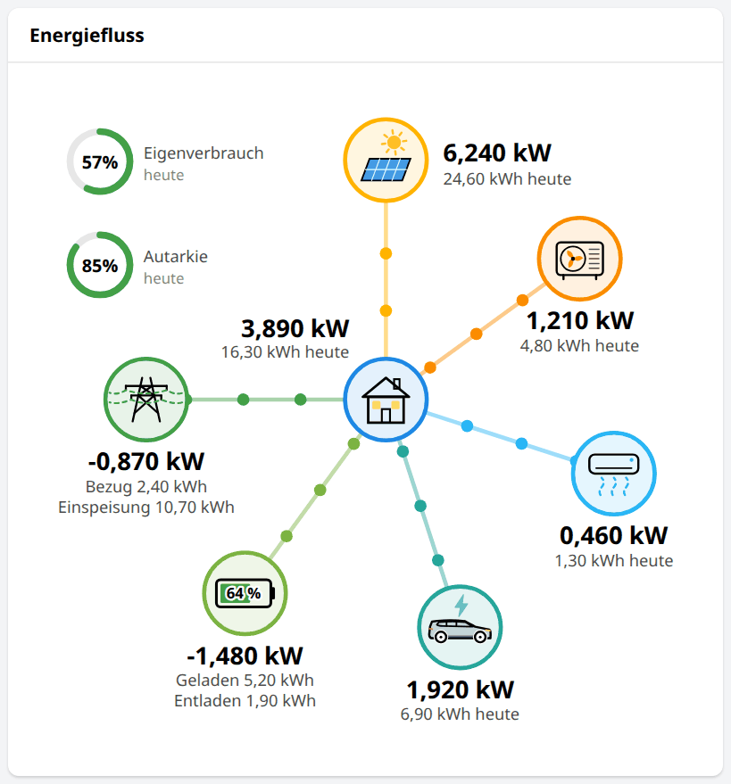

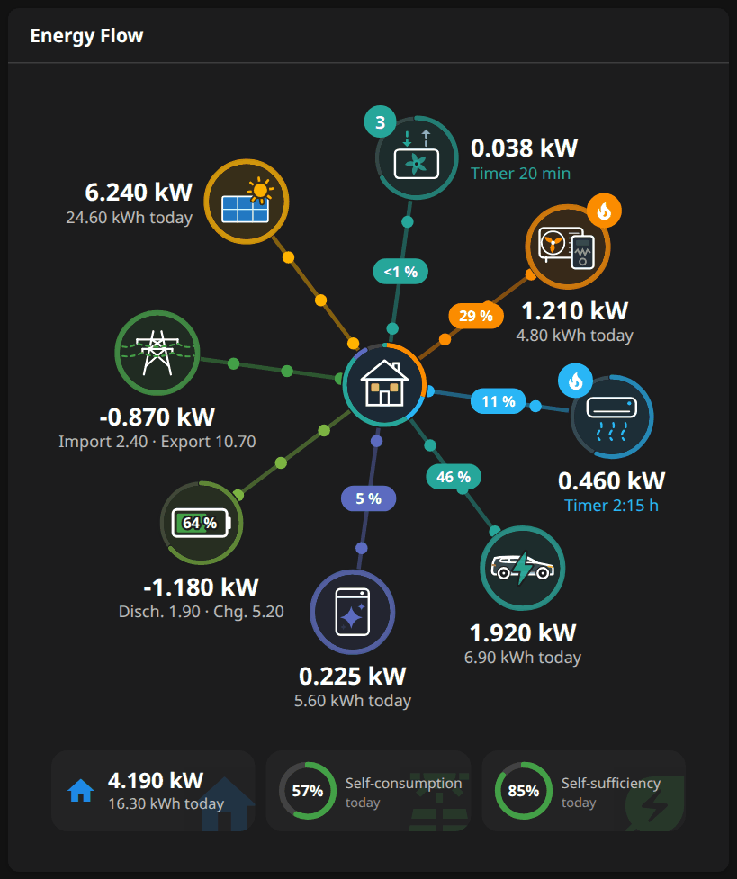

<details>
<summary>44 props</summary>

| Prop | Item | Item type |
|---|---|---|
| `pvPower` | Huawei Inverter Input Power | Number:Power |
| `gridPower` | Huawei Inverter Power Meter Active Power | Number:Power |
| `heatpumpPower` | ESPAltherma Electrical Power | Number:Power |
| `acSwitch` | Faikout Perfera Switch | Switch |
| `acUnitPower` | Air Conditioning Unit Power | Number:Power |
| `ecarPower` | E-Car Power | Number:Power |
| `washingMachine1Power` | Washing Machine 1 Power | Number:Power |
| `washingMachine2Power` | Washing Machine 2 Power | Number:Power |
| `tumbleDryerPower` | Tumble Dryer Power | Number:Power |
| `dishwasherPower` | Dishwasher Power | Number:Power |
| `batteryPower` | Huawei Inverter Energy Storage Power | Number:Power |
| `ventilationPower` | Ventilation Power | Number:Power |
| `batterySoc` | Huawei Inverter Energy Storage SOC | Number:Dimensionless |
| `heatpumpDhwEta` | Heatpump DHW Done At | DateTime |
| `heatpumpDhwSince` | Heatpump DHW Charging Since | DateTime |
| `homePower` | Home Active Power | Number:Power |
| `acTimer` | Air Conditioning Timer | Number:Time |
| `acTimerSet` | Air Conditioning Timer Set | Number:Time |
| `ventilationTimer` | Ventilation Timer | Number:Time |
| `ventilationTimerSet` | Ventilation Timer Set | Number:Time |
| `heatpumpInvFrequency` | ESPAltherma Inverter Frequency | Number:Frequency |
| `heatpumpBuhStep1Mode` | ESPAltherma Backup Heater (BUH) Step 1 Mode | Switch |
| `heatpumpBuhStep2Mode` | ESPAltherma Backup Heater (BUH) Step 2 Mode | Switch |
| `heatpumpBshMode` | ESPAltherma Booster Heater (BSH) Mode | Switch |
| `heatpumpDefrostOperaton` | ESPAltherma Defrost Operation | Switch |
| `heatpumpValve` | ESPAltherma 3-Way Valve Mode | String |
| `acMode` | Faikout Perfera Mode | String |
| `ventilationLevel` | ESPLyfterl Level | String |
| `pvEnergyToday` | Huawei Inverter E-Day | Number:Energy |
| `ventilationEnergyToday` | Ventilation Energy Today | Number:Energy |
| `gridImportToday` | Huawei Inverter Power Meter Ec-Day | Number:Energy |
| `gridExportToday` | Huawei Inverter Power Meter Ep-Day | Number:Energy |
| `heatpumpEnergyToday` | ESPAltherma Energy Today | Number:Energy |
| `acUnitEnergyToday` | Air Conditioning Unit Energy Today | Number:Energy |
| `ecarEnergyToday` | E-Car Energy Today | Number:Energy |
| `washingMachine1EnergyToday` | Washing Machine 1 Energy Today | Number:Energy |
| `washingMachine2EnergyToday` | Washing Machine 2 Energy Today | Number:Energy |
| `tumbleDryerEnergyToday` | Tumble Dryer Energy Today | Number:Energy |
| `dishwasherEnergyToday` | Dishwasher Energy Today | Number:Energy |
| `batteryDischargeToday` | Huawei Inverter Energy Storage Day Discharge | Number:Energy |
| `batteryChargeToday` | Huawei Inverter Energy Storage Day Charge | Number:Energy |
| `homeEnergyToday` | Home Energy Day | Number:Energy |
| `tileHistory` | Tile history | String |
| `pvSelfUseToday` | Photovoltaics Own Ec-Day | Number:Energy |

</details>

### Switches: `switches-card`

The switchable plugs under the energy flow as `switch-tile`s, five abreast, three on a phone: icon, *On* or *Off*, name,
power and today's energy; a tap anywhere switches, and while on a tile is tinted and outlined in its colour.

Needs `switch-tile`.

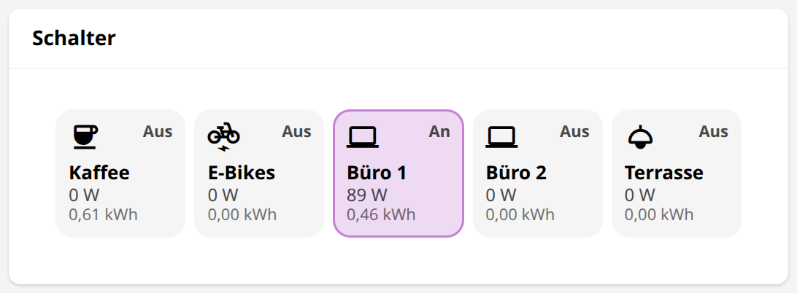

<details>
<summary>15 props</summary>

| Prop | Item | Item type |
|---|---|---|
| `coffeeMachineSwitch` | Coffee Machine Switch | Switch |
| `coffeeMachinePower` | Coffee Machine Power | Number:Power |
| `coffeeMachineEnergyToday` | Coffee Machine Energy Today | Number:Energy |
| `bicycleBatteriesSwitch` | Bicycle Batteries Switch | Switch |
| `bicycleBatteriesPower` | Bicycle Batteries Power | Number:Power |
| `bicycleBatteriesEnergyToday` | Bicycle Batteries Energy Today | Number:Energy |
| `office1Switch` | Office 1 Switch | Switch |
| `office1Power` | Office 1 Power | Number:Power |
| `office1EnergyToday` | Office 1 Energy Today | Number:Energy |
| `office2Switch` | Office 2 Switch | Switch |
| `office2Power` | Office 2 Power | Number:Power |
| `office2EnergyToday` | Office 2 Energy Today | Number:Energy |
| `terraceLightSwitch` | Terrace Light Switch | Switch |
| `terraceLightPower` | Terrace Light Power | Number:Power |
| `terraceLightEnergyToday` | Terrace Light Energy Today | Number:Energy |

</details>

### Appliances: `appliances-card`

Washing machines, dryer and dishwasher as `appliance-tile`s, each drawn inside a ring filled with the program progress,
the rest of it pulsing and the arc in step with it; drums and paddles turn and the spray arm sprays while they run, with
a pill for the remaining time; a machine without progress pulses its whole ring and shows its power in a dimmed pill
beside its state.

Needs `appliance-icon`, `appliance-tile`.

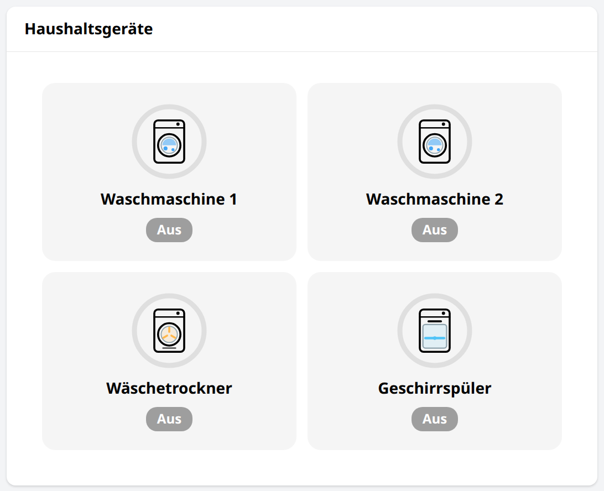

<details>
<summary>21 props</summary>

| Prop | Item | Item type |
|---|---|---|
| `washer1ProgramProgress` | Miele Washing Machine WWG360 Program Progress | Number:Dimensionless |
| `washer1OperationState` | Miele Washing Machine WWG360 Operation State | String |
| `washer1ActiveProgram` | Miele Washing Machine WWG360 Active Program | String |
| `washer1ProgramPhase` | Miele Washing Machine WWG360 Program Phase | String |
| `washer1ProgramFinishedTime` | Miele Washing Machine WWG360 Program Finished Time | DateTime |
| `washer1ProgramRemainingTime` | Miele Washing Machine WWG360 Program Remaining Time | Number |
| `washingMachine2Power` | Washing Machine 2 Power | Number:Power |
| `washingMachine2Finished` | Washing Machine 2 Finished | Switch |
| `washingMachine2Since` | Washing Machine 2 Running Since | DateTime |
| `dryerProgramProgress` | Miele Tumble Dryer TWC560WP Program Progress | Number:Dimensionless |
| `dryerOperationState` | Miele Tumble Dryer TWC560WP Operation State | String |
| `dryerActiveProgram` | Miele Tumble Dryer TWC560WP Active Program | String |
| `dryerProgramPhase` | Miele Tumble Dryer TWC560WP Program Phase | String |
| `dryerProgramFinishedTime` | Miele Tumble Dryer TWC560WP Program Finished Time | DateTime |
| `dryerProgramRemainingTime` | Miele Tumble Dryer TWC560WP Program Remaining Time | Number |
| `dishwasherProgramProgress` | Miele Dishwasher G7465 Program Progress | Number:Dimensionless |
| `dishwasherOperationState` | Miele Dishwasher G7465 Operation State | String |
| `dishwasherActiveProgram` | Miele Dishwasher G7465 Active Program | String |
| `dishwasherProgramPhase` | Miele Dishwasher G7465 Program Phase | String |
| `dishwasherProgramFinishedTime` | Miele Dishwasher G7465 Program Finished Time | DateTime |
| `dishwasherProgramRemainingTime` | Miele Dishwasher G7465 Program Remaining Time | Number |

</details>

### Heating and hot water: `heating-card`

Two tiles in the appliances' style, the DHW tank and the heat pump: the tank drawn as in the heat pump card, its water
in three layers (the top in its temperature's colour) with the Effect Heater beside it, lit while it heats, its ring
filled by its temperature and a badge for where its heat comes from (the booster heater's red bolt, else the heat pump
while the compressor charges the tank); the heat pump as the energy flow's node with its mode badge, filled while the
heat pump's own measured circuit draws, its red bolt only for the backup heater in the wall unit (the tank's booster
heater shows on the tank), its ring as in the energy flow, whole while it draws and filling towards the expected end of
a hot-water charge, while the setpoint pill gives way to the time left, as a Miele machine's, and a line names the end.
Each tile's pill holds the temperature, the tank's and the leaving water's, filled in the tile's colour while hot water
or heating is switched on, outlined while off, beside a tinted pill with the setpoint and a small target icon; a tap
opens the heat pump's page of my installation. Below them today's electricity and heat of the heat pump split into space
heating, DHW and standby as bars (hovering a part lifts it everywhere), each with today against yesterday at this time
in a pill in the middle of its title (the difference in kWh), and today's COPs of space heating, DHW and in total in one
row as rings like the energy flow's self-consumption, each with today against yesterday at this time in a pill under its
title. While the tank charges or the heating runs, a line under its tile says since when. The screenshots show it with
the heat pump card's demo values.

Needs `flow-node`.

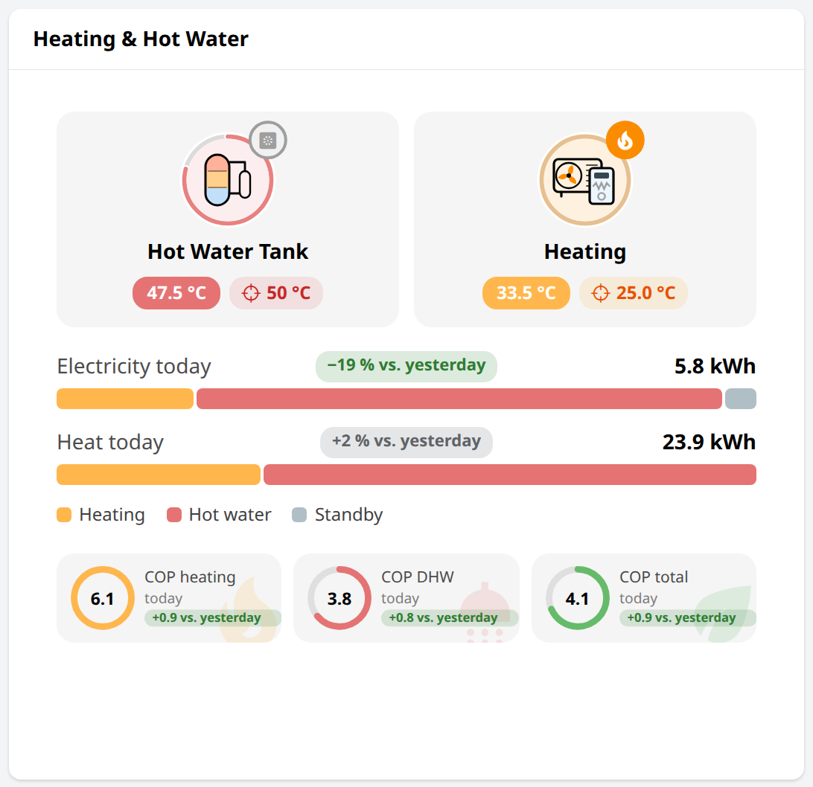

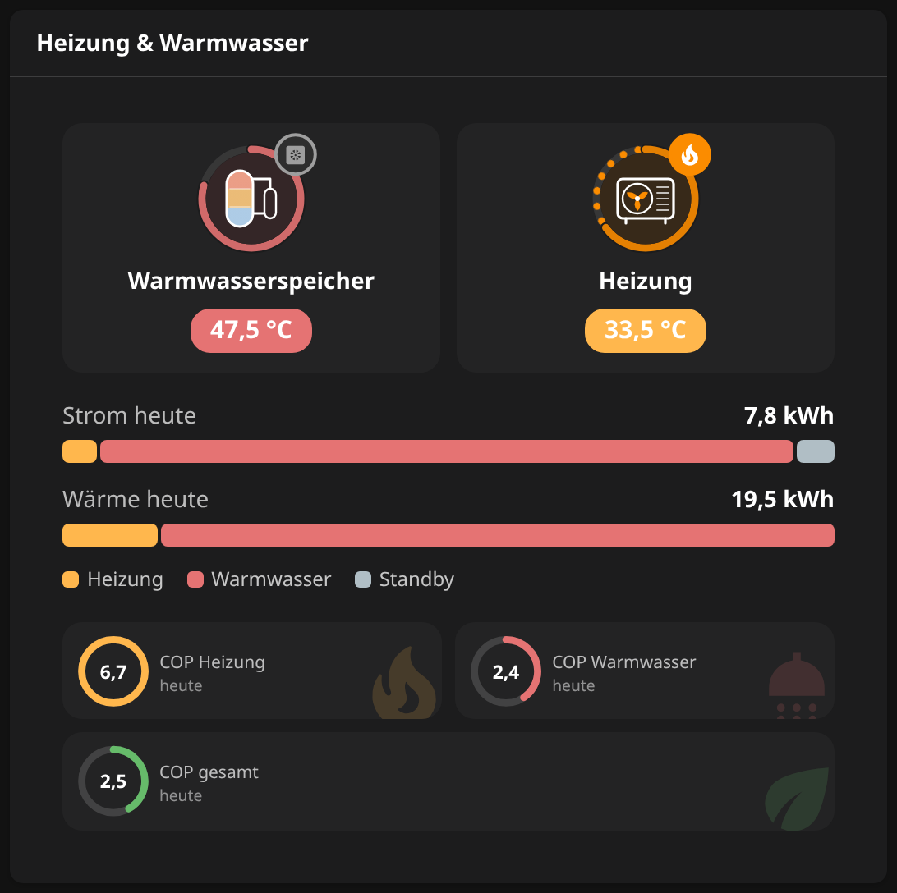

<details>
<summary>30 props</summary>

| Prop | Item | Item type |
|---|---|---|
| `heatpumpDhwTankTemp` | ESPAltherma DHW Tank Temperature | Number:Temperature |
| `heatpumpWaterPumpOperation` | ESPAltherma Water Pump Operation | Switch |
| `heatpumpFlowSensor` | ESPAltherma Flow Sensor (l/min) | Number:VolumetricFlowRate |
| `heatpumpValve` | ESPAltherma 3-Way Valve Mode | String |
| `heatpumpBshMode` | ESPAltherma Booster Heater (BSH) Mode | Switch |
| `heatpumpInvFrequency` | ESPAltherma Inverter Frequency | Number:Frequency |
| `heatpumpDhwPower` | Pyaltherma DHW Power | Switch |
| `heatpumpDhwEta` | Heatpump DHW Done At | DateTime |
| `heatpumpDhwSince` | Heatpump DHW Charging Since | DateTime |
| `heatpumpDhwSetpoint` | ESPAltherma DHW Setpoint | Number:Temperature |
| `heatpumpPower` | ESPAltherma Electrical Power | Number:Power |
| `heatpumpBuhStep1Mode` | ESPAltherma Backup Heater (BUH) Step 1 Mode | Switch |
| `heatpumpBuhStep2Mode` | ESPAltherma Backup Heater (BUH) Step 2 Mode | Switch |
| `heatpumpCircuitPower` | Heatpump Power | Number:Power |
| `heatpumpDefrostOperaton` | ESPAltherma Defrost Operation | Switch |
| `heatpumpLeavingWaterTempAfterBuh` | ESPAltherma Leaving Water Temperature After BUH | Number:Temperature |
| `heatpumpClimateControlPower` | Pyaltherma Climate Control Power | Switch |
| `heatpumpLeavingWaterSetpoint` | ESPAltherma Leaving Water Setpoint | Number:Temperature |
| `heatpumpHeatingSince` | Heatpump Heating Running Since | DateTime |
| `heatpumpEnergyToday` | ESPAltherma Energy Today | Number:Energy |
| `tileHistory` | Tile history | String |
| `heatpumpEnergySpaceToday` | ESPAltherma Energy Space Today | Number:Energy |
| `heatpumpEnergyDhwToday` | ESPAltherma Energy DHW Today | Number:Energy |
| `heatpumpEnergyStandbyToday` | ESPAltherma Energy Standby Today | Number:Energy |
| `heatpumpHeatingEnergyToday` | ESPAltherma Heating Energy Today | Number:Energy |
| `heatpumpHeatingEnergySpaceToday` | ESPAltherma Heating Energy Space Today | Number:Energy |
| `heatpumpHeatingEnergyDhwToday` | ESPAltherma Heating Energy DHW Today | Number:Energy |
| `heatpumpDcopSpace` | ESPAltherma DCOP Space | Number |
| `heatpumpDcopDhw` | ESPAltherma DCOP DHW | Number |
| `heatpumpDcop` | ESPAltherma DCOP | Number |

</details>

### Electricity price: `electricity-price-card`

The all-in price, the cheapest and priciest hour, and the prices 12 hours back and 36 hours ahead, coloured green,
orange and red by price.

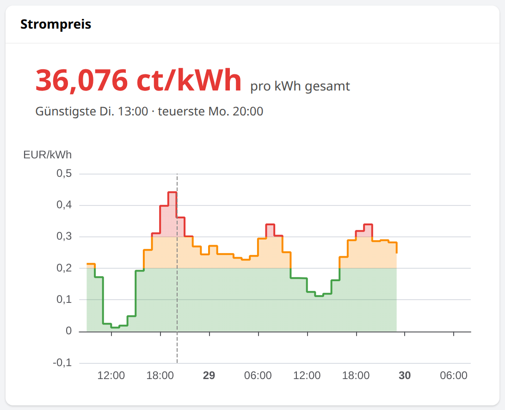

<details>
<summary>6 props</summary>

| Prop | Item | Item type |
|---|---|---|
| `priceTotalGross` | EPEX Spot aWATTar Total Gross | Number:EnergyPrice |
| `priceCheapestHour` | Cheapest hour | DateTime |
| `pricePriciestHour` | EPEX Spot aWATTar Priciest Hour | DateTime |
| `priceTotalNet` | EPEX Spot aWATTar Total Net | Number:EnergyPrice |
| `priceMarketGross` | EPEX Spot aWATTar Market Gross | Number:EnergyPrice |
| `priceMarketNet` | EPEX Spot aWATTar | Number:EnergyPrice |

</details>

### Heat pump: `heatpump-card`

A section through the house: the outdoor unit on the roof (the energy flow's `flow-node`), wall unit, three-way valve,
DHW tank (in layers, the Effect Heater beside it) and radiators in the basement, floor heating on the two levels above.
Every device is one grey ring like the energy flow's nodes, pulsing while it works, softly beside the arc that shows its
value, which pulses in step with it; the outdoor unit's fan turns while the compressor runs and its ring is filled by
the compressor's frequency, the wall unit's by its own draw, the measured circuit (full and red while the backup heater
runs; the tank's booster heater does not count), the tank's by its temperature, radiators and floor loops by the leaving
water while they carry it. Dots run along the pipes, as many as a pipe is long, one at least, faster with the water's
flow or the compressor's frequency, and all of them backwards during a defrost. The valve shows its position in its
icon. Badges just outside three rings say what the outdoor unit's ring shows (*Hz*) and the wall unit's (water while it
flows, a red bolt while the backup heater runs) and where the tank's heat comes from; grey while their device rests.
Tiles in the style of the switch tiles hold the figures: the outdoor unit, the control (heating, hot water, Smart Grid,
automation), the refrigerant, the heating circuit, the climate of the two floors, the tank with its booster heater and
the indoor unit with its own power (the measured circuit plus the backup heater), each tinted in its colour while what
it shows is at work. A tap on a tile, the wall unit, the outdoor unit, the tank or the valve opens its quick popup (see
[Quick popups](#quick-popups)). At the card's top, across its whole width as the energy flow's tiles, the electrical
power, the heat and the COP as a row of value tiles that open their quick popups too (today's split and COPs are in the
heating card). The drawing ends at the house's walls, and the tiles beside them end flush with the walls; on a phone it
takes the card's width inside the same padding as the value tiles above it, so the house and its outer tiles line up
with them. Everywhere else it stands at its own size, as the energy flow does, so their texts keep the UI's sizes and
their rings come out the same and never shrink, centred and in the middle of the height the card is given. The
recordings show it with demo values (a space heating run).

Needs `boost-pill`, `flow-node`, `ground-floor-quick`, `heatpump-circuit-quick`, `heatpump-control-quick`,
`heatpump-cop-quick`, `heatpump-electric-quick`, `heatpump-heat-quick`, `heatpump-indoor-quick`,
`heatpump-outdoor-quick`, `heatpump-refrigerant-quick`, `heatpump-tank-quick`, `heatpump-valve-quick`, `item-popup`,
`pill-slider`, `pill-switch`, `state-bar`, `upper-floor-quick`, `value-tile`.

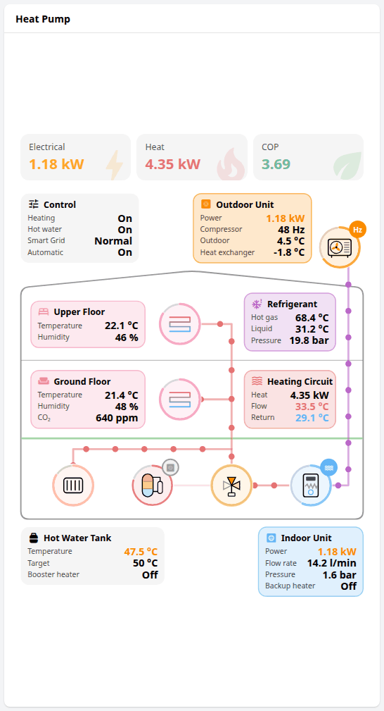

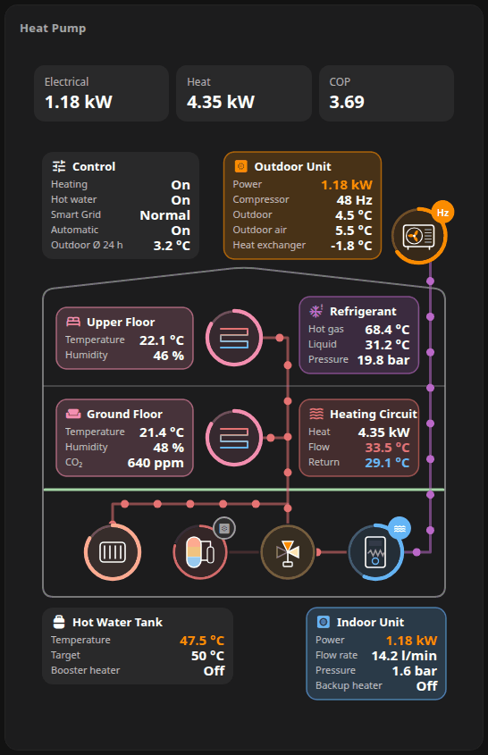

<details>
<summary>59 props</summary>

| Prop | Item | Item type |
|---|---|---|
| `heatpumpPower` | ESPAltherma Electrical Power | Number:Power |
| `heatpumpEnergyToday` | ESPAltherma Energy Today | Number:Energy |
| `heatpumpElectricalPowerSpace` | ESPAltherma Electrical Power Space | Number:Power |
| `heatpumpElectricalPowerDhw` | ESPAltherma Electrical Power DHW | Number:Power |
| `heatpumpElectricalPowerStandby` | ESPAltherma Electrical Power Standby | Number:Power |
| `heatpumpEnergySpaceToday` | ESPAltherma Energy Space Today | Number:Energy |
| `heatpumpEnergyDhwToday` | ESPAltherma Energy DHW Today | Number:Energy |
| `heatpumpEnergyStandbyToday` | ESPAltherma Energy Standby Today | Number:Energy |
| `heatpumpHeatPower` | ESPAltherma Heating Power | Number:Power |
| `heatpumpHeatingEnergyToday` | ESPAltherma Heating Energy Today | Number:Energy |
| `heatpumpHeatingPowerSpace` | ESPAltherma Heating Power Space | Number:Power |
| `heatpumpHeatingPowerDhw` | ESPAltherma Heating Power DHW | Number:Power |
| `heatpumpHeatingEnergySpaceToday` | ESPAltherma Heating Energy Space Today | Number:Energy |
| `heatpumpHeatingEnergyDhwToday` | ESPAltherma Heating Energy DHW Today | Number:Energy |
| `heatpumpCop` | ESPAltherma COP | Number |
| `heatpumpDcop` | ESPAltherma DCOP | Number |
| `heatpumpCopSpace` | ESPAltherma COP Space | Number |
| `heatpumpCopDhw` | ESPAltherma COP DHW | Number |
| `heatpumpDcopSpace` | ESPAltherma DCOP Space | Number |
| `heatpumpDcopDhw` | ESPAltherma DCOP DHW | Number |
| `heatpumpExtAmbientTemp` | ESPAltherma External Ambient Temperature | Number:Temperature |
| `heatpumpDhwTankTemp` | ESPAltherma DHW Tank Temperature | Number:Temperature |
| `heatpumpInvFrequency` | ESPAltherma Inverter Frequency | Number:Frequency |
| `heatpumpDefrostOperaton` | ESPAltherma Defrost Operation | Switch |
| `heatpumpWaterPumpOperation` | ESPAltherma Water Pump Operation | Switch |
| `heatpumpFlowSensor` | ESPAltherma Flow Sensor (l/min) | Number:VolumetricFlowRate |
| `heatpumpValve` | ESPAltherma 3-Way Valve Mode | String |
| `heatpumpBuhStep1Mode` | ESPAltherma Backup Heater (BUH) Step 1 Mode | Switch |
| `heatpumpBuhStep2Mode` | ESPAltherma Backup Heater (BUH) Step 2 Mode | Switch |
| `heatpumpBshMode` | ESPAltherma Booster Heater (BSH) Mode | Switch |
| `heatpumpLeavingWaterTempAfterBuh` | ESPAltherma Leaving Water Temperature After BUH | Number:Temperature |
| `heatpumpCircuitPower` | Heatpump Power | Number:Power |
| `heatpumpHeatExchangerMidTemp` | ESPAltherma Heat Exchanger Mid Temperature | Number:Temperature |
| `heatpumpSmartGrid` | ESPAltherma Smart Grid | String |
| `heatpumpClimateControlPower` | Pyaltherma Climate Control Power | Switch |
| `heatpumpDhwBoost` | Pyaltherma DHW Powerful | Switch |
| `heatpumpDhwPower` | Pyaltherma DHW Power | Switch |
| `heatpumpManagement` | Heatpump Management | Group |
| `heatpumpDischargePipeTemp` | ESPAltherma Discharge Pipe Temperature | Number:Temperature |
| `heatpumpRefrigerantTemp` | ESPAltherma Refrigerant Temperature Liquid Side | Number:Temperature |
| `heatpumpRefrigerantPressure` | ESPAltherma Refrigerant Pressure Sensor | Number:Pressure |
| `heatpumpHeatingPowerAfterBuh` | ESPAltherma Heating Power After BUH | Number:Power |
| `heatpumpInletWaterTemp` | ESPAltherma Inlet Water Temperature | Number:Temperature |
| `acTemperature` | Faikout Perfera Temperature | Number:Temperature |
| `tadoHumidity` | Tado Humidity | Number:Dimensionless |
| `heatpumpIndoorAmbientTemp` | ESPAltherma Indoor Ambient Temperature | Number:Temperature |
| `netatmoWeatherstationAtmosphericHumidity` | Netatmo Weatherstation Atmospheric Humidity | Number:Dimensionless |
| `netatmoWeatherstationCo2` | Netatmo Weatherstation CO2 | Number:Dimensionless |
| `heatpumpDhwSetpoint` | ESPAltherma DHW Setpoint | Number:Temperature |
| `heatpumpBshPower` | ESPAltherma Electrical Power Booster Heater | Number:Power |
| `heatpumpBuhPower` | ESPAltherma Electrical Power Backup Heater | Number:Power |
| `heatpumpWaterPressure` | ESPAltherma Water Pressure | Number:Pressure |
| `heatpumpDhwTempHeating` | Pyaltherma DHW Temp Heating | Number:Temperature |
| `heatpumpDhwManagement` | Heatpump DHW Management | Switch |
| `heatpumpLeavingWaterTempOffsetHeating` | Pyaltherma Leaving Water Temp Offset Heating | Number:Temperature |
| `heatpumpLeavingWaterSetpoint` | ESPAltherma Leaving Water Setpoint | Number:Temperature |
| `heatpumpOutdoorAirTemp` | ESPAltherma Outdoor Air Temperature | Number:Temperature |
| `heatpumpTargetDischargeTemp` | ESPAltherma Target Discharge Temperature | Number:Temperature |
| `heatpumpWaterPumpSignal` | ESPAltherma Water Pump Signal | Number:Dimensionless |

</details>

### Consumption today: `consumption-card`

Today's consumption as one bar split by source (PV, grid), the total against yesterday at this time in a pill between
the two shares (the difference in kWh), and as one bar split by consumer, with a legend in two columns that gives each
consumer's energy and how many kWh more (orange) or fewer (green) it drew than yesterday until this time; hovering a
part lifts it everywhere. The screenshot shows it with demo values.

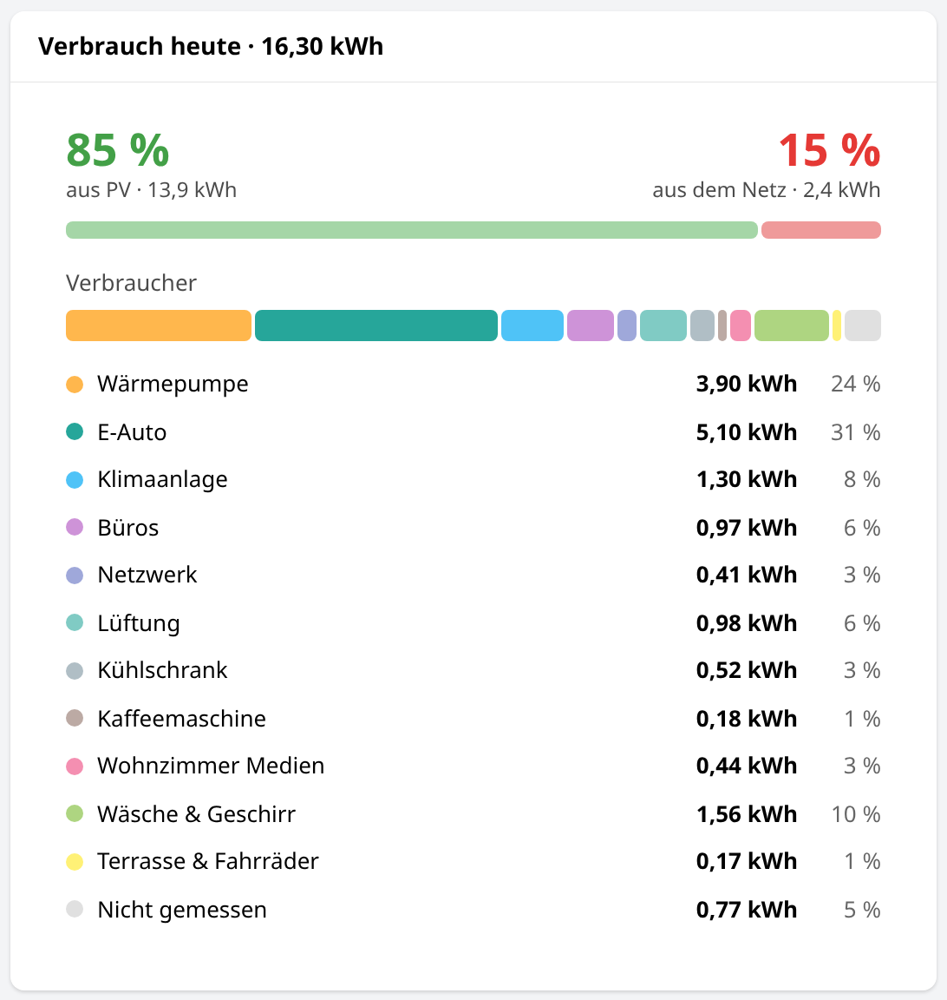

<details>
<summary>21 props</summary>

| Prop | Item | Item type |
|---|---|---|
| `homeEnergyToday` | Home Energy Day | Number:Energy |
| `pvSelfUseToday` | Photovoltaics Own Ec-Day | Number:Energy |
| `tileHistory` | Tile history | String |
| `gridImportToday` | Huawei Inverter Power Meter Ec-Day | Number:Energy |
| `heatpumpEnergyToday` | ESPAltherma Energy Today | Number:Energy |
| `ecarEnergyToday` | E-Car Energy Today | Number:Energy |
| `acUnitEnergyToday` | Air Conditioning Unit Energy Today | Number:Energy |
| `office1EnergyToday` | Office 1 Energy Today | Number:Energy |
| `office2EnergyToday` | Office 2 Energy Today | Number:Energy |
| `networkEnergyToday` | Network Energy Today | Number:Energy |
| `ventilationEnergyToday` | Ventilation Energy Today | Number:Energy |
| `refrigeratorEnergyToday` | Refrigerator Energy Today | Number:Energy |
| `coffeeMachineEnergyToday` | Coffee Machine Energy Today | Number:Energy |
| `livingRoomEntertainmentEnergyToday` | Living Room Entertainment Energy Today | Number:Energy |
| `dishwasherEnergyToday` | Dishwasher Energy Today | Number:Energy |
| `washingMachine1EnergyToday` | Washing Machine 1 Energy Today | Number:Energy |
| `washingMachine2EnergyToday` | Washing Machine 2 Energy Today | Number:Energy |
| `tumbleDryerEnergyToday` | Tumble Dryer Energy Today | Number:Energy |
| `terraceLightEnergyToday` | Terrace Light Energy Today | Number:Energy |
| `bicycleBatteriesEnergyToday` | Bicycle Batteries Energy Today | Number:Energy |
| `acMeterEnergyToday` | Air Conditioning Energy Today | Number:Energy |

</details>

### Energy per day: `energy-days-card`

The month's daily home consumption as stacked bars: from PV and from the grid, with PV production beside it.

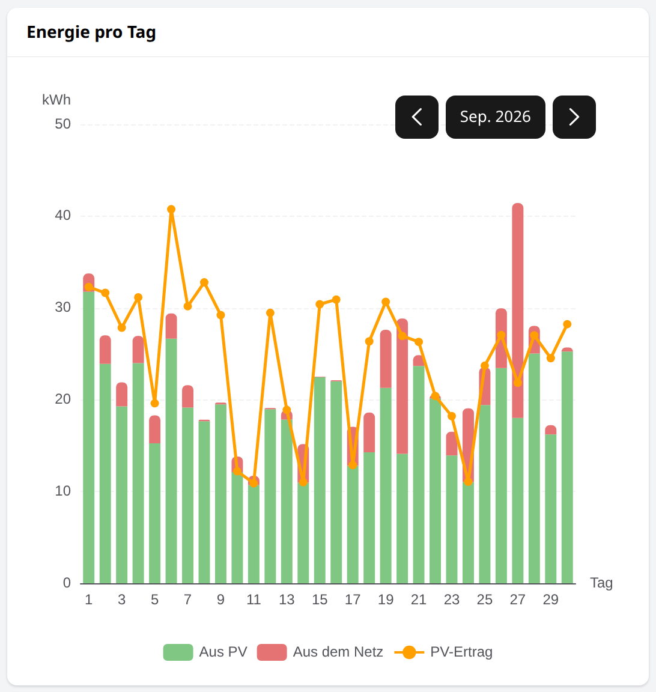

<details>
<summary>3 props</summary>

| Prop | Item | Item type |
|---|---|---|
| `dailySelfUse` | Energy Daily Self Use | Number:Energy |
| `dailyGridImport` | Energy Daily Grid Import | Number:Energy |
| `dailyPv` | Energy Daily PV | Number:Energy |

</details>

### PV production per day: `pv-days-card`

The daily PV yield of a year in four views a bar switches: a calendar heatmap of the year, two half-years, twelve month
calendars and the months' sums as bars; a wider screen gets the year, the month calendars and the bars, a phone the
half-years instead of the year.

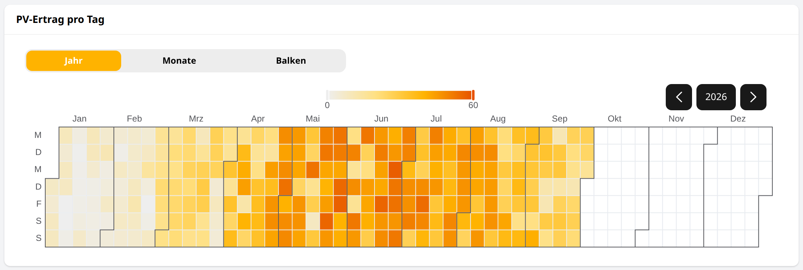

<details>
<summary>1 props</summary>

| Prop | Item | Item type |
|---|---|---|
| `dailyPv` | Energy Daily PV | Number:Energy |

</details>

### Temperatures: `temperatures-card`

Indoor and outdoor temperature now, each with its change over the last hour in a pill beside it and under that indoors
the room's climate in a word (from the humidity), outdoors whether airing dries or dampens the rooms (from both airs'
absolute humidity); the day's minimum and maximum, and the last day as a chart from 15-minute means.

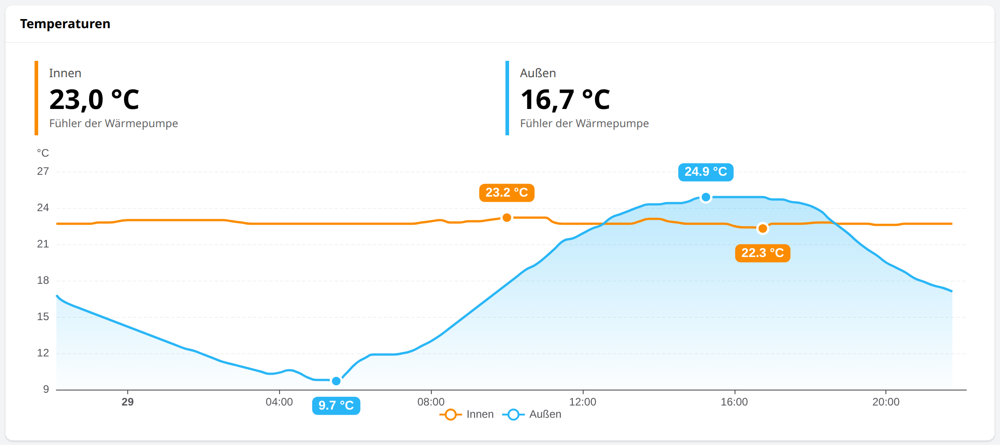

<details>
<summary>9 props</summary>

| Prop | Item | Item type |
|---|---|---|
| `heatpumpIndoorAmbientTemp` | ESPAltherma Indoor Ambient Temperature | Number:Temperature |
| `tileHistory` | Tile history | String |
| `netatmoWeatherstationAtmosphericHumidity` | Netatmo Weatherstation Atmospheric Humidity | Number:Dimensionless |
| `heatpumpExtAmbientTemp` | ESPAltherma External Ambient Temperature | Number:Temperature |
| `netatmoOutdoorTemperature` | Netatmo Outdoor Temperature | Number:Temperature |
| `netatmoOutdoorAtmosphericHumidity` | Netatmo Outdoor Atmospheric Humidity | Number:Dimensionless |
| `netatmoWeatherstationTemperature` | Netatmo Weatherstation Temperature | Number:Temperature |
| `temperatureIndoor15min` | Temperature Indoor 15 min | Number:Temperature |
| `temperatureOutdoor15min` | Temperature Outdoor 15 min | Number:Temperature |

</details>

## Quick popups

Compact popups the heat pump card opens: the heat pump's controls or the values and charts of one of its parts, under
a small head with its state and above *All details*, which opens the heat pump's page of my installation. Each is a
widget that takes its items as props; open it from a link with `action: popup`, `actionModal: widget:<uid>` and its
items in `actionModalConfig`, as the card does:

```yaml
action: popup
actionModal: widget:heatpump-tank-quick
actionModalConfig:
  heatpumpDhwTankTemp: espaltherma_dhw_tank_temp
  heatpumpDhwSetpoint: espaltherma_dhw_setpoint
  heatpumpBshMode: espaltherma_bsh_mode
  heatpumpBshPower: espaltherma_electrical_power_bsh
```

It opens 420 px wide, on a phone full screen; its values stand two abreast on top, its charts start below their period
buttons, and a closed period menu takes no room. The card's tiles, wall unit, outdoor unit, tank and valve and the
three figures at its top open them:

- `heatpump-control-quick`, control: all the heat pump's controls: the Smart Grid, heating, hot water and automation,
  the DHW setpoint, the hot-water boost and the leaving water offset.
- `heatpump-indoor-quick`, indoor unit: the circulation pump as a ring with the water's flow and the water pressure
  rated in words on top; its power without the backup heater, the flow, the pressure and the backup heater over the day.
- `heatpump-outdoor-quick`, outdoor unit: the compressor's frequency as a ring and the outdoor air beside the heat
  exchanger on top; its power, the compressor, the outdoor temperature with its heat exchanger's and the outdoor air
  sensor over the day.
- `heatpump-refrigerant-quick`, refrigerant: the hot gas against its target as a setpoint bar on top; hot gas with its
  target, liquid, heat exchanger and pressure over the day.
- `heatpump-circuit-quick`, heating circuit: the leaving water offset, the leaving and inlet water's spread and the
  leaving water against its setpoint on top; leaving with inlet water and the heat over the day.
- `heatpump-tank-quick`, DHW tank: the tank in layers with its temperature against the setpoint on top; its temperature
  with its setpoint and its booster heater's on and off as a band over the day.
- `heatpump-valve-quick`, three-way valve: its position over the day as a band, space heating and DHW in turn.
- `upper-floor-quick`, upper floor: the humidity rated in words on top; temperature and humidity over the day.
- `ground-floor-quick`, ground floor: humidity and CO₂ rated in words on top; temperature, humidity and CO₂ over the
  day.
- `heatpump-electric-quick`, electricity: the split by purpose now and today as bars on top; the power of space heating,
  DHW and standby over the day, their energy per day of the month.
- `heatpump-heat-quick`, heat: the split by purpose now and today as bars on top; the heat of space heating and DHW over
  the day, per day of the month.
- `heatpump-cop-quick`, COP: electricity plus ambient heat becoming heat as flow bands, now while the compressor runs
  and for the day, each over a row of rings with the COP in total, of space heating and of DHW; the COP and the outdoor
  temperature over the day, the daily COPs of the month.

| | | |
|---|---|---|
| 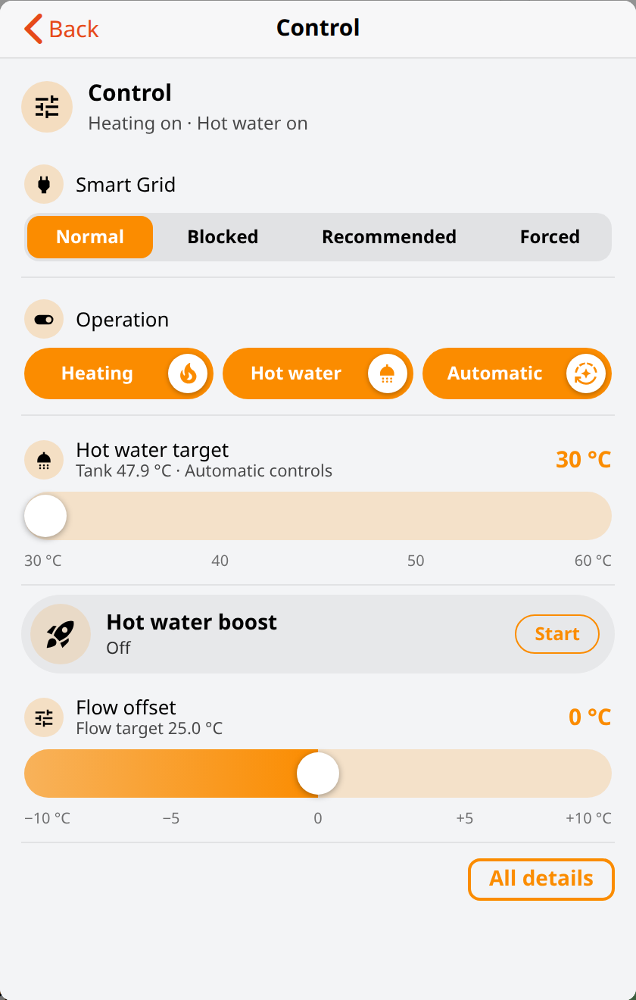 | 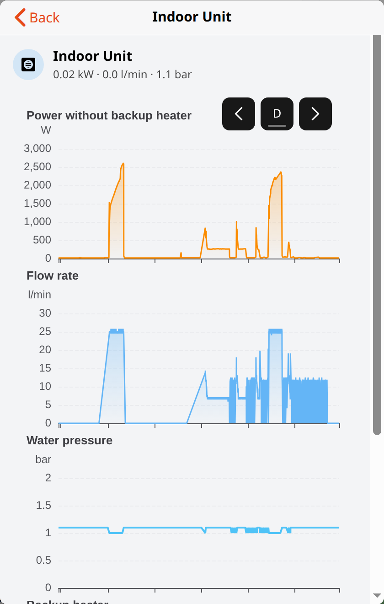 | 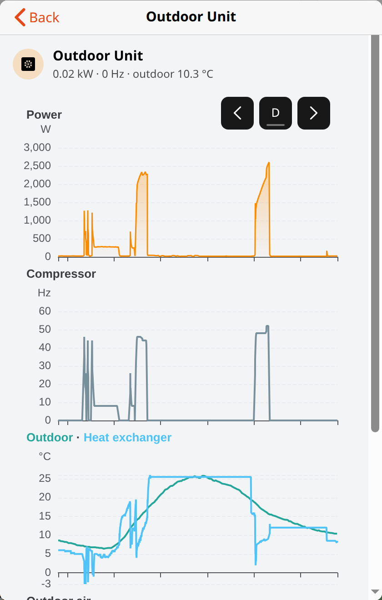 |
| 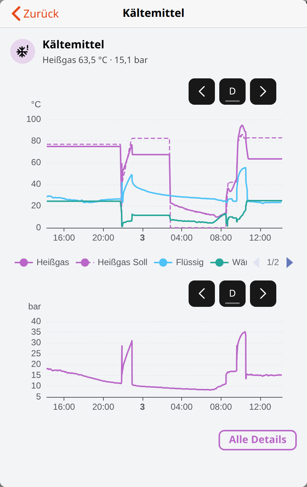 | 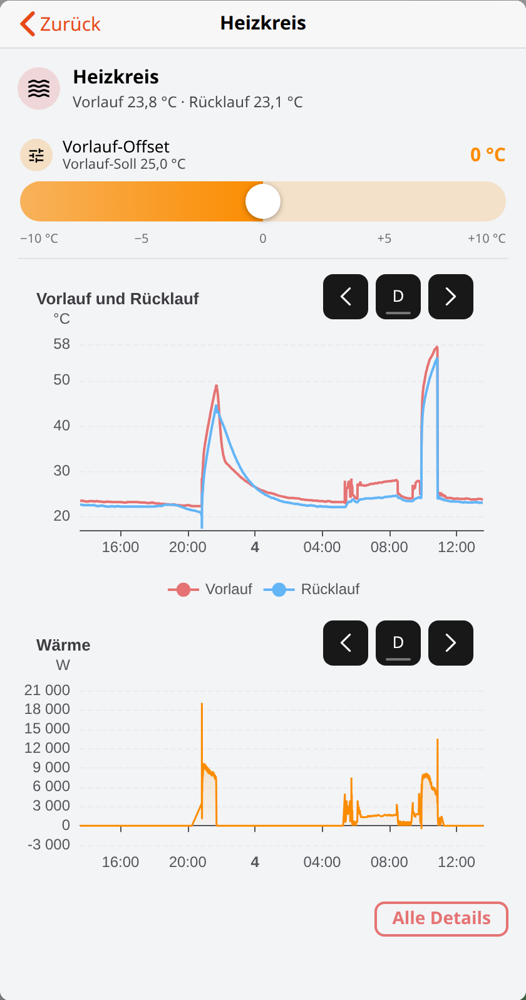 | 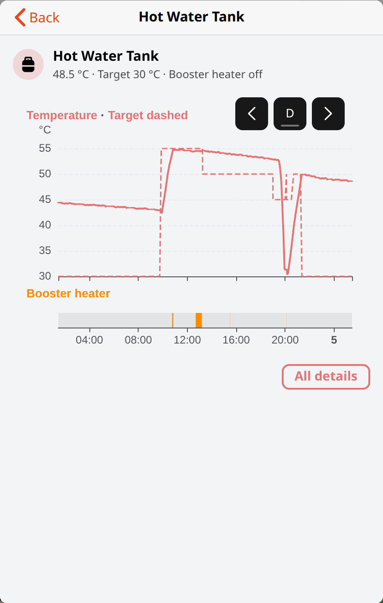 |
| 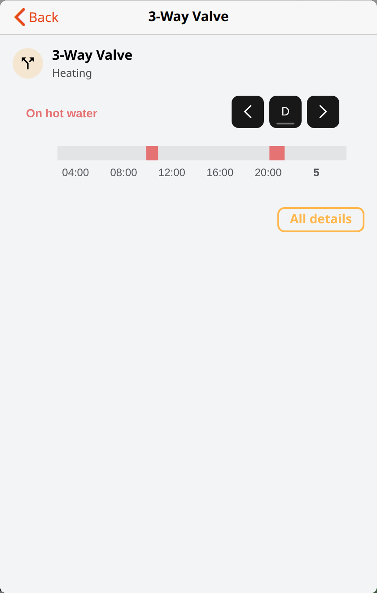 | 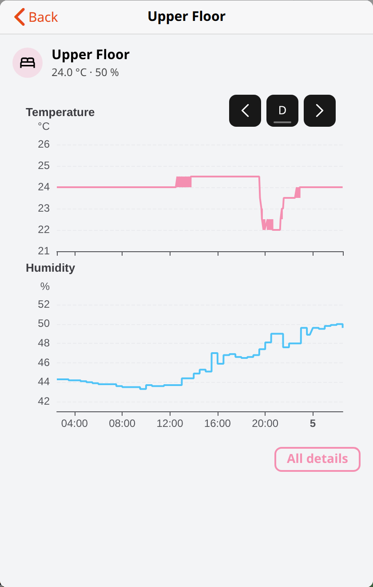 | 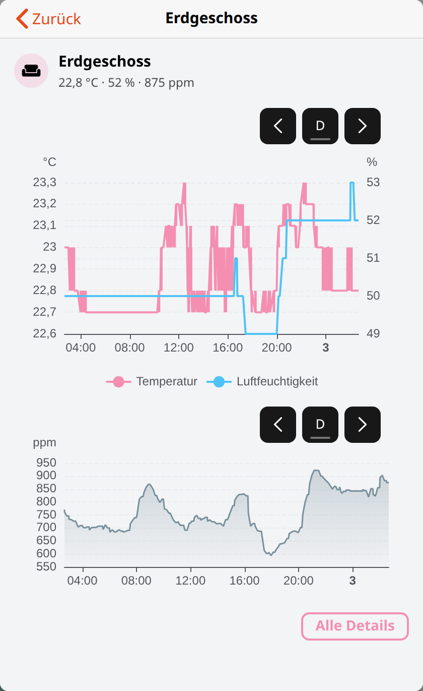 |
| 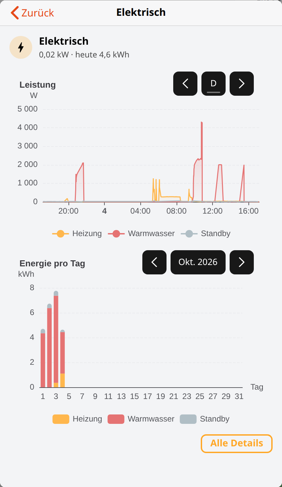 | 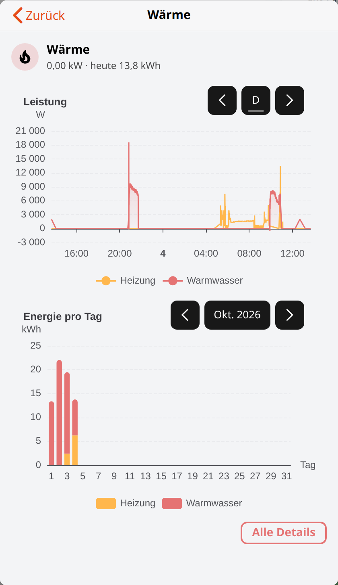 | 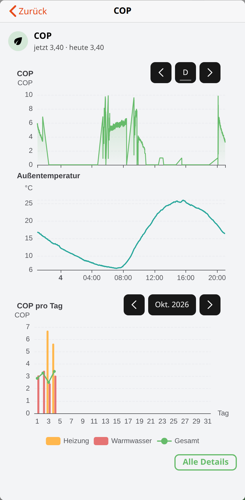 |

`heatpump-control-quick` needs `boost-pill`, `pill-slider`, `pill-switch`, `state-bar`.

<details>
<summary><code>heatpump-control-quick</code>: 10 props</summary>

| Prop | Item | Item type |
|---|---|---|
| `heatpumpClimateControlPower` | Pyaltherma Climate Control Power | Switch |
| `heatpumpDhwPower` | Pyaltherma DHW Power | Switch |
| `heatpumpSmartGrid` | ESPAltherma Smart Grid | String |
| `heatpumpManagement` | Heatpump Management | Group |
| `heatpumpDhwTempHeating` | Pyaltherma DHW Temp Heating | Number:Temperature |
| `heatpumpDhwTankTemp` | ESPAltherma DHW Tank Temperature | Number:Temperature |
| `heatpumpDhwManagement` | Heatpump DHW Management | Switch |
| `heatpumpDhwBoost` | Pyaltherma DHW Powerful | Switch |
| `heatpumpLeavingWaterTempOffsetHeating` | Pyaltherma Leaving Water Temp Offset Heating | Number:Temperature |
| `heatpumpLeavingWaterSetpoint` | ESPAltherma Leaving Water Setpoint | Number:Temperature |

</details>

<details>
<summary><code>heatpump-indoor-quick</code>: 5 props</summary>

| Prop | Item | Item type |
|---|---|---|
| `heatpumpCircuitPower` | Heatpump Power | Number:Power |
| `heatpumpBuhPower` | ESPAltherma Electrical Power Backup Heater | Number:Power |
| `heatpumpFlowSensor` | ESPAltherma Flow Sensor (l/min) | Number:VolumetricFlowRate |
| `heatpumpWaterPressure` | ESPAltherma Water Pressure | Number:Pressure |
| `heatpumpWaterPumpSignal` | ESPAltherma Water Pump Signal | Number:Dimensionless |

</details>

<details>
<summary><code>heatpump-outdoor-quick</code>: 5 props</summary>

| Prop | Item | Item type |
|---|---|---|
| `heatpumpCircuitPower` | Heatpump Power | Number:Power |
| `heatpumpInvFrequency` | ESPAltherma Inverter Frequency | Number:Frequency |
| `heatpumpExtAmbientTemp` | ESPAltherma External Ambient Temperature | Number:Temperature |
| `heatpumpHeatExchangerMidTemp` | ESPAltherma Heat Exchanger Mid Temperature | Number:Temperature |
| `heatpumpOutdoorAirTemp` | ESPAltherma Outdoor Air Temperature | Number:Temperature |

</details>

<details>
<summary><code>heatpump-refrigerant-quick</code>: 5 props</summary>

| Prop | Item | Item type |
|---|---|---|
| `heatpumpDischargePipeTemp` | ESPAltherma Discharge Pipe Temperature | Number:Temperature |
| `heatpumpRefrigerantPressure` | ESPAltherma Refrigerant Pressure Sensor | Number:Pressure |
| `heatpumpTargetDischargeTemp` | ESPAltherma Target Discharge Temperature | Number:Temperature |
| `heatpumpRefrigerantTemp` | ESPAltherma Refrigerant Temperature Liquid Side | Number:Temperature |
| `heatpumpHeatExchangerMidTemp` | ESPAltherma Heat Exchanger Mid Temperature | Number:Temperature |

</details>

`heatpump-circuit-quick` needs `pill-slider`.

<details>
<summary><code>heatpump-circuit-quick</code>: 6 props</summary>

| Prop | Item | Item type |
|---|---|---|
| `heatpumpLeavingWaterTempAfterBuh` | ESPAltherma Leaving Water Temperature After BUH | Number:Temperature |
| `heatpumpInletWaterTemp` | ESPAltherma Inlet Water Temperature | Number:Temperature |
| `heatpumpLeavingWaterTempOffsetHeating` | Pyaltherma Leaving Water Temp Offset Heating | Number:Temperature |
| `heatpumpLeavingWaterSetpoint` | ESPAltherma Leaving Water Setpoint | Number:Temperature |
| `heatpumpClimateControlPower` | Pyaltherma Climate Control Power | Switch |
| `heatpumpHeatingPowerAfterBuh` | ESPAltherma Heating Power After BUH | Number:Power |

</details>

<details>
<summary><code>heatpump-tank-quick</code>: 4 props</summary>

| Prop | Item | Item type |
|---|---|---|
| `heatpumpDhwTankTemp` | ESPAltherma DHW Tank Temperature | Number:Temperature |
| `heatpumpDhwSetpoint` | ESPAltherma DHW Setpoint | Number:Temperature |
| `heatpumpBshMode` | ESPAltherma Booster Heater (BSH) Mode | Switch |
| `heatpumpBshPower` | ESPAltherma Electrical Power Booster Heater | Number:Power |

</details>

<details>
<summary><code>heatpump-valve-quick</code>: 1 props</summary>

| Prop | Item | Item type |
|---|---|---|
| `heatpumpValve` | ESPAltherma 3-Way Valve Mode | String |

</details>

<details>
<summary><code>upper-floor-quick</code>: 2 props</summary>

| Prop | Item | Item type |
|---|---|---|
| `acTemperature` | Faikout Perfera Temperature | Number:Temperature |
| `tadoHumidity` | Tado Humidity | Number:Dimensionless |

</details>

<details>
<summary><code>ground-floor-quick</code>: 3 props</summary>

| Prop | Item | Item type |
|---|---|---|
| `heatpumpIndoorAmbientTemp` | ESPAltherma Indoor Ambient Temperature | Number:Temperature |
| `netatmoWeatherstationAtmosphericHumidity` | Netatmo Weatherstation Atmospheric Humidity | Number:Dimensionless |
| `netatmoWeatherstationCo2` | Netatmo Weatherstation CO2 | Number:Dimensionless |

</details>

<details>
<summary><code>heatpump-electric-quick</code>: 8 props</summary>

| Prop | Item | Item type |
|---|---|---|
| `heatpumpPower` | ESPAltherma Electrical Power | Number:Power |
| `heatpumpEnergyToday` | ESPAltherma Energy Today | Number:Energy |
| `heatpumpElectricalPowerSpace` | ESPAltherma Electrical Power Space | Number:Power |
| `heatpumpElectricalPowerDhw` | ESPAltherma Electrical Power DHW | Number:Power |
| `heatpumpElectricalPowerStandby` | ESPAltherma Electrical Power Standby | Number:Power |
| `heatpumpEnergySpaceToday` | ESPAltherma Energy Space Today | Number:Energy |
| `heatpumpEnergyDhwToday` | ESPAltherma Energy DHW Today | Number:Energy |
| `heatpumpEnergyStandbyToday` | ESPAltherma Energy Standby Today | Number:Energy |

</details>

<details>
<summary><code>heatpump-heat-quick</code>: 6 props</summary>

| Prop | Item | Item type |
|---|---|---|
| `heatpumpHeatPower` | ESPAltherma Heating Power | Number:Power |
| `heatpumpHeatingEnergyToday` | ESPAltherma Heating Energy Today | Number:Energy |
| `heatpumpHeatingPowerSpace` | ESPAltherma Heating Power Space | Number:Power |
| `heatpumpHeatingPowerDhw` | ESPAltherma Heating Power DHW | Number:Power |
| `heatpumpHeatingEnergySpaceToday` | ESPAltherma Heating Energy Space Today | Number:Energy |
| `heatpumpHeatingEnergyDhwToday` | ESPAltherma Heating Energy DHW Today | Number:Energy |

</details>

<details>
<summary><code>heatpump-cop-quick</code>: 11 props</summary>

| Prop | Item | Item type |
|---|---|---|
| `heatpumpCop` | ESPAltherma COP | Number |
| `heatpumpDcop` | ESPAltherma DCOP | Number |
| `heatpumpHeatPower` | ESPAltherma Heating Power | Number:Power |
| `heatpumpPower` | ESPAltherma Electrical Power | Number:Power |
| `heatpumpCopSpace` | ESPAltherma COP Space | Number |
| `heatpumpCopDhw` | ESPAltherma COP DHW | Number |
| `heatpumpHeatingEnergyToday` | ESPAltherma Heating Energy Today | Number:Energy |
| `heatpumpEnergyToday` | ESPAltherma Energy Today | Number:Energy |
| `heatpumpDcopSpace` | ESPAltherma DCOP Space | Number |
| `heatpumpDcopDhw` | ESPAltherma DCOP DHW | Number |
| `heatpumpExtAmbientTemp` | ESPAltherma External Ambient Temperature | Number:Temperature |

</details>


## Controls

The parts of the quick popups and of my device pages' controls.


### Segmented bar: `state-bar`

The states of one item as the segments of a bar, the current one filled in the colour; a tap sends a segment's state.
`options` holds `value=label` pairs separated by semicolons. With `byText` the segments are as wide as their labels, so
a long one such as *Recommended* fits on a phone; Framework7's sliding highlight is sized for equal segments and is
hidden then. `color` may be an expression, e.g. grey while the device is off.

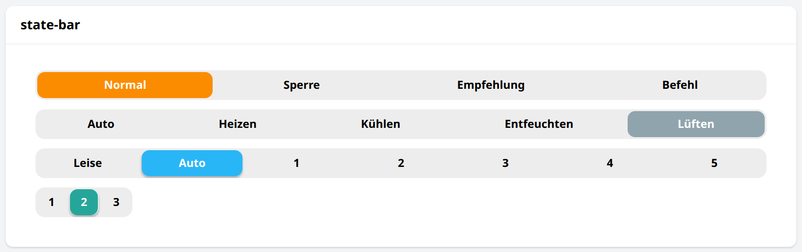

```yaml
component: widget:state-bar
config:
  item: esplyfterl_level
  options: 1=1;2=2;3=3
  color: "#26a69a"
```

| Prop | Description | Type | Default |
|---|---|---|---|
| `item` | The item whose states the segments send | Item |  |
| `options` | value=label pairs separated by semicolons, e.g. 1=Low;2=Medium;3=High | TEXT |  |
| `color` | Colour of the current segment as #rrggbb; may be an expression | TEXT | `#78909c` |
| `byText` | Segments as wide as their labels instead of equal widths | BOOLEAN |  |
| `flex` | CSS flex of the bar in a row, e.g. 1 1 240px | TEXT |  |
| `width` | CSS width of the bar | TEXT | `100%` |

### Switch tile: `switch-tile`

A plug or device as a small tile: its icon, *On* or *Off*, the name and a value such as its power; a tap anywhere
switches it. While on it is tinted and outlined in its colour. Put several in a grid, e.g. `grid-template-columns:
repeat(auto-fill, minmax(120px, 1fr))`.

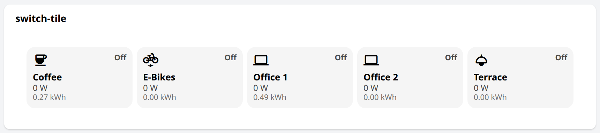

```yaml
component: widget:switch-tile
config:
  item: coffee_machine_switch
  title: Coffee Machine
  icon: material:coffee
  color: "#8d6e63"
  value: =Math.round(Number(items.coffee_machine_power.numericState) || 0) + ' W'
```

| Prop | Description | Type | Default |
|---|---|---|---|
| `item` | The switch item | Item |  |
| `title` | Name of the plug or device | TEXT |  |
| `icon` | Icon, e.g. material:coffee (its state follows the item) | TEXT |  |
| `color` | Colour of the tile while on as #rrggbb | TEXT | `#78909c` |
| `value` | A line under the name, e.g. the power; usually an expression | TEXT |  |
| `energy` | A line under the value, e.g. today's energy; usually an expression; empty: none | TEXT |  |

### On/off pill: `power-pill`

A device's on and off as a wide pill: a white knob with the power symbol slides to the right and the pill fills with the
device colour while on, with `onText` in it (an expression, e.g. the mode it runs in); a tap anywhere switches. The plug
cards and the device pages switch with it.

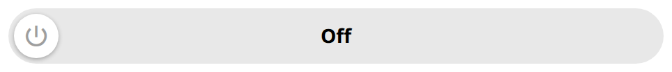

```yaml
component: widget:power-pill
config:
  item: faikout_perfera_switch
  color: "#29b6f6"
  onText: ="On · " + items.faikout_perfera_mode.displayState
```

| Prop | Description | Type | Default |
|---|---|---|---|
| `item` | The switch item | Item |  |
| `color` | Device colour as #rrggbb, of the pill while on | TEXT | `#78909c` |
| `onText` | What the pill says while on, e.g. On · Fan; usually an expression | TEXT | `On` |

### Boost pill: `boost-pill`

A boost that runs for a while, as a pill: its icon in a tinted circle, the name, what it does while it runs (`running`,
an expression) or *Off*, and *Start* or *Stop*; while it runs the pill fills with a gradient of the device colour and
rings pulse from the icon. A tap anywhere switches the item. My heat pump's hot-water boost and my air conditioner's
boost both carry a rocket.

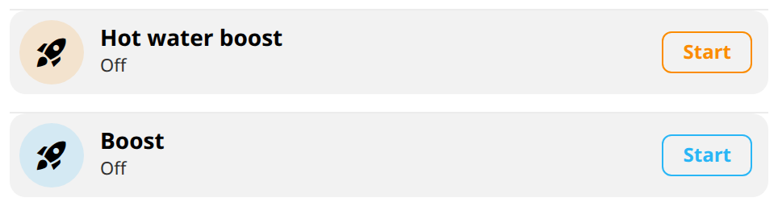

```yaml
component: widget:boost-pill
config:
  item: pyaltherma_dhw_powerful
  title: Hot water boost
  icon: material:rocket_launch
  color: "#fb8c00"
  running: ="running · tank " + items.espaltherma_dhw_tank_temp.displayState
```

| Prop | Description | Type | Default |
|---|---|---|---|
| `item` | The switch item | Item |  |
| `title` | Name of the boost | TEXT | `Boost` |
| `icon` | Icon, e.g. material:rocket_launch; a classic openHAB icon follows the item's state | TEXT | `material:bolt` |
| `color` | Device colour as #rrggbb | TEXT | `#fb8c00` |
| `running` | The line under the title while the boost runs; usually an expression | TEXT | `running` |

### Slider: `pill-slider`

A setting as a wide pill slider in the device colour, for setpoints, offsets, powers and timers: a gradient fills the
bar up to the value, the white knob stays inside the bar at both ends, and the value is sent once on release. Only the
knob can be dragged, so scrolling across a slider on a phone leaves it alone. Above the
bar an icon in a tinted circle (for a timer, `ring: true`, a ring around a timer icon that empties as the item runs
down to 0, full at `ringFull`, e.g. the minutes it was last set to, or at `max`), the title with a line of context and the value large on the right; `marks` puts labels below the bar.
`value` and `context` are expressions, evaluated where the slider is placed. The slider is only built once the item
has a numeric state, because MainUI's slider starts at its minimum and a touch ending on it sends its value.

```yaml
component: widget:pill-slider
config:
  item: faikout_perfera_temperature_setpoint
  color: "#29b6f6"
  min: 18
  max: 30
  step: 0.5
  unit: °C
  title: Target
  icon: material:device_thermostat
  value: =items.faikout_perfera_temperature_setpoint.displayState
  context: ="Room " + items.faikout_perfera_temperature.displayState
  marks: 18=18 °C;22=22;26=26;30=30 °C
```

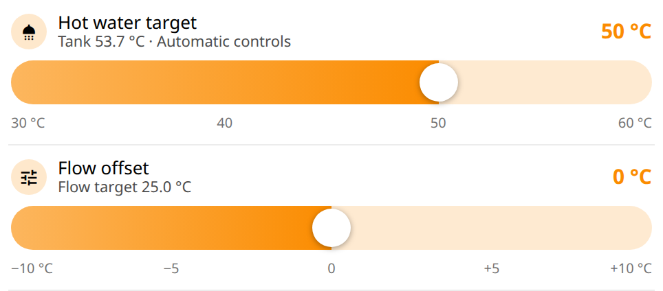

| Prop | Description | Type | Default |
|---|---|---|---|
| `item` | The number item the slider sets | Item |  |
| `color` | Device colour as #rrggbb | TEXT | `#78909c` |
| `min` | The slider's lowest value | DECIMAL | `0` |
| `max` | The slider's highest value | DECIMAL | `100` |
| `step` | The slider's step | DECIMAL | `1` |
| `unit` | Unit on the label while dragging and of the command sent; must be the item's own (a difference in K sent to a °C item is taken as an absolute temperature) | TEXT |  |
| `title` | Title above the slider | TEXT |  |
| `icon` | The badge's icon, e.g. material:thermostat | TEXT | `material:tune` |
| `ring` | A ring around a timer icon instead of the icon, emptying as the item runs down to 0 | BOOLEAN |  |
| `ringFull` | What a full timer ring stands for, e.g. an expression on the minutes the timer was last set to; empty: the maximum | TEXT |  |
| `value` | The value to show, usually an expression on the item | TEXT |  |
| `valueColor` | Colour of the value where it is not the device colour; empty: the text colour | TEXT |  |
| `context` | A line under the title saying what the setting does, usually an expression | TEXT |  |
| `marks` | value=label pairs below the bar, separated by semicolons, e.g. 0=0;60=1 h;120=2 h | TEXT |  |
| `opacity` | e.g. 0.6 while the device is off | TEXT |  |
| `row` | A row of a page's or popup's controls, with their divider | BOOLEAN |  |

### Switch pill: `pill-switch`

A switch for switches that stand side by side: a pill 34 px high in which a white knob with the icon of what it
switches (`icon`; the power symbol without one) slides to the right while the pill fills with the card's colour, the
name in the part the knob leaves free. Every pill has the same sizes and 12 px text. Put several in a grid that places
as many as fit, e.g. `grid-template-columns: repeat(auto-fit, minmax(120px, 1fr))`, which holds a name such as
*Hot water* and lets three pills stand abreast where there is room and two and one on a phone. A tap anywhere on the
pill switches the item.

```yaml
component: widget:pill-switch
config:
  item: pyaltherma_climate_control_power
  title: Heating
  icon: material:local_fire_department
  color: "#fb8c00"
```


| Prop | Description | Type | Default |
|---|---|---|---|
| `item` | The switch item | Item |  |
| `title` | Name of the switch, in the pill | TEXT |  |
| `icon` | Icon on the knob, of what it switches, e.g. material:shower | TEXT | `material:power_settings_new` |
| `color` | The card's colour as #rrggbb, of the pill while on | TEXT | `#78909c` |

### Switch row: `switch-row`

A switch in a list of switches: its icon in a circle tinted in the card's colour while on, the name, *On* or *Off*, and
a switch drawn in the card's colour, a track that fills while on and a white knob that slides over. A tap anywhere
on the row switches the item.

```yaml
component: widget:switch-row
config:
  item: faikout_perfera_eco_mode
  title: Eco
  icon: material:eco
  color: "#29b6f6"
```

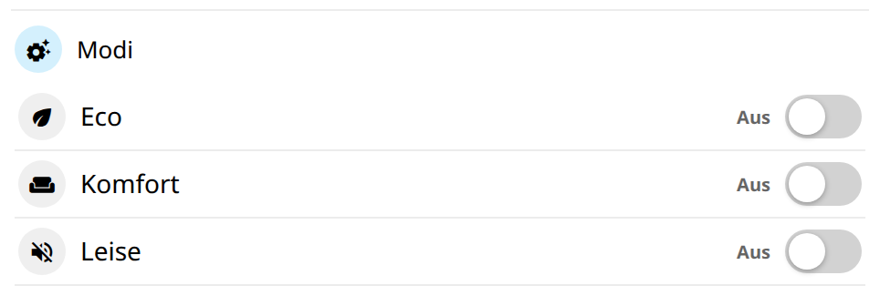

| Prop | Description | Type | Default |
|---|---|---|---|
| `item` | The switch item | Item |  |
| `title` | Name of the switch | TEXT |  |
| `icon` | The icon, e.g. material:eco | TEXT | `material:power_settings_new` |
| `color` | The card's colour as #rrggbb, of the switch while on | TEXT | `#78909c` |

## Energy flow

The energy flow card's lines, nodes and rings, for a flow of your own. They draw SVG, so place them in an `svg`
component, in its `viewBox` coordinates: every node is a circle of radius 30 around `x`, `y`, a line runs best from
rim to rim. Place the lines first, so the nodes cover their ends and the dots slide in under the rims. Powers are
expressions in W, evaluated where the widget stands:

```yaml
component: svg
config:
  viewBox: 0 0 440 110
  width: 100%
slots:
  default:
    - component: widget:flow-link
      config: { x1: 80, y1: 45, x2: 190, y2: 45, color: "#ffb300", forward: true,
                power: "=Number(items.huawei_inverter_input_power.numericState) || 0" }
    - component: widget:flow-link
      config: { x1: 250, y1: 45, x2: 360, y2: 45, color: "#26a69a", forward: true, threshold: 100,
                power: "=Number(items.e_car_power.numericState) || 0" }
    - component: widget:flow-node
      config: { kind: pv, x: 50, y: 45, power: "=Number(items.huawei_inverter_input_power.numericState) || 0" }
    - component: widget:flow-node
      config: { kind: home, x: 220, y: 45, power: "=Number(items.home_active_power.numericState) || 0" }
    - component: widget:flow-node
      config: { kind: e-car, x: 390, y: 45, power: "=Number(items.e_car_power.numericState) || 0" }
```

The recordings show the widgets with fixed demo values.


### Node: `flow-node`

A device in a ring, its animation driven by `power`: `pv` (a straight module of six cells with the sun in front of its
corner, both brighter with the power, rays turning faster), `grid` (a pylon, red on import and green on export, dashes
running along its wires), `home` (a house whose windows glow and pulse with the consumption), `heat-pump` (an outdoor
unit whose fan turns while `frequency`, the compressor's, is above 0 Hz, faster from 30 and 55 Hz), `heat-pump-split`
(the whole split heat pump: that outdoor unit with the indoor unit standing in front of its right side),
`air-conditioner` (an indoor unit whose air streams flow), `e-car` (a car with a bolt fading in and out while it
charges), `battery` (filled to `soc`, red, orange or green), `appliances` (an appliance's housing with sparkles for a
front, the big one breathing and the small ones twinkling while they run) and `ventilation` (a ventilation unit whose
fan turns above 5 W, faster with the power, and whose two arrows, fresh air in and used air out, flow while it runs). A
node is its drawing on a disc tinted in its colour over an opaque one in the card colour, so dots running under it
disappear; the card that places it draws the grey ring around it, as the energy flow does (`track()` in the generator),
and its badges.

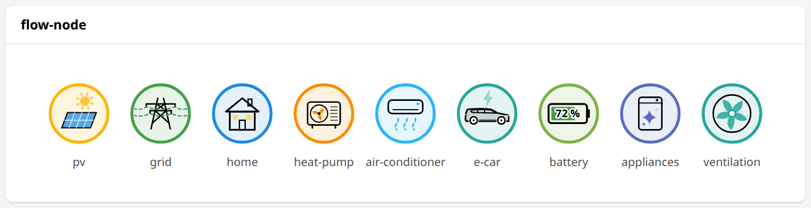

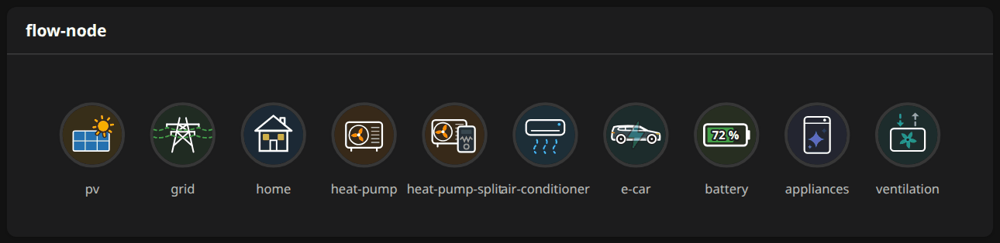

| Prop | Description | Type | Default |
|---|---|---|---|
| `kind` | The device drawn | TEXT |  |
| `x` | Centre's x in the flow's viewBox | DECIMAL |  |
| `y` | Centre's y in the flow's viewBox | DECIMAL |  |
| `power` | The power in W; usually an expression on an item | TEXT |  |
| `soc` | The battery's state of charge in %; usually an expression | DECIMAL |  |
| `frequency` | The heat pump's compressor frequency in Hz, which turns its fan; usually an expression | DECIMAL |  |

### Line: `flow-link`

A line from (`x1`, `y1`) to (`x2`, `y2`) in `color`. While |`power`| exceeds `threshold` three dots run along it,
towards (`x2`, `y2`) while `forward` holds and back otherwise, at four speeds by the power; below the threshold the line
fades. The dots run a dot radius past both ends, so they slide out from under one node's rim and back under the other's.
`color` and `forward` may be expressions, e.g. the grid's line green and outward while it exports.

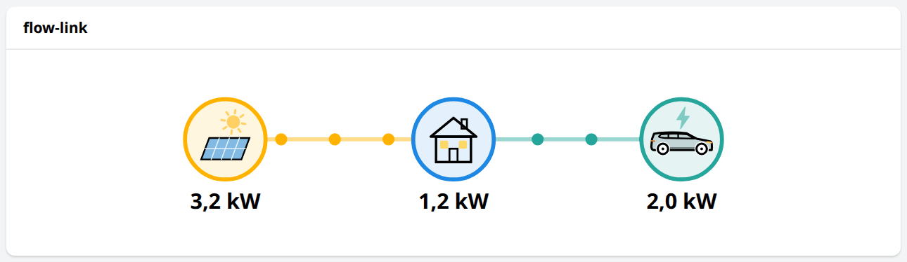

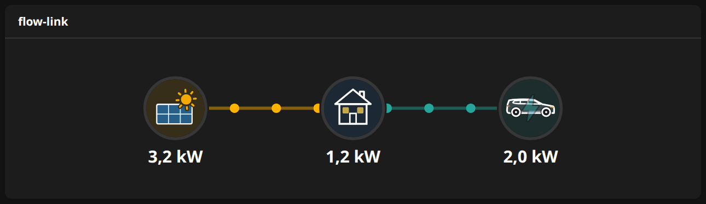

| Prop | Description | Type | Default |
|---|---|---|---|
| `x1` | Start point's x in the flow's viewBox | DECIMAL |  |
| `y1` | Start point's y in the flow's viewBox | DECIMAL |  |
| `x2` | End point's x in the flow's viewBox | DECIMAL |  |
| `y2` | End point's y in the flow's viewBox | DECIMAL |  |
| `color` | The link's colour as #rrggbb; may be an expression | TEXT | `#78909c` |
| `power` | The power in W; usually an expression on an item | TEXT |  |
| `forward` | The dots run from (x1, y1) to (x2, y2) while it holds, else back; usually an expression | BOOLEAN |  |
| `threshold` | The power in W above which the dots run | DECIMAL | `10` |

## Appliances

The appliances card's parts.

### Appliance icon: `appliance-icon`

A washer, dryer or dishwasher (`kind`: `washer`, `dryer`, `dish-washer`) drawn inside a ring: the drum's laundry, the
dryer's paddles or the dishwasher's spray arm turn while `running` holds, droplets rise in the dishwasher. While it runs
the ring fills with `progress`, or pulses where there is none.

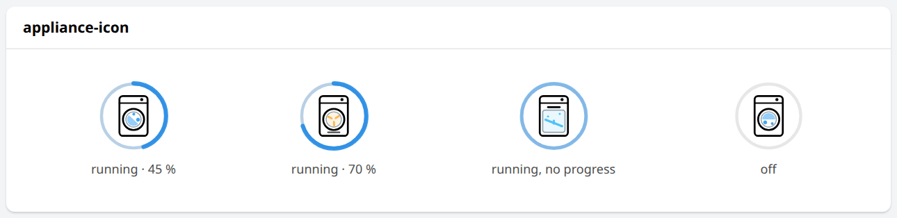

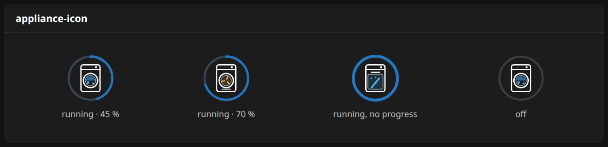

```yaml
component: widget:appliance-icon
config:
  kind: dryer
  running: =items.miele_tumble_dryer_twc560wp_program_progress.state !== 'UNDEF'
  progress: =Number(items.miele_tumble_dryer_twc560wp_program_progress.numericState) || 0
  size: 72
```

| Prop | Description | Type | Default |
|---|---|---|---|
| `kind` | The appliance drawn | TEXT |  |
| `running` | Whether it runs; usually an expression | BOOLEAN |  |
| `progress` | Program progress in %, filling the ring while it runs; empty: the ring pulses | DECIMAL |  |
| `color` | Colour of the ring as #rrggbb | TEXT | `#1e88e5` |
| `size` | Width and height in px | INTEGER | `72` |

### Appliance tile: `appliance-tile`

An appliance as a tile of the appliances card: its icon, name and state; a tap opens the page `popup` as a popup. A
Miele machine comes with the items of its program (`progress`, `state`, `program`, `phase`, `finished`, `remaining`, as
the Miele binding provides them): the ring shows the progress, the state chip is blue while it runs, green when it is
finished and grey otherwise, beside it the remaining time, and program, phase and end time below. A machine behind a
metered plug comes with its `power` and an optional `done` switch: it runs above 10 W, is finished while `done` is on,
and its ring pulses. Put the tiles in a grid, e.g. two columns.


```yaml
- component: widget:appliance-tile
  config:
    kind: washer
    title: Washing Machine 1
    popup: washing_machine_1
    progress: miele_washing_machine_wwg360_program_progress
    state: miele_washing_machine_wwg360_operation_state
    program: miele_washing_machine_wwg360_active_program
    phase: miele_washing_machine_wwg360_program_phase
    finished: miele_washing_machine_wwg360_program_finished_time
    remaining: miele_washing_machine_wwg360_program_remaining_time
- component: widget:appliance-tile
  config:
    kind: washer
    title: Washing Machine 2
    popup: washing_machine_2
    power: washing_machine_2_power
    done: washing_machine_2_finished
```

Needs `appliance-icon`.

| Prop | Description | Type | Default |
|---|---|---|---|
| `kind` | The appliance drawn | TEXT |  |
| `title` | The appliance's name | TEXT |  |
| `popup` | The uid of the page a tap opens as a popup | TEXT |  |
| `progress` | Miele item _program_progress, e.g. miele_washing_machine_program_progress; set for a Miele machine | Item |  |
| `state` | Miele item _operation_state, e.g. miele_washing_machine_operation_state; set for a Miele machine | Item |  |
| `program` | Miele item _active_program, e.g. miele_washing_machine_active_program; set for a Miele machine | Item |  |
| `phase` | Miele item _program_phase, e.g. miele_washing_machine_program_phase; set for a Miele machine | Item |  |
| `finished` | Miele item _program_finished_time, e.g. miele_washing_machine_program_finished_time; set for a Miele machine | Item |  |
| `remaining` | Miele item _program_remaining_time, e.g. miele_washing_machine_program_remaining_time; set for a Miele machine | Item |  |
| `power` | The plug's power item, for a machine without program data | Item |  |
| `done` | Switch item that is on while the plug machine is finished | Item |  |
| `since` | DateTime item holding since when the plug machine runs (UNDEF at rest) | Item |  |

## Weather

### Weather icon: `weather-icon`

The weather drawn from a symbol in the style of the energy flow's nodes: the sun, its rays turning slowly, or the moon
while `day` is false. The sky in five levels: `clear` alone, `fair` with a small cloud, `partly` behind a cloud of its
size, `mostly` peeking out behind a large cloud with a darker one behind it, `overcast` as two clouds; `veil` behind
three thin streaks; a raised cloud over `fog`, falling `rain`, drifting white `snow` or a flickering bolt (`thunder`),
with the sun peeking out at its top left for showers (`rain_sun`, `snow_sun`, `thunder_sun`). Nothing for any other
value, as an item is `NULL` after a restart. My rule works the symbol out from Open-Meteo: a day's sky from the share of
its daylight the sun shines, an hour's from the cloud layers, the high ones counted half. My weather bar shows the
present weather with it, and my weather page each day's, beside its hours of sunshine with their share of the daylight
and the strongest wind with an arrow of its dominant direction and its compass point, above a chart of the next 60
hours: temperature with the weather drawn above it and over the precipitation of each hour, the wind below with arrows
of its direction, both every three hours; ECharts takes no widget, so the drawings there are this widget's layers as
still SVG images. That page is part of my installation, not a widget of this repository; its rule writes the forecast as
JSON into String items, and the chart reads them through an `oh-data-series` whose `data` is an expression such as
`=JSON.parse(items.weather_hourly.state).map((r) => [r[0] * 1000, r[1]])`, with no persistence involved. The warnings in
the screenshots are demo values.

| Light | Dark |
|---|---|
| 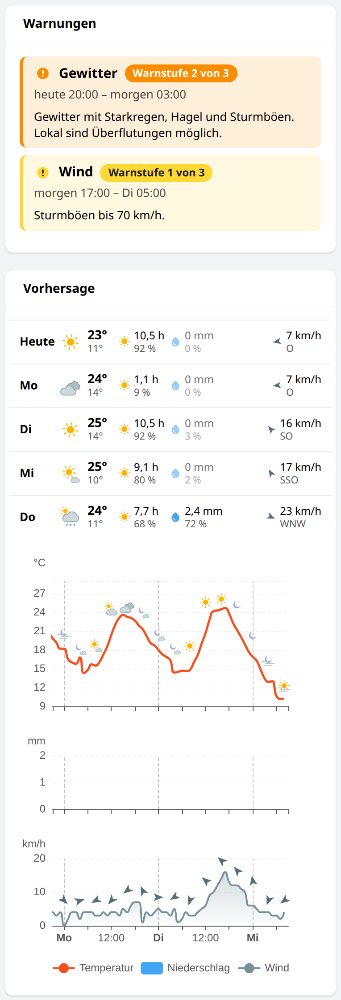 | 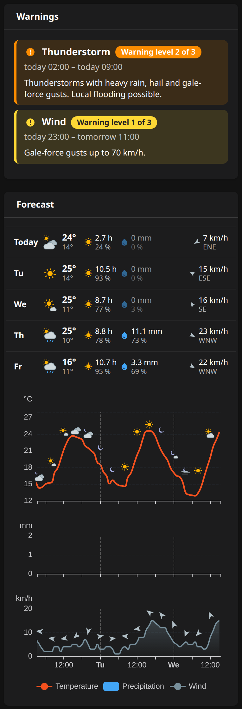 |

```yaml
component: widget:weather-icon
config:
  symbol: =items.weather_symbol.state
  day: =items.weather_is_day.state !== 'OFF'
  size: 36
```

| Prop | Description | Type | Default |
|---|---|---|---|
| `symbol` | The weather drawn: clear, fair, partly, mostly, overcast, veil, fog, rain, snow, thunder, rain_sun, snow_sun, thunder_sun; usually an expression | TEXT |  |
| `day` | Whether the sun is up; false draws the moon; usually an expression | BOOLEAN | `true` |
| `size` | Width and height in px | INTEGER | `36` |

### Weather day: `weather-day`

The popup a day of my weather page opens: at the top the day in quarter hours as the page's chart draws the next hours,
from midnight to midnight (MainUI's day chart, `chartType: day`, its `future` the days from today); below it the day
hour by hour in the columns of the page's day rows (the time, the weather drawn with `weather-icon`, the temperature,
the minutes of sunshine, the precipitation with its probability, the wind with an arrow of its direction and its compass
point), the present hour on a grey band and the hours gone by pale. Both titles name the day. Two chevrons at the right
of the popup's navbar step to the day before or after, within the forecast's five days from today: they set a variable
of an `oh-context` around the content, and they stand fixed in the navbar's place (the popup's transform makes it their
containing block; a global rule takes the popup content's `z-index` away, so the navbar does not cover them). It reads
two String items my weather rule writes as JSON for the five days of the forecast: the hours (`[time, temperature,
precipitation, wind, direction, symbol, day, probability, sunshine minutes]`) and the quarter hours (`[time,
temperature, precipitation, wind, direction]`); `date` is the day's midnight in epoch seconds. Open it from a link:

| Light | Dark |
|---|---|
| 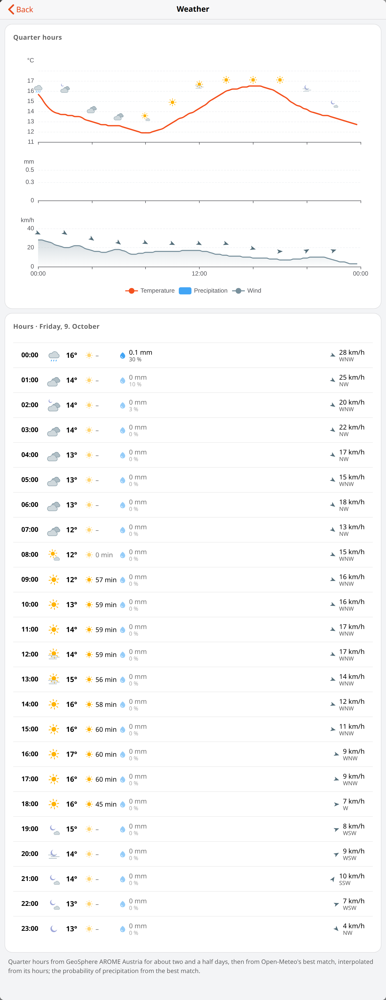 | 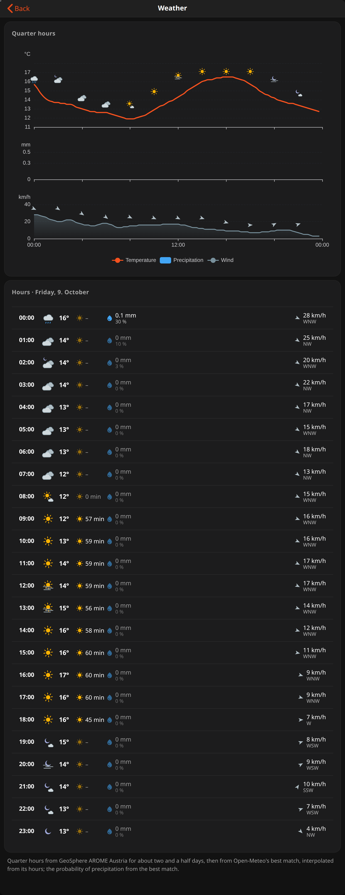 |

```yaml
action: popup
actionModal: widget:weather-day
actionModalConfig:
  date: =loop.day.t
  weatherHourlyDays: weather_hourly_days
  weatherQuarterHours: weather_quarter_hours
```

Needs `weather-icon`.

| Prop | Item | Item type |
|---|---|---|
| `weatherQuarterHours` | Weather Quarter Hours of the Five Days | String |
| `weatherHourlyDays` | Weather Hours of the Five Days | String |

## Plug cards

Four cards for a metered plug, built from one item prefix: `<prefix>_power`, `_switch`, `_energy_today`,
`_energy_total`, `_voltage`, `_current`, `_power_factor`, `_apparent_power` and `_reactive_power`, as a Tasmota plug
provides them. On a device page they stand two by two: the plug card beside the electrical card, titled after the
meter (`Electrical · Nous Plug`, `Electrical · Shelly EM`), and the power over the day beside the energy per day; where
the plug card is far taller (a car with `range` and a note), the two stand one above the other, and the power over the
day takes the height beside them. `plug-card` also covers devices that are not plugs: give it
the device's `title`, hide the switch with `controllable: false`, or take the switch from another item with `switch`.

The comparisons with yesterday and the last 7 days come from one String item, `history`, which the rule in
[`scripts/openhab-ui/applied/tile_history.py`](scripts/openhab-ui/applied/tile_history.py) writes every ten minutes:
for each item its value yesterday and the mean of the last 7 days at this time, and the same ten minutes later, between
which the cards interpolate to the current minute; so no widget queries persistence for a comparison.

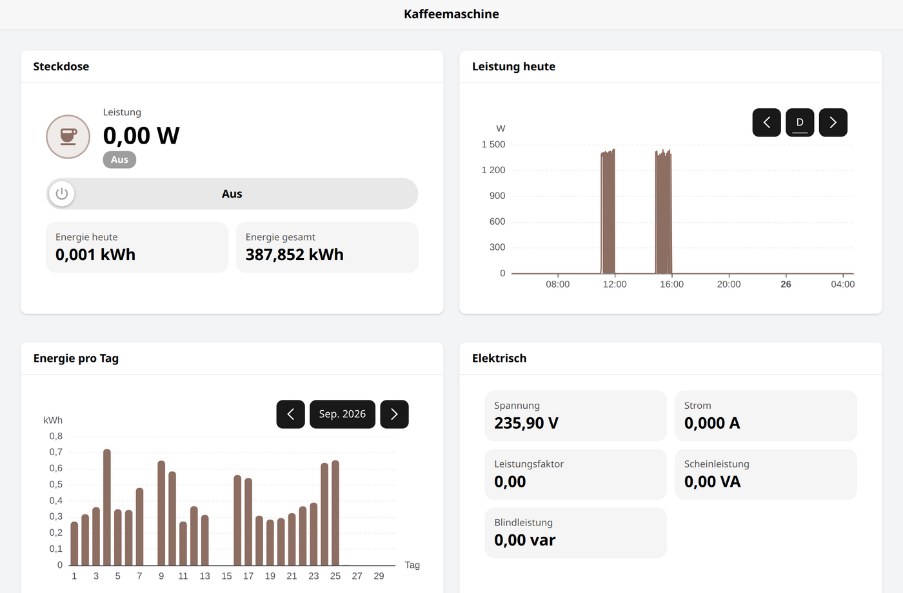

### `plug-card`

Now: the device's icon large in a ring, pulsing while it works (its energy-flow node or appliance icon, else its icon), power, on/off pill, today's energy against yesterday at this time and the mean of the last 7 days, the total on rollers like a meter's; with `range` (kWh per 100 km) a road with the car where today's charge would take it. Needs `appliance-icon`, `flow-node`, `item-popup`, `power-pill`.

| Prop | Description | Type | Default |
|---|---|---|---|
| `prefix` | Name prefix of the plug's items: `<prefix>_power`, _switch, _energy_today, _energy_total, _voltage, _current, _power_factor, _apparent_power, _reactive_power | TEXT |  |
| `title` | Card title, the device's name where the card is not a plug | TEXT | `Plug` |
| `icon` | Device icon, e.g. material:coffee | TEXT | `material:power` |
| `color` | Device colour as #rrggbb | TEXT | `#8d6e63` |
| `controllable` | Show the plug's switch | BOOLEAN | `true` |
| `note` | Small print under the energies, hidden when empty | TEXT |  |
| `switch` | The switch's item where it is not `<prefix>_switch`, e.g. a shared meter's | Item |  |
| `kind` | The device drawn in its icon: an energy-flow node or an appliance; empty: the icon above | TEXT |  |
| `threshold` | Watts above which the icon's ring pulses | INTEGER | `10` |
| `active` | Whether the device works, instead of the threshold; usually an expression | BOOLEAN |  |
| `frequency` | The heat pump's compressor frequency, turning its drawing's fan; usually an expression | DECIMAL |  |
| `progress` | An appliance's programme progress in %, filling its ring; usually an expression | DECIMAL |  |
| `range` | kWh per 100 km of a car: today's charge shown as the kilometres it drives | DECIMAL |  |
| `history` | The String item the rule tile_history writes the tiles' history into (comparison with yesterday) | Item |  |

### `plug-power-card`

Power over the day.

| Prop | Description | Type | Default |
|---|---|---|---|
| `prefix` | Name prefix of the plug's items: `<prefix>_power`, _switch, _energy_today, _energy_total, _voltage, _current, _power_factor, _apparent_power, _reactive_power | TEXT |  |
| `color` | Device colour as #rrggbb | TEXT | `#8d6e63` |

### `plug-energy-days-card`

Energy per day of the month.

| Prop | Description | Type | Default |
|---|---|---|---|
| `prefix` | Name prefix of the plug's items: `<prefix>_power`, _switch, _energy_today, _energy_total, _voltage, _current, _power_factor, _apparent_power, _reactive_power | TEXT |  |
| `color` | Device colour as #rrggbb | TEXT | `#8d6e63` |

### `plug-electric-card`

Voltage in its band of 230 V ± 10 %, current against the socket's 16 A, active, reactive and apparent power as a triangle with the power factor rated; the triangle's tile takes the height a taller card beside it leaves, the triangle in its middle, and keeps its size without load. Needs `item-popup`.

| Prop | Description | Type | Default |
|---|---|---|---|
| `prefix` | Name prefix of the plug's items: `<prefix>_power`, _switch, _energy_today, _energy_total, _voltage, _current, _power_factor, _apparent_power, _reactive_power | TEXT |  |
| `title` | Card title | TEXT | `Electrical` |

## Item popup: `item-popup`

The popup every tile of my device pages opens, in place of the analyzer: the item's value large and its course over
the day with arrows for earlier days, as a line for measurements or as a band of states for switches, texts and
numbers with state options (labelled from the `states` prop), or the value alone for dates. Given a second item
(`item2`, with `name`, `name2` and `color2`), it shows both values side by side and their courses as two lines, as my
tiles of two values (flow and return) open it. Open it from any link with `action: popup`, `actionModal:
widget:item-popup` and its props in `actionModalConfig`:

```yaml
action: popup
actionModal: widget:item-popup
actionModalConfig:
  item: coffee_machine_energy_today
  title: Energy today
  kind: number
```

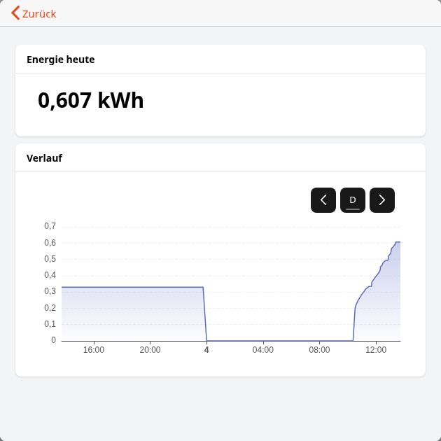

| Prop | Description | Type | Default |
|---|---|---|---|
| `item` | The item to show | Item |  |
| `title` | Title of the popup, the tile's | TEXT |  |
| `color` | Colour of the course as #rrggbb | TEXT | `#5c6bc0` |
| `kind` | number: its course as a line; state: a band of its states; none: only the value | TEXT | `number` |
| `states` | value=label pairs, comma-separated, for the band of states | TEXT |  |
| `item2` | A second item, shown beside the first and as a second line | Item |  |
| `name` | The first item's name beside a second item; empty: the title | TEXT |  |
| `name2` | The second item's name | TEXT |  |
| `color2` | Colour of the second item's value and line as #rrggbb | TEXT | `#78909c` |

## Value tile: `value-tile`

The plain tile for a value: a title over the value, in the text colour. My
device pages and popups give most values a form of their own now (a scale, a rating, a course); the tile stays for
states, texts and counters, and in the heat pump card. The screenshot shows it with the air conditioner's values.
Pass the value as an expression; it is evaluated where the tile is placed. With `item` a tap opens the item popup.
The tile's lengths are em of its font size, 14 px unless `fontSize` sets another, so `fontSize: 1.1em` makes it a
tenth larger and lets it grow with a card that scales its font. `wrap` lets a long text wrap across the whole row of
a grid.

```yaml
component: widget:value-tile
config:
  title: Flow
  value: =items.espaltherma_leaving_water_temp_after_buh.displayState
  color: "#e57373"
  item: espaltherma_leaving_water_temp_after_buh
```

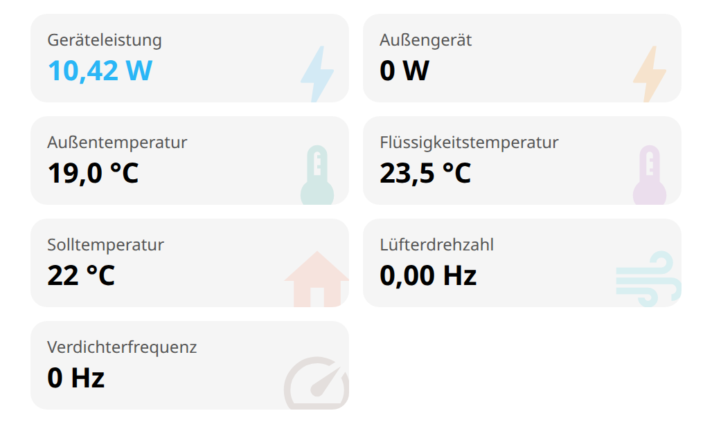

| Prop | Description | Type | Default |
|---|---|---|---|
| `title` | Title above the value | TEXT |  |
| `value` | The text to show, usually an expression on an item | TEXT |  |
| `color` | Colour of the item popup's course as #rrggbb | TEXT |  |
| `item` | The item whose popup a tap opens; empty: no tap | Item |  |
| `action` | popup: the item popup (widget item-popup); options: the item's command options | TEXT | `popup` |
| `kind` | What the item popup shows: number, state or none | TEXT | `number` |
| `states` | value=label pairs, comma-separated, for the item popup's band of states | TEXT |  |
| `wrap` | A long text wraps across the whole row of the grid instead of being cut | BOOLEAN |  |
| `fontSize` | The tile's base size, e.g. 1.1em to grow with its card; default 14px | TEXT |  |

## About these widgets

The widgets are generated from Python by the script that builds my whole MainUI, which keeps the cards of the
dashboard and the device pages consistent; that is why their YAML is dense and machine-formatted. The script and its
tools are in [`scripts/openhab-ui/`](scripts/openhab-ui/): `dashboard.py`, the headless-Chrome tools behind the
screenshots, and the one-off JSONDB changes in `applied/`. The cards are
built from the smaller widgets wherever a part stands in more than one place or makes sense on its own, so a fix in
one widget reaches every place it stands. The widgets in this repository are exported from that script unchanged.
