# openHAB Widgets

MainUI widgets from my openHAB 5 installation: the cards of an energy and home dashboard and the parts they are built
from, which work on their own too: device panels with their heads, pills, bars and sliders, the nodes and lines of the
energy flow, appliance icons and tiles, a weather drawing; besides them a set of cards for every metered plug, a popup
for any item and the tile their values stand in. The UI texts are German, numbers use a decimal comma. No widget names
an item: every item comes in as a prop, so the widgets work with any item names.


| Dark mode | Phone |
|---|---|
|  |  |

## Installing a widget

In MainUI open *Developer Tools → Widgets*, create a widget and replace its code with the content of a `.yml` file from
this repository. Use it on a layout page as a component `widget:<uid>` with its props, for example:

```yaml
- component: widget:plug-card
  config:
    prefix: coffee_machine
    title: Kaffeemaschine
    icon: material:coffee
    color: "#8d6e63"
```

Many widgets place other widgets of this repository; install those too, under the same uids. Every section below
names the widgets one needs, directly or through the widgets it places.

The widgets rely on MainUI of openHAB 5 (SVG and CSS in card content, `:has()` for hover highlights, `color-mix()`,
aggregate chart series, `oh-context` variables). Values are shown through the items' state descriptions, so units and
number formats come from the items.

| Widget | Needs |
|---|---|
| `air-conditioner-controls` | `boost-button`, `boost-pill`, `device-head`, `pill-slider`, `pill-switch`, `state-bar` |
| `appliance-icon` | – |
| `appliance-tile` | `appliance-icon` |
| `appliances-card` | `appliance-icon`, `appliance-tile` |
| `boost-button` | – |
| `boost-pill` | – |
| `consumption-card` | – |
| `controls-card` | `air-conditioner-controls`, `boost-button`, `boost-pill`, `device-head`, `heatpump-controls`, `pill-slider`, `pill-switch`, `state-bar`, `switch-tile`, `ventilation-controls` |
| `device-head` | `boost-button`, `pill-switch`, `state-bar` |
| `electricity-price-card` | – |
| `energy-days-card` | – |
| `energy-flow-card` | `flow-link`, `flow-node`, `flow-share-ring` |
| `flow-link` | – |
| `flow-node` | – |
| `flow-share-ring` | – |
| `heatpump-card` | `flow-node`, `item-popup`, `value-tile` |
| `heatpump-controls` | `boost-button`, `device-head`, `pill-slider`, `pill-switch`, `state-bar` |
| `item-popup` | – |
| `pill-slider` | – |
| `pill-switch` | – |
| `plug-card` | `item-popup`, `power-pill`, `value-tile` |
| `plug-electric-card` | `item-popup`, `value-tile` |
| `plug-energy-days-card` | – |
| `plug-power-card` | – |
| `power-pill` | – |
| `pv-days-card` | – |
| `state-bar` | – |
| `switch-row` | – |
| `switch-tile` | – |
| `temperatures-card` | – |
| `value-tile` | `item-popup` |
| `ventilation-controls` | `boost-button`, `device-head`, `pill-slider`, `pill-switch`, `state-bar` |
| `weather-card` | `weather-icon` |
| `weather-icon` | – |

## Dashboard cards

The cards of my overview page. Each takes the items it shows as props; the prop names say what an item is. Some
elements open popup pages of my installation when tapped (`page:flow_*`, `page:hp_*`, `page:appliance_*`,
`page:forecast`); they are not part of this repository.

### Weather: `weather-card`

A slim bar across the top: the present weather drawn in the style of the energy flow (`weather-icon`: sun or moon, alone
or behind a cloud, clouds with rain, snow, a bolt or fog, gently animated), the outdoor temperature from a local sensor,
and the minimum and maximum of today and the next two days. While an official warning of GeoSphere Austria is in effect
or begins within 24 hours, it is teased beside the temperature: a disc in its level's colour (yellow, orange, red) with
an exclamation mark and a ring pulsing out of it, on a wider screen in a pill with the warning's short text (*Gewitter
bis 20:00*). On a phone the gaps narrow, and below 380 px the chevron goes, so the bar keeps its fit. A tap opens the
forecast popup of my installation (see [Weather](#weather)). Its items come from two rules,
`scripts/openhab-ui/applied/weather_forecast_rule.js`, which reads Open-Meteo's GeoSphere AROME Austria model, and
`weather_warnings_rule.js`, which reads GeoSphere Austria's warnings and sends a broadcast notification when their level
rises to orange or red.

Needs `weather-icon`.


<details>
<summary>11 props</summary>

| Prop | Item | Item type |
|---|---|---|
| `weatherCode` | Wetter aktuell | Number |
| `weatherIsDay` | Wetter Tag | Switch |
| `heatpumpExtAmbientTemp` | ESPAltherma Außentemperatur | Number:Temperature |
| `weatherWarningLevel` | Wetterwarnung Stufe | Number |
| `weatherWarningText` | Wetterwarnung | String |
| `weatherDay0Min` | Wetter heute Min. | Number:Temperature |
| `weatherDay0Max` | Wetter heute Max. | Number:Temperature |
| `weatherDay1Min` | Wetter morgen Min. | Number:Temperature |
| `weatherDay1Max` | Wetter morgen Max. | Number:Temperature |
| `weatherDay2Min` | Wetter übermorgen Min. | Number:Temperature |
| `weatherDay2Max` | Wetter übermorgen Max. | Number:Temperature |

</details>

### Controls: `controls-card`

Heat pump, air conditioner and ventilation, each folded to a head of three lines with its main action on the right: a
Boost button for the heat pump's hot water, the air conditioner's on/off pill, the ventilation levels 1 to 3; the heat
pump's second line names which of its switches are on and which off. A tap on a head folds out its details, each group
under its icon and title: Smart Grid, Betrieb (the switch pills Heizung, Warmwasser and Automatik, each with the icon of
what it switches, three abreast where there is room and two and one on a phone) and sliders for the DHW setpoint and the
leaving water offset; mode, fan, setpoint, boost and timer (usable while the unit is off); the ventilation timer. Below
them tiles that toggle plugs and show their power. The three devices are the widgets `heatpump-controls`,
`air-conditioner-controls` and `ventilation-controls`, the tiles `switch-tile`.

Needs `air-conditioner-controls`, `boost-button`, `boost-pill`, `device-head`, `heatpump-controls`, `pill-slider`,
`pill-switch`, `state-bar`, `switch-tile`, `ventilation-controls`.

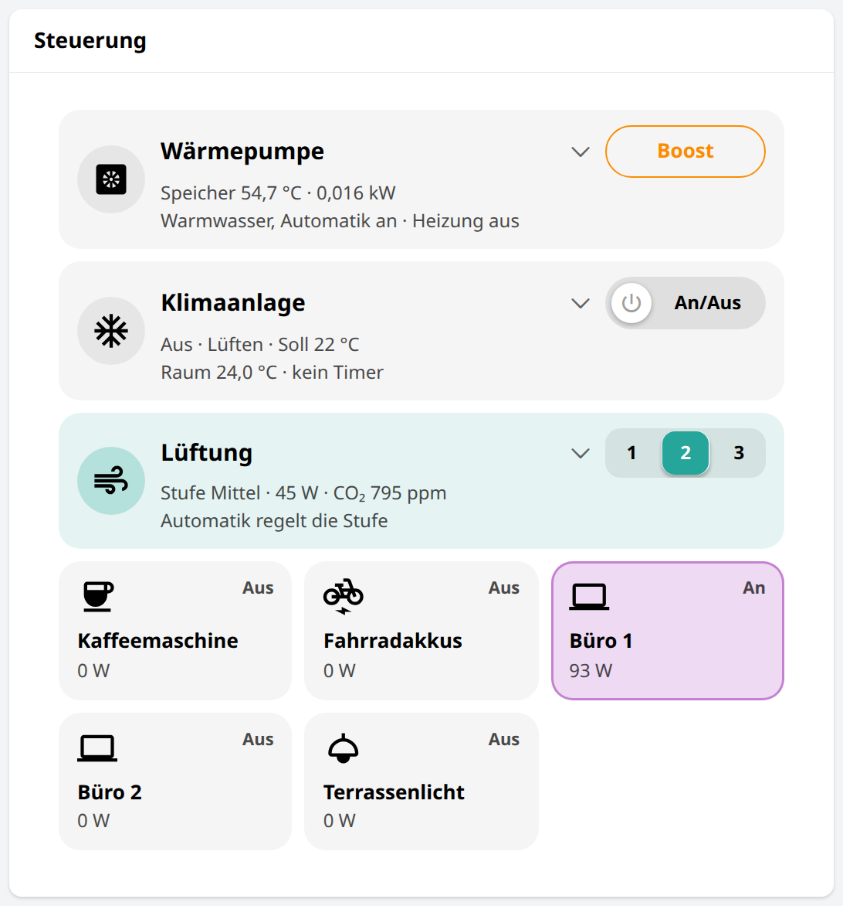

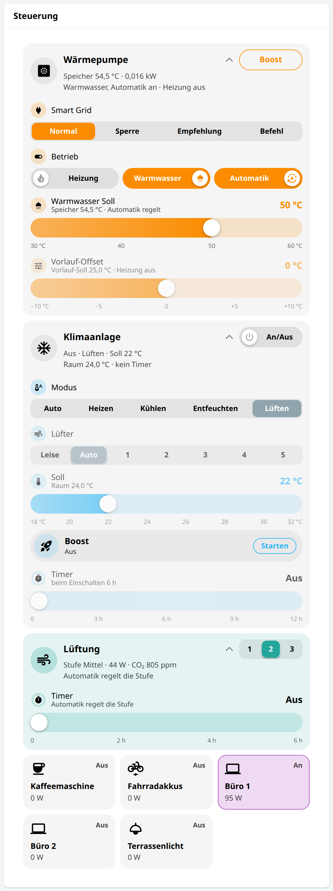

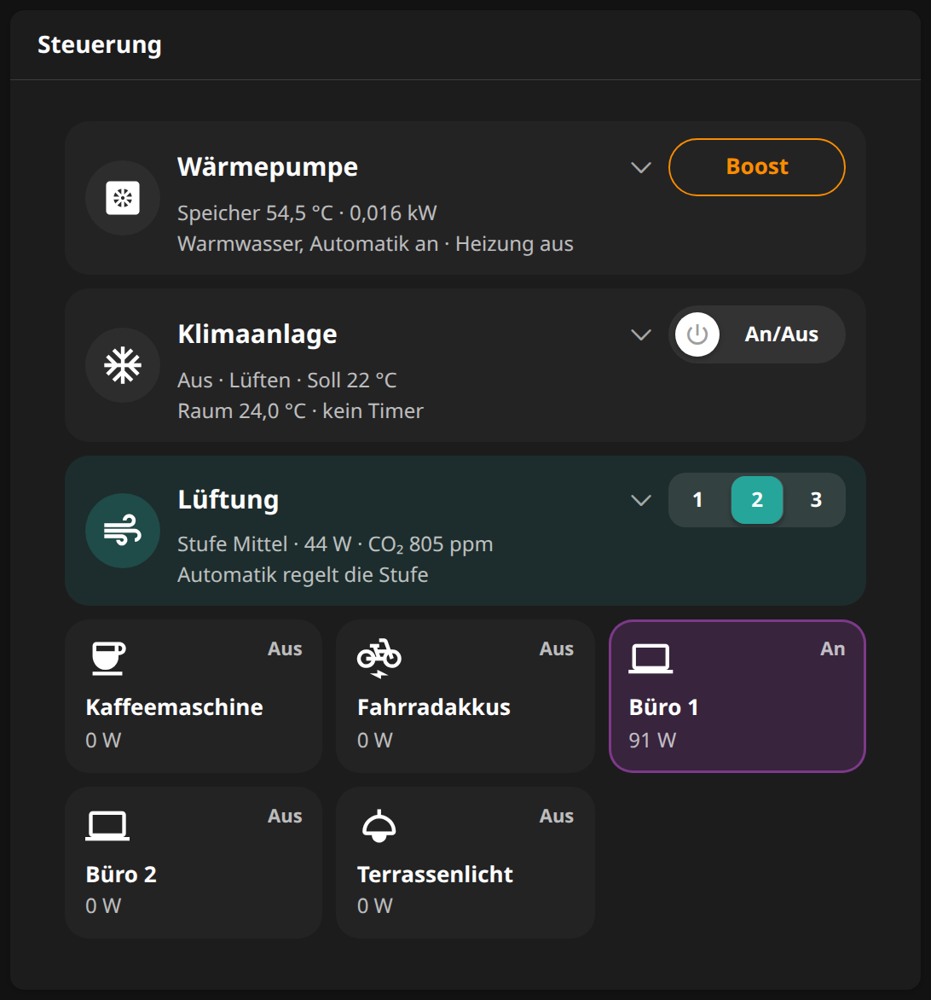

<details>
<summary>33 props</summary>

| Prop | Item | Item type |
|---|---|---|
| `heatpumpPower` | ESPAltherma Elektrische Leistung | Number:Power |
| `heatpumpDhwBoost` | Pyaltherma Warmwasser-Boost | Switch |
| `heatpumpDhwTankTemp` | ESPAltherma Warmwasserspeicher Temperatur | Number:Temperature |
| `heatpumpClimateControlPower` | Pyaltherma Heizung Ein/Aus | Switch |
| `heatpumpDhwPower` | Pyaltherma Warmwasser Ein/Aus | Switch |
| `heatpumpManagement` | Wärmepumpe Automatik | Group |
| `heatpumpSmartGrid` | ESPAltherma Smart Grid | String |
| `heatpumpDhwTempHeating` | Pyaltherma Warmwasser Solltemperatur | Number:Temperature |
| `heatpumpDhwManagement` | Wärmepumpe Warmwasser-Automatik | Switch |
| `heatpumpLeavingWaterTempOffsetHeating` | Pyaltherma Vorlauf-Offset Heizen | Number:Temperature |
| `heatpumpLeavingWaterSetpoint` | ESPAltherma Vorlauf Sollwert | Number:Temperature |
| `acSwitch` | Faikout Perfera Schalter | Switch |
| `acMode` | Faikout Perfera Modus | String |
| `acTemperatureSetpoint` | Faikout Perfera Solltemperatur | Number:Temperature |
| `acTemperature` | Faikout Perfera Temperatur | Number:Temperature |
| `acTimer` | Klimaanlage Timer | Number:Time |
| `acFan` | Faikout Perfera Lüfter | String |
| `acPowerful` | Faikout Perfera Powerful | Switch |
| `ventilationLevel` | ESPLyfterl Stufe | String |
| `ventilationPower` | Lüftung Leistung | Number:Power |
| `netatmoWeatherstationCo2` | Netatmo Wetterstation CO2 | Number:Dimensionless |
| `ventilationTimer` | Lüftung Timer | Number:Time |
| `ventilationManagement` | Lüftung Automatik | Group |
| `coffeeMachineSwitch` | Kaffeemaschine Schalter | Switch |
| `coffeeMachinePower` | Kaffeemaschine Leistung | Number:Power |
| `bicycleBatteriesSwitch` | Fahrradakkus Schalter | Switch |
| `bicycleBatteriesPower` | Fahrradakkus Leistung | Number:Power |
| `office1Switch` | Büro 1 Schalter | Switch |
| `office1Power` | Büro 1 Leistung | Number:Power |
| `office2Switch` | Büro 2 Schalter | Switch |
| `office2Power` | Büro 2 Leistung | Number:Power |
| `terraceLightSwitch` | Terrassenlicht Schalter | Switch |
| `terraceLightPower` | Terrassenlicht Leistung | Number:Power |

</details>

### Energy flow: `energy-flow-card`

A regular star around the house: PV, heat pump, air conditioner, E-Car, battery and grid, each with its power and
today's energy. Dots run along the lines in the direction of the flow at four speeds and slide under the node rims; the
icons move with the power (sun rays, fan, air streams, pylon dashes, a pulsing bolt over the charging car, the battery
filled to its state of charge). Rings for today's self-consumption and self-sufficiency sit in the free corner. The card
places its lines, nodes and rings as `flow-link`, `flow-node` and `flow-share-ring`. The recording and the dark
screenshot show it with demo values.

Needs `flow-link`, `flow-node`, `flow-share-ring`.


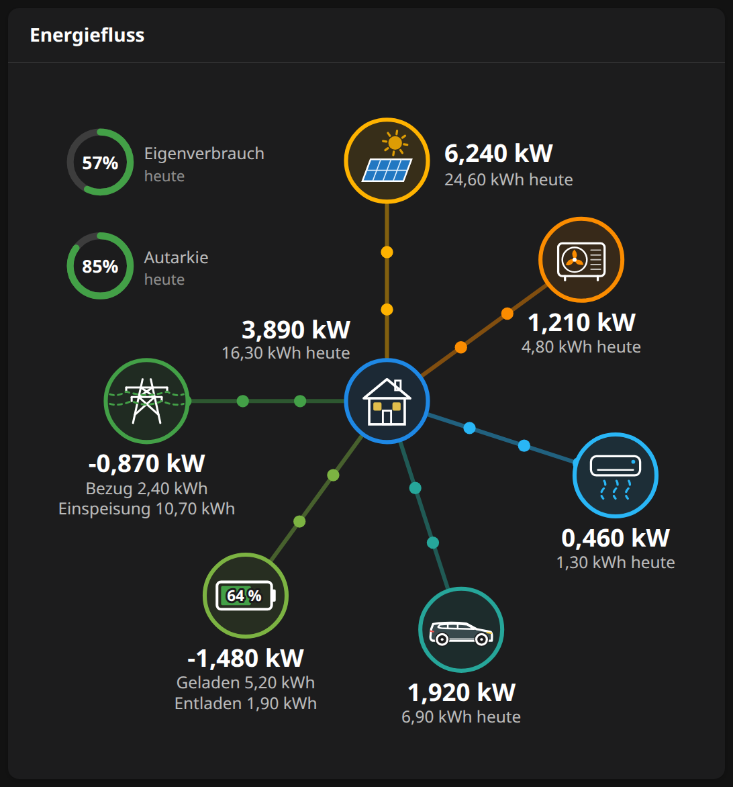

<details>
<summary>19 props</summary>

| Prop | Item | Item type |
|---|---|---|
| `pvPower` | Wechselrichter Eingangsleistung | Number:Power |
| `gridPower` | Stromzähler Wirkleistung | Number:Power |
| `heatpumpPower` | ESPAltherma Elektrische Leistung | Number:Power |
| `acSwitch` | Faikout Perfera Schalter | Switch |
| `acUnitPower` | Klimaanlage Geräteleistung | Number:Power |
| `ecarPower` | E-Auto Leistung | Number:Power |
| `batteryPower` | Batteriespeicher Leistung | Number:Power |
| `homePower` | Haus Leistung | Number:Power |
| `batterySoc` | Batteriespeicher Ladestand | Number:Dimensionless |
| `pvEnergyToday` | Wechselrichter Ertrag heute | Number:Energy |
| `pvSelfUseToday` | Photovoltaik Eigenverbrauch heute | Number:Energy |
| `homeEnergyToday` | Haus Energie heute | Number:Energy |
| `gridImportToday` | Stromzähler Bezug heute | Number:Energy |
| `gridExportToday` | Stromzähler Einspeisung heute | Number:Energy |
| `heatpumpEnergyToday` | ESPAltherma Energie heute | Number:Energy |
| `acUnitEnergyToday` | Klimaanlage Geräteenergie heute | Number:Energy |
| `ecarEnergyToday` | E-Auto Energie heute | Number:Energy |
| `batteryChargeToday` | Batteriespeicher Ladung heute | Number:Energy |
| `batteryDischargeToday` | Batteriespeicher Entladung heute | Number:Energy |

</details>

### Appliances: `appliances-card`

Washing machines, dryer and dishwasher as `appliance-tile`s, each drawn inside a ring filled with the program progress;
drums and paddles turn and the spray arm sprays while they run, with a pill for the remaining time.

Needs `appliance-icon`, `appliance-tile`.


<details>
<summary>20 props</summary>

| Prop | Item | Item type |
|---|---|---|
| `washer1ProgramProgress` | Miele Waschmaschine WWG360 Fortschritt | Number:Dimensionless |
| `washer1OperationState` | Miele Waschmaschine WWG360 Status | String |
| `washer1ActiveProgram` | Miele Waschmaschine WWG360 Programm | String |
| `washer1ProgramPhase` | Miele Waschmaschine WWG360 Programmphase | String |
| `washer1ProgramFinishedTime` | Miele Waschmaschine WWG360 Fertig um | DateTime |
| `washer1ProgramRemainingTime` | Miele Waschmaschine WWG360 Restzeit | Number |
| `washingMachine2Power` | Waschmaschine 2 Leistung | Number:Power |
| `washingMachine2Finished` | Waschmaschine 2 Fertig | Switch |
| `dryerProgramProgress` | Miele Wäschetrockner TWC560WP Fortschritt | Number:Dimensionless |
| `dryerOperationState` | Miele Wäschetrockner TWC560WP Status | String |
| `dryerActiveProgram` | Miele Wäschetrockner TWC560WP Programm | String |
| `dryerProgramPhase` | Miele Wäschetrockner TWC560WP Programmphase | String |
| `dryerProgramFinishedTime` | Miele Wäschetrockner TWC560WP Fertig um | DateTime |
| `dryerProgramRemainingTime` | Miele Wäschetrockner TWC560WP Restzeit | Number |
| `dishwasherProgramProgress` | Miele Geschirrspüler G7465 Fortschritt | Number:Dimensionless |
| `dishwasherOperationState` | Miele Geschirrspüler G7465 Status | String |
| `dishwasherActiveProgram` | Miele Geschirrspüler G7465 Programm | String |
| `dishwasherProgramPhase` | Miele Geschirrspüler G7465 Programmphase | String |
| `dishwasherProgramFinishedTime` | Miele Geschirrspüler G7465 Fertig um | DateTime |
| `dishwasherProgramRemainingTime` | Miele Geschirrspüler G7465 Restzeit | Number |

</details>

### Electricity price: `electricity-price-card`

The all-in price, the cheapest and priciest hour, and the prices 12 hours back and 36 hours ahead, coloured green,
orange and red by price.


<details>
<summary>6 props</summary>

| Prop | Item | Item type |
|---|---|---|
| `priceTotalGross` | Strompreis gesamt brutto | Number:EnergyPrice |
| `priceCheapestHour` | Günstigste Stunde | DateTime |
| `pricePriciestHour` | Teuerste Stunde | DateTime |
| `priceTotalNet` | Strompreis gesamt netto | Number:EnergyPrice |
| `priceMarketGross` | Strompreis Markt brutto | Number:EnergyPrice |
| `priceMarketNet` | Strompreis Markt netto | Number:EnergyPrice |

</details>

### Heat pump: `heatpump-card`

A section through the house: outdoor unit on the roof (the energy flow's `flow-node`), wall unit, three-way valve and
DHW tank in the basement, floor heating and radiators on their levels, with the flow animated along the pipes as the
valve decides. Beside it the power, today's energies split into space heating, DHW and standby, and daily COPs. The
drawing scales so its circles come out as large as the energy flow's. On a wide screen the figures beside it take the
room the drawing leaves and grow with it, up to one and a half times their size.

Needs `flow-node`, `item-popup`, `value-tile`.

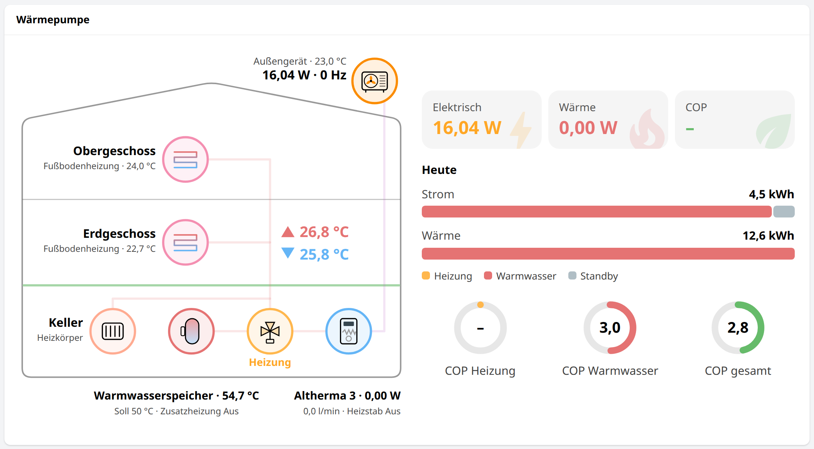

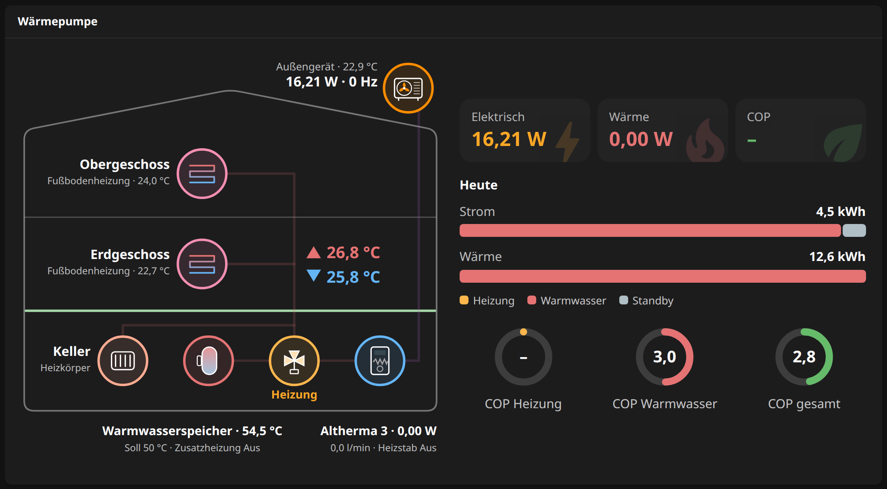

<details>
<summary>28 props</summary>

| Prop | Item | Item type |
|---|---|---|
| `heatpumpDhwTankTemp` | ESPAltherma Warmwasserspeicher Temperatur | Number:Temperature |
| `heatpumpInvFrequency` | ESPAltherma Verdichterfrequenz | Number:Frequency |
| `heatpumpWaterPumpOperation` | ESPAltherma Umwälzpumpe | Switch |
| `heatpumpFlowSensor` | ESPAltherma Durchfluss | Number:VolumetricFlowRate |
| `heatpumpValve` | ESPAltherma 3-Wege-Ventil | String |
| `heatpumpPower` | ESPAltherma Elektrische Leistung | Number:Power |
| `heatpumpBuhStep1Mode` | ESPAltherma Heizstab Stufe 1 | Switch |
| `heatpumpBuhStep2Mode` | ESPAltherma Heizstab Stufe 2 | Switch |
| `heatpumpBshMode` | ESPAltherma Zusatzheizung Speicher | Switch |
| `heatpumpExtAmbientTemp` | ESPAltherma Außentemperatur | Number:Temperature |
| `heatpumpDefrostOperaton` | ESPAltherma Abtauen | Switch |
| `acTemperature` | Faikout Perfera Temperatur | Number:Temperature |
| `heatpumpIndoorAmbientTemp` | ESPAltherma Raumtemperatur | Number:Temperature |
| `heatpumpLeavingWaterTempAfterBuh` | ESPAltherma Vorlauftemperatur nach Heizstab | Number:Temperature |
| `heatpumpInletWaterTemp` | ESPAltherma Rücklauftemperatur | Number:Temperature |
| `heatpumpDhwSetpoint` | ESPAltherma Warmwasser Sollwert | Number:Temperature |
| `heatpumpHeatPower` | ESPAltherma Heizleistung | Number:Power |
| `heatpumpCop` | ESPAltherma COP | Number |
| `heatpumpEnergyToday` | ESPAltherma Energie heute | Number:Energy |
| `heatpumpEnergySpaceToday` | ESPAltherma Energie Heizung heute | Number:Energy |
| `heatpumpEnergyDhwToday` | ESPAltherma Energie Warmwasser heute | Number:Energy |
| `heatpumpEnergyStandbyToday` | ESPAltherma Energie Standby heute | Number:Energy |
| `heatpumpHeatingEnergyToday` | ESPAltherma Heizenergie heute | Number:Energy |
| `heatpumpHeatingEnergySpaceToday` | ESPAltherma Heizenergie Heizung heute | Number:Energy |
| `heatpumpHeatingEnergyDhwToday` | ESPAltherma Heizenergie Warmwasser heute | Number:Energy |
| `heatpumpDcopSpace` | ESPAltherma Tages-COP Heizung | Number |
| `heatpumpDcopDhw` | ESPAltherma Tages-COP Warmwasser | Number |
| `heatpumpDcop` | ESPAltherma Tages-COP | Number |

</details>

### Consumption today: `consumption-card`

Today's consumption as one bar split by source (PV, grid) and by consumer, with a legend in two columns; hovering a part
lifts it everywhere. The screenshot shows it with demo values.


<details>
<summary>20 props</summary>

| Prop | Item | Item type |
|---|---|---|
| `homeEnergyToday` | Haus Energie heute | Number:Energy |
| `pvSelfUseToday` | Photovoltaik Eigenverbrauch heute | Number:Energy |
| `gridImportToday` | Stromzähler Bezug heute | Number:Energy |
| `heatpumpEnergyToday` | ESPAltherma Energie heute | Number:Energy |
| `ecarEnergyToday` | E-Auto Energie heute | Number:Energy |
| `acUnitEnergyToday` | Klimaanlage Geräteenergie heute | Number:Energy |
| `office1EnergyToday` | Büro 1 Energie heute | Number:Energy |
| `office2EnergyToday` | Büro 2 Energie heute | Number:Energy |
| `networkEnergyToday` | Netzwerk Energie heute | Number:Energy |
| `ventilationEnergyToday` | Lüftung Energie heute | Number:Energy |
| `refrigeratorEnergyToday` | Kühlschrank Energie heute | Number:Energy |
| `coffeeMachineEnergyToday` | Kaffeemaschine Energie heute | Number:Energy |
| `livingRoomEntertainmentEnergyToday` | Wohnzimmer Medien Energie heute | Number:Energy |
| `dishwasherEnergyToday` | Geschirrspüler Energie heute | Number:Energy |
| `washingMachine1EnergyToday` | Waschmaschine 1 Energie heute | Number:Energy |
| `washingMachine2EnergyToday` | Waschmaschine 2 Energie heute | Number:Energy |
| `tumbleDryerEnergyToday` | Wäschetrockner Energie heute | Number:Energy |
| `terraceLightEnergyToday` | Terrassenlicht Energie heute | Number:Energy |
| `bicycleBatteriesEnergyToday` | Fahrradakkus Energie heute | Number:Energy |
| `acMeterEnergyToday` | Klimaanlage Energie heute | Number:Energy |

</details>

### Energy per day: `energy-days-card`

The month's daily home consumption as stacked bars: from PV and from the grid, with PV production beside it.


<details>
<summary>3 props</summary>

| Prop | Item | Item type |
|---|---|---|
| `dailySelfUse` | Energie täglich Eigenverbrauch | Number:Energy |
| `dailyGridImport` | Energie täglich Netzbezug | Number:Energy |
| `dailyPv` | Energie täglich PV | Number:Energy |

</details>

### PV production per day: `pv-days-card`

A calendar heatmap of the daily PV yield.


<details>
<summary>1 props</summary>

| Prop | Item | Item type |
|---|---|---|
| `dailyPv` | Energie täglich PV | Number:Energy |

</details>

### Temperatures: `temperatures-card`

Indoor and outdoor temperature now, the day's minimum and maximum, and the last day as a chart from 15-minute means.


<details>
<summary>4 props</summary>

| Prop | Item | Item type |
|---|---|---|
| `heatpumpIndoorAmbientTemp` | ESPAltherma Raumtemperatur | Number:Temperature |
| `heatpumpExtAmbientTemp` | ESPAltherma Außentemperatur | Number:Temperature |
| `temperatureIndoor15min` | Temperatur innen 15 min | Number:Temperature |
| `temperatureOutdoor15min` | Temperatur außen 15 min | Number:Temperature |

</details>

## Device controls

The parts of the controls card. A device panel is a `device-head` over its details, which fold out on a tap on the
head. Folding sends no command: the head sets a variable, which the panel declares in an `oh-context` around head and
details. It has to be a context variable: MainUI gives every widget instance its own copy of the page's variables, so
a page variable the head widget set would never reach the details, while a context's variables reach through the
widgets placed inside it.

### Device panels: `heatpump-controls`, `air-conditioner-controls`, `ventilation-controls`

The three devices of the controls card, each a widget of its own that takes its items as props:

- `heatpump-controls`, the heat pump: storage temperature and power in its head, and which of its three switches are on
  (Warmwasser, Automatik an · Heizung aus), Boost as its main action; folded out Smart Grid (`state-bar`), Betrieb
  (`pill-switch`: Heizung, Warmwasser, and Automatik, which switches a group of the heat pump's automations) and the
  sliders for DHW setpoint and leaving water offset (`pill-slider`).
- `air-conditioner-controls`, the air conditioner: state, mode, setpoint, room temperature and timer in its head, on/off
  as its main action; folded out mode and fan (`state-bar`), setpoint, boost (`boost-pill`) and timer, in the order of
  its popup, faded while the unit is off but usable.
- `ventilation-controls`, the ventilation: level, power, CO₂ and what the automation does in its head, the levels 1 to 3
  as its main action; folded out the timer slider. It always runs, so its panel is always tinted.

Each panel is tinted in its device's colour while the device runs; place them one under the other.

| Heat pump | Air conditioner | Ventilation |
|---|---|---|
| 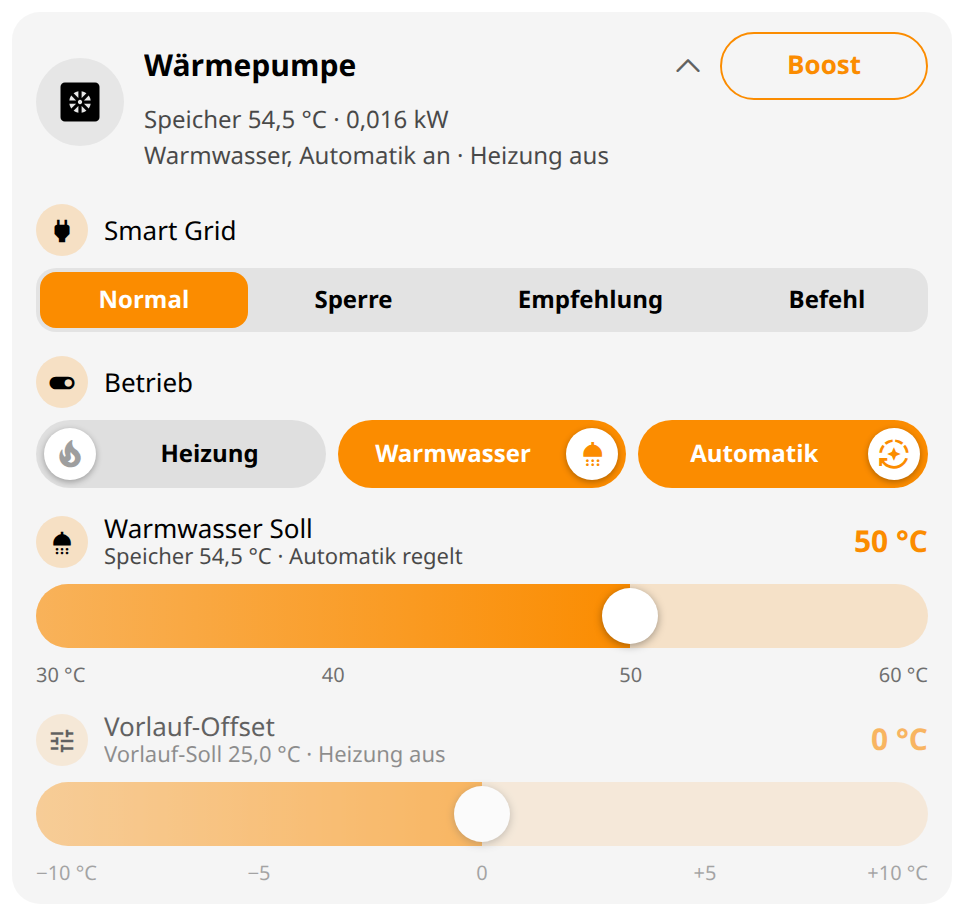 | 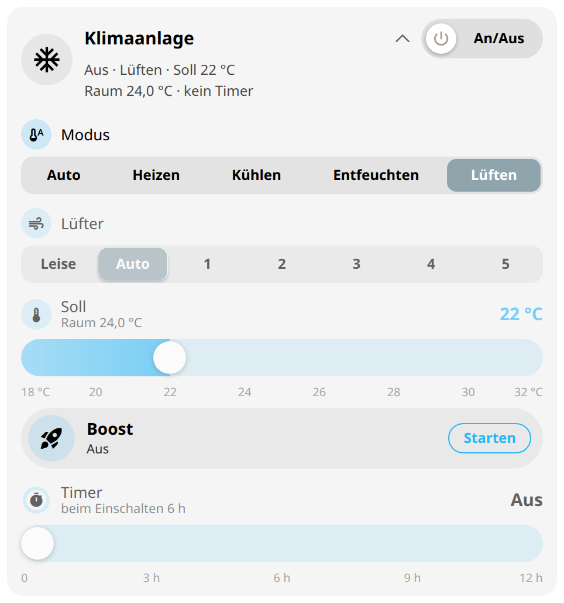 | 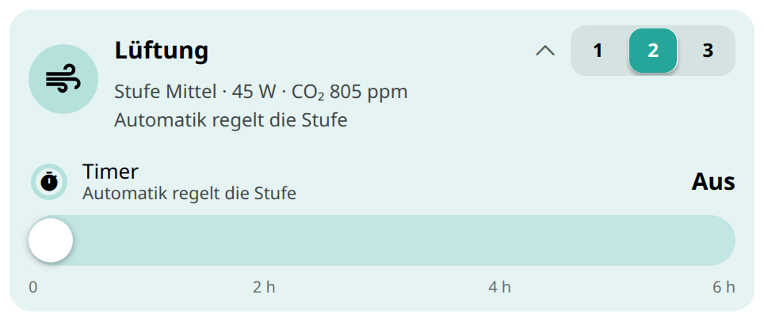 |

`heatpump-controls` needs `boost-button`, `device-head`, `pill-slider`, `pill-switch`, `state-bar`.

`air-conditioner-controls` needs `boost-button`, `boost-pill`, `device-head`, `pill-slider`, `pill-switch`, `state-bar`.

`ventilation-controls` needs `boost-button`, `device-head`, `pill-slider`, `pill-switch`, `state-bar`.

<details>
<summary><code>heatpump-controls</code>: 11 props</summary>

| Prop | Item | Item type |
|---|---|---|
| `heatpumpPower` | ESPAltherma Elektrische Leistung | Number:Power |
| `heatpumpDhwBoost` | Pyaltherma Warmwasser-Boost | Switch |
| `heatpumpDhwTankTemp` | ESPAltherma Warmwasserspeicher Temperatur | Number:Temperature |
| `heatpumpClimateControlPower` | Pyaltherma Heizung Ein/Aus | Switch |
| `heatpumpDhwPower` | Pyaltherma Warmwasser Ein/Aus | Switch |
| `heatpumpManagement` | Wärmepumpe Automatik | Group |
| `heatpumpSmartGrid` | ESPAltherma Smart Grid | String |
| `heatpumpDhwTempHeating` | Pyaltherma Warmwasser Solltemperatur | Number:Temperature |
| `heatpumpDhwManagement` | Wärmepumpe Warmwasser-Automatik | Switch |
| `heatpumpLeavingWaterTempOffsetHeating` | Pyaltherma Vorlauf-Offset Heizen | Number:Temperature |
| `heatpumpLeavingWaterSetpoint` | ESPAltherma Vorlauf Sollwert | Number:Temperature |

</details>

<details>
<summary><code>air-conditioner-controls</code>: 7 props</summary>

| Prop | Item | Item type |
|---|---|---|
| `acSwitch` | Faikout Perfera Schalter | Switch |
| `acMode` | Faikout Perfera Modus | String |
| `acTemperatureSetpoint` | Faikout Perfera Solltemperatur | Number:Temperature |
| `acTemperature` | Faikout Perfera Temperatur | Number:Temperature |
| `acTimer` | Klimaanlage Timer | Number:Time |
| `acFan` | Faikout Perfera Lüfter | String |
| `acPowerful` | Faikout Perfera Powerful | Switch |

</details>

<details>
<summary><code>ventilation-controls</code>: 5 props</summary>

| Prop | Item | Item type |
|---|---|---|
| `ventilationLevel` | ESPLyfterl Stufe | String |
| `ventilationPower` | Lüftung Leistung | Number:Power |
| `netatmoWeatherstationCo2` | Netatmo Wetterstation CO2 | Number:Dimensionless |
| `ventilationTimer` | Lüftung Timer | Number:Time |
| `ventilationManagement` | Lüftung Automatik | Group |

</details>


### Device head: `device-head`

A device in three lines: its icon in a circle, tinted in the device's colour while `active` holds; beside it the name
with a chevron and the main action, and under them two lines of state that run the whole width, under the action too, so
they stay readable on a phone. A tap anywhere but on the action folds the details in or out through the variable `var`.
The main action is a switch pill (`action: switch`, `pill-switch`), a boost button (`button`, `boost-button`) or a
segmented bar (`bar`, `state-bar` with `actionOptions`) on `actionItem`. Declare `var` in an `oh-context` around the
head and the details, and show the details while `vars.<var>` holds:

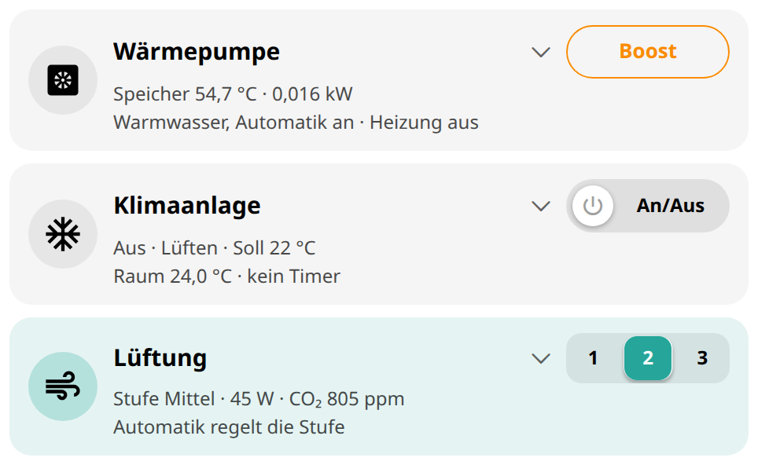

```yaml
component: oh-context
config:
  variables:
    acOpen: false
slots:
  default:
    - component: div
      slots:
        default:
          - component: widget:device-head
            config:
              icon: material:ac_unit
              title: Klimaanlage
              line1: "=(items.faikout_perfera_switch.state === 'ON' ? 'An · ' : 'Aus · ') + items.faikout_perfera_mode.displayState"
              line2: ="Raum " + items.faikout_perfera_temperature.displayState
              color: "#29b6f6"
              active: =items.faikout_perfera_switch.state === 'ON'
              var: acOpen
              action: switch
              actionItem: faikout_perfera_switch
              actionTitle: An/Aus
          - component: div
            config:
              visible: =!!vars.acOpen
            slots:
              default:
                - component: widget:state-bar
                  config:
                    item: faikout_perfera_mode
                    options: A=Auto;H=Heizen;C=Kühlen;D=Entfeuchten;F=Lüften
                    color: "#29b6f6"
                    byText: true
```

Needs `boost-button`, `pill-switch`, `state-bar`.

| Prop | Description | Type | Default |
|---|---|---|---|
| `icon` | The device's icon | TEXT |  |
| `title` | The device's name | TEXT |  |
| `line1` | First line of state; usually an expression | TEXT |  |
| `line2` | Second line of state; usually an expression | TEXT |  |
| `color` | Device colour as #rrggbb | TEXT | `#78909c` |
| `active` | Whether the device runs, which tints its icon; usually an expression | BOOLEAN |  |
| `var` | The variable that folds the device's details in and out; declare it in an oh-context around the head and the details | TEXT |  |
| `action` | switch (a switch pill), button (a boost button), bar (a segmented bar) or empty | TEXT |  |
| `actionItem` | The item of the main action | Item |  |
| `actionTitle` | The switch pill's or button's text | TEXT |  |
| `actionOptions` | The bar's value=label pairs separated by semicolons | TEXT |  |

### Segmented bar: `state-bar`

The states of one item as the segments of a bar, the current one filled in the colour; a tap sends a segment's state.
`options` holds `value=label` pairs separated by semicolons. With `byText` the segments are as wide as their labels, so
a long one such as *Entfeuchten* fits on a phone; Framework7's sliding highlight is sized for equal segments and is
hidden then. `color` may be an expression, e.g. grey while the device is off.


```yaml
component: widget:state-bar
config:
  item: esplyfterl_level
  options: 1=1;2=2;3=3
  color: "#26a69a"
```

| Prop | Description | Type | Default |
|---|---|---|---|
| `item` | The item whose states the segments send | Item |  |
| `options` | value=label pairs separated by semicolons, e.g. 1=Niedrig;2=Mittel;3=Hoch | TEXT |  |
| `color` | Colour of the current segment as #rrggbb; may be an expression | TEXT | `#78909c` |
| `byText` | Segments as wide as their labels instead of equal widths | BOOLEAN |  |
| `flex` | CSS flex of the bar in a row, e.g. 1 1 240px | TEXT |  |
| `width` | CSS width of the bar | TEXT | `100%` |

### Switch tile: `switch-tile`

A plug or device as a small tile: its icon, *An* or *Aus*, the name and a value such as its power; a tap anywhere
switches it. While on it is tinted and outlined in its colour. Put several in a grid, e.g. `grid-template-columns:
repeat(auto-fill, minmax(120px, 1fr))`.


```yaml
component: widget:switch-tile
config:
  item: coffee_machine_switch
  title: Kaffeemaschine
  icon: material:coffee
  color: "#8d6e63"
  value: =Math.round(Number(items.coffee_machine_power.numericState) || 0) + ' W'
```

| Prop | Description | Type | Default |
|---|---|---|---|
| `item` | The switch item | Item |  |
| `title` | Name of the plug or device | TEXT |  |
| `icon` | Icon, e.g. material:coffee (its state follows the item) | TEXT |  |
| `color` | Colour of the tile while on as #rrggbb | TEXT | `#78909c` |
| `value` | A line under the name, e.g. the power; usually an expression | TEXT |  |

### On/off pill: `power-pill`

A device's on and off as a wide pill: a white knob with the power symbol slides to the right and the pill fills with the
device colour while on, with `onText` in it (an expression, e.g. the mode it runs in); a tap anywhere switches. The plug
cards and the device pages switch with it.


```yaml
component: widget:power-pill
config:
  item: faikout_perfera_switch
  color: "#29b6f6"
  onText: ="An · " + items.faikout_perfera_mode.displayState
```

| Prop | Description | Type | Default |
|---|---|---|---|
| `item` | The switch item | Item |  |
| `color` | Device colour as #rrggbb, of the pill while on | TEXT | `#78909c` |
| `onText` | What the pill says while on, e.g. An · Lüften; usually an expression | TEXT | `An` |

### Boost pill: `boost-pill`

A boost that runs for a while, as a pill: its icon in a tinted circle, the name, what it does while it runs (`running`,
an expression) or *Aus*, and *Starten* or *Stoppen*; while it runs the pill fills with a gradient of the device colour
and rings pulse from the icon. A tap anywhere switches the item. My heat pump's hot-water boost and my air conditioner's
boost both carry a rocket.


```yaml
component: widget:boost-pill
config:
  item: pyaltherma_dhw_powerful
  title: Warmwasser-Boost
  icon: material:rocket_launch
  color: "#fb8c00"
  running: ="läuft · Speicher " + items.espaltherma_dhw_tank_temp.displayState
```

| Prop | Description | Type | Default |
|---|---|---|---|
| `item` | The switch item | Item |  |
| `title` | Name of the boost | TEXT | `Boost` |
| `icon` | Icon, e.g. material:rocket_launch; a classic openHAB icon follows the item's state | TEXT | `material:bolt` |
| `color` | Device colour as #rrggbb | TEXT | `#fb8c00` |
| `running` | The line under the title while the boost runs; usually an expression | TEXT | `läuft` |

### Boost button: `boost-button`

A boost as one small pill, for a place without room for the boost pill such as a device head: its name in the device
colour, outlined, filled with the colour while it runs. A tap switches the item.

```yaml
component: widget:boost-button
config:
  item: pyaltherma_dhw_powerful
  title: Boost
  color: "#fb8c00"
```

| Prop | Description | Type | Default |
|---|---|---|---|
| `item` | The switch item | Item |  |
| `title` | The button's text | TEXT | `Boost` |
| `color` | Device colour as #rrggbb | TEXT | `#fb8c00` |

### Slider: `pill-slider`

A setting as a wide pill slider in the device colour, for setpoints, offsets, powers and timers: a gradient fills the
bar up to the value, the white knob stays inside the bar at both ends, and the value is sent once on release. Only the
knob can be dragged, so scrolling across a slider on a phone leaves it alone. Above the
bar an icon in a tinted circle (for a timer, `ring: true`, a ring around a timer icon that empties as the item runs
down to 0), the title with a line of context and the value large on the right; `marks` puts labels below the bar.
`value` and `context` are expressions, evaluated where the slider is placed. The slider is only built once the item
has a numeric state, because MainUI's slider starts at its minimum and a touch ending on it sends its value.

```yaml
component: widget:pill-slider
config:
  item: faikout_perfera_temperature_setpoint
  color: "#29b6f6"
  min: 18
  max: 32
  step: 0.5
  unit: °C
  title: Soll
  icon: material:device_thermostat
  value: =items.faikout_perfera_temperature_setpoint.displayState
  context: ="Raum " + items.faikout_perfera_temperature.displayState
  marks: 18=18 °C;22=22;26=26;32=32 °C
```


| Prop | Description | Type | Default |
|---|---|---|---|
| `item` | The number item the slider sets | Item |  |
| `color` | Device colour as #rrggbb | TEXT | `#78909c` |
| `min` | The slider's lowest value | DECIMAL | `0` |
| `max` | The slider's highest value | DECIMAL | `100` |
| `step` | The slider's step | DECIMAL | `1` |
| `unit` | Unit on the label while dragging and of the command sent; must be the item's own (a difference in K sent to a °C item is taken as an absolute temperature) | TEXT |  |
| `title` | Title above the slider | TEXT |  |
| `icon` | The badge's icon, e.g. material:thermostat | TEXT | `material:tune` |
| `ring` | A ring around a timer icon instead of the icon, emptying as the item runs down to 0 | BOOLEAN |  |
| `value` | The value to show, usually an expression on the item | TEXT |  |
| `valueColor` | Colour of the value where it is not the device colour; empty: the text colour | TEXT |  |
| `context` | A line under the title saying what the setting does, usually an expression | TEXT |  |
| `marks` | value=label pairs below the bar, separated by semicolons, e.g. 0=0;60=1 h;120=2 h | TEXT |  |
| `opacity` | e.g. 0.6 while the device is off | TEXT |  |
| `row` | A row of a page's or popup's controls, with their divider | BOOLEAN |  |

### Switch pill: `pill-switch`

A switch for switches that stand side by side: a pill 34 px high in which a white knob with the icon of what it
switches (`icon`; the power symbol without one) slides to the right while the pill fills with the card's colour, the
name in the part the knob leaves free. Every pill has the same sizes and 12 px text. Put several in a grid that places
as many as fit, e.g. `grid-template-columns: repeat(auto-fit, minmax(120px, 1fr))`, which holds a name such as
*Warmwasser* and lets three pills stand abreast where there is room and two and one on a phone. A tap anywhere on the
pill switches the item.

```yaml
component: widget:pill-switch
config:
  item: pyaltherma_climate_control_power
  title: Heizung
  icon: material:local_fire_department
  color: "#fb8c00"
```


| Prop | Description | Type | Default |
|---|---|---|---|
| `item` | The switch item | Item |  |
| `title` | Name of the switch, in the pill | TEXT |  |
| `icon` | Icon on the knob, of what it switches, e.g. material:shower | TEXT | `material:power_settings_new` |
| `color` | The card's colour as #rrggbb, of the pill while on | TEXT | `#78909c` |

### Switch row: `switch-row`

A switch in a list of switches: its icon in a circle tinted in the card's colour while on, the name, *An* or *Aus*, and
a switch drawn in the card's colour, a track that fills while on and a white knob that slides over. A tap anywhere
on the row switches the item.

```yaml
component: widget:switch-row
config:
  item: faikout_perfera_eco_mode
  title: Eco
  icon: material:eco
  color: "#29b6f6"
```


| Prop | Description | Type | Default |
|---|---|---|---|
| `item` | The switch item | Item |  |
| `title` | Name of the switch | TEXT |  |
| `icon` | The icon, e.g. material:eco | TEXT | `material:power_settings_new` |
| `color` | The card's colour as #rrggbb, of the switch while on | TEXT | `#78909c` |

## Energy flow

The energy flow card's lines, nodes and rings, for a flow of your own. They draw SVG, so place them in an `svg`
component, in its `viewBox` coordinates: every node is a circle of radius 30 around `x`, `y`, a line runs best from
rim to rim. Place the lines first, so the nodes cover their ends and the dots slide in under the rims. Powers are
expressions in W, evaluated where the widget stands:

```yaml
component: svg
config:
  viewBox: 0 0 440 110
  width: 100%
slots:
  default:
    - component: widget:flow-link
      config: { x1: 80, y1: 45, x2: 190, y2: 45, color: "#ffb300", forward: true,
                power: "=Number(items.huawei_inverter_input_power.numericState) || 0" }
    - component: widget:flow-link
      config: { x1: 250, y1: 45, x2: 360, y2: 45, color: "#26a69a", forward: true, threshold: 100,
                power: "=Number(items.e_car_power.numericState) || 0" }
    - component: widget:flow-node
      config: { kind: pv, x: 50, y: 45, power: "=Number(items.huawei_inverter_input_power.numericState) || 0" }
    - component: widget:flow-node
      config: { kind: home, x: 220, y: 45, power: "=Number(items.home_active_power.numericState) || 0" }
    - component: widget:flow-node
      config: { kind: e-car, x: 390, y: 45, power: "=Number(items.e_car_power.numericState) || 0" }
```

The recordings show the widgets with fixed demo values.


### Node: `flow-node`

A device in a ring, its animation driven by `power`: `pv` (a tilted module under a sun, both brighter with the power,
rays turning faster), `grid` (a pylon, red on import and green on export, dashes running along its wires), `home` (a
house whose windows glow and pulse with the consumption), `heat-pump` (an outdoor unit whose fan turns above 100 W),
`air-conditioner` (an indoor unit whose air streams flow), `e-car` (a car with a bolt fading in and out while it
charges) and `battery` (filled to `soc`, red, orange or green). The ring has an opaque disc in the card colour under its
tint, so dots running under it disappear.


| Prop | Description | Type | Default |
|---|---|---|---|
| `kind` | The device drawn | TEXT |  |
| `x` | Centre's x in the flow's viewBox | DECIMAL |  |
| `y` | Centre's y in the flow's viewBox | DECIMAL |  |
| `power` | The power in W; usually an expression on an item | TEXT |  |
| `soc` | The battery's state of charge in %; usually an expression | DECIMAL |  |

### Line: `flow-link`

A line from (`x1`, `y1`) to (`x2`, `y2`) in `color`. While |`power`| exceeds `threshold` three dots run along it,
towards (`x2`, `y2`) while `forward` holds and back otherwise, at four speeds by the power; below the threshold the line
fades. The dots run a dot radius past both ends, so they slide out from under one node's rim and back under the other's.
`color` and `forward` may be expressions, e.g. the grid's line green and outward while it exports.


| Prop | Description | Type | Default |
|---|---|---|---|
| `x1` | Start point's x in the flow's viewBox | DECIMAL |  |
| `y1` | Start point's y in the flow's viewBox | DECIMAL |  |
| `x2` | End point's x in the flow's viewBox | DECIMAL |  |
| `y2` | End point's y in the flow's viewBox | DECIMAL |  |
| `color` | The link's colour as #rrggbb; may be an expression | TEXT | `#78909c` |
| `power` | The power in W; usually an expression on an item | TEXT |  |
| `forward` | The dots run from (x1, y1) to (x2, y2) while it holds, else back; usually an expression | BOOLEAN |  |
| `threshold` | The power in W above which the dots run | DECIMAL | `10` |

### Share ring: `flow-share-ring`

A ring around (`x`, `y`) filled to `part` / `whole`, the percentage inside and `title` with *heute* beside it; the
energy flow shows today's self-consumption and self-sufficiency with it.

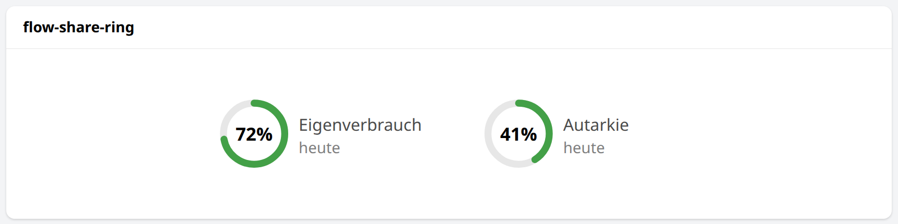

```yaml
component: widget:flow-share-ring
config:
  x: 40
  y: 40
  title: Eigenverbrauch
  part: =Number(items.photovoltaics_own_ec_day.numericState) || 0
  whole: =Number(items.huawei_inverter_e_day.numericState) || 0
```

| Prop | Description | Type | Default |
|---|---|---|---|
| `x` | Centre's x in the flow's viewBox | DECIMAL |  |
| `y` | Centre's y in the flow's viewBox | DECIMAL |  |
| `title` | Text beside the ring, e.g. Eigenverbrauch | TEXT |  |
| `part` | The part, e.g. today's PV energy used at home; usually an expression | TEXT |  |
| `whole` | The whole, e.g. today's PV energy; usually an expression | TEXT |  |

## Appliances

The appliances card's parts.

### Appliance icon: `appliance-icon`

A washer, dryer or dishwasher (`kind`: `washer`, `dryer`, `dish-washer`) drawn inside a ring: the drum's laundry, the
dryer's paddles or the dishwasher's spray arm turn while `running` holds, droplets rise in the dishwasher. While it runs
the ring fills with `progress`, or pulses where there is none.


```yaml
component: widget:appliance-icon
config:
  kind: dryer
  running: =items.miele_tumble_dryer_twc560wp_program_progress.state !== 'UNDEF'
  progress: =Number(items.miele_tumble_dryer_twc560wp_program_progress.numericState) || 0
  size: 72
```

| Prop | Description | Type | Default |
|---|---|---|---|
| `kind` | The appliance drawn | TEXT |  |
| `running` | Whether it runs; usually an expression | BOOLEAN |  |
| `progress` | Program progress in %, filling the ring while it runs; empty: the ring pulses | DECIMAL |  |
| `color` | Colour of the ring as #rrggbb | TEXT | `#1e88e5` |
| `size` | Width and height in px | INTEGER | `72` |

### Appliance tile: `appliance-tile`

An appliance as a tile of the appliances card: its icon, name and state; a tap opens the page `popup` as a popup. A
Miele machine comes with the items of its program (`progress`, `state`, `program`, `phase`, `finished`, `remaining`, as
the Miele binding provides them): the ring shows the progress, the state chip is blue while it runs, green when it is
finished and grey otherwise, beside it the remaining time, and program, phase and end time below. A machine behind a
metered plug comes with its `power` and an optional `done` switch: it runs above 10 W, is finished while `done` is on,
and its ring pulses. Put the tiles in a grid, e.g. two columns.


```yaml
- component: widget:appliance-tile
  config:
    kind: washer
    title: Waschmaschine 1
    popup: appliance_washing_machine_1
    progress: miele_washing_machine_wwg360_program_progress
    state: miele_washing_machine_wwg360_operation_state
    program: miele_washing_machine_wwg360_active_program
    phase: miele_washing_machine_wwg360_program_phase
    finished: miele_washing_machine_wwg360_program_finished_time
    remaining: miele_washing_machine_wwg360_program_remaining_time
- component: widget:appliance-tile
  config:
    kind: washer
    title: Waschmaschine 2
    popup: appliance_washing_machine_2
    power: washing_machine_2_power
    done: washing_machine_2_finished
```

Needs `appliance-icon`.

| Prop | Description | Type | Default |
|---|---|---|---|
| `kind` | The appliance drawn | TEXT |  |
| `title` | The appliance's name | TEXT |  |
| `popup` | The uid of the page a tap opens as a popup | TEXT |  |
| `progress` | Miele item _program_progress, e.g. miele_washing_machine_program_progress; set for a Miele machine | Item |  |
| `state` | Miele item _operation_state, e.g. miele_washing_machine_operation_state; set for a Miele machine | Item |  |
| `program` | Miele item _active_program, e.g. miele_washing_machine_active_program; set for a Miele machine | Item |  |
| `phase` | Miele item _program_phase, e.g. miele_washing_machine_program_phase; set for a Miele machine | Item |  |
| `finished` | Miele item _program_finished_time, e.g. miele_washing_machine_program_finished_time; set for a Miele machine | Item |  |
| `remaining` | Miele item _program_remaining_time, e.g. miele_washing_machine_program_remaining_time; set for a Miele machine | Item |  |
| `power` | The plug's power item, for a machine without program data | Item |  |
| `done` | Switch item that is on while the plug machine is finished | Item |  |

## Weather

### Weather icon: `weather-icon`

The weather drawn from a WMO code in the style of the energy flow's nodes: the sun, its rays turning slowly, or the moon
while `day` is false, alone when it is clear (code 0) and behind a small cloud when partly cloudy (1, 2); a cloud (3),
raised over fog (45, 48), falling rain (drizzle, rain and showers: 51 to 67, 80 to 82), drifting snow (71 to 77, 85, 86)
or a flickering bolt (95 to 99). Nothing while `code` is no number, as an item is `NULL` after a restart. My weather bar
shows the present weather with it, and my forecast popup each day's, above a chart of the next 60 hours: temperature
over the precipitation of each hour, the wind below. That popup is a page of my installation, not a widget of this
repository; its rule writes the forecast as JSON into String items, and the chart reads them through an `oh-data-series`
whose `data` is an expression such as `=JSON.parse(items.weather_hourly.state).map((r) => [r[0] * 1000, r[1]])`, with no
persistence involved. The warnings in the screenshots are demo values.

| Light | Dark |
|---|---|
| 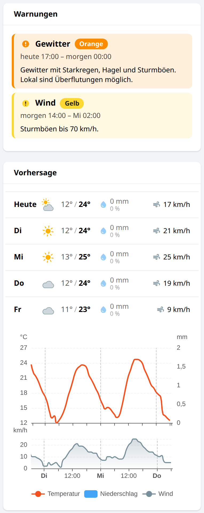 | 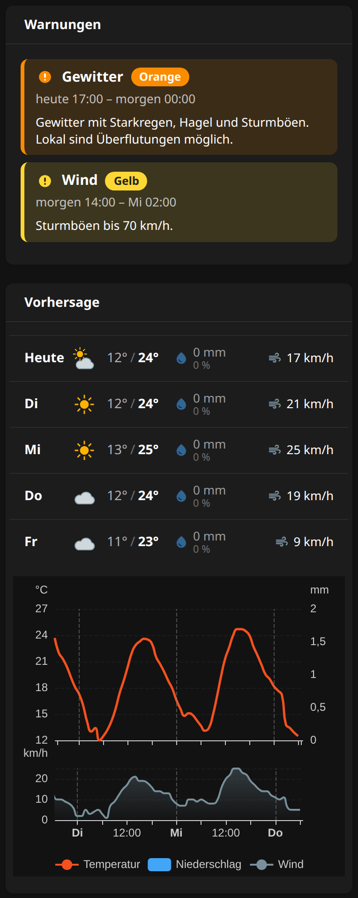 |

```yaml
component: widget:weather-icon
config:
  code: =items.weather_code.state
  day: =items.weather_is_day.state !== 'OFF'
  size: 36
```

| Prop | Description | Type | Default |
|---|---|---|---|
| `code` | The weather as a WMO code, 0 (clear) to 99 (thunderstorm with hail); usually an expression | DECIMAL |  |
| `day` | Whether the sun is up; false draws the moon; usually an expression | BOOLEAN | `true` |
| `size` | Width and height in px | INTEGER | `36` |

## Plug cards

Four cards for a metered plug, built from one item prefix: `<prefix>_power`, `_switch`, `_energy_today`,
`_energy_total`, `_voltage`, `_current`, `_power_factor`, `_apparent_power` and `_reactive_power`, as a Tasmota plug
provides them. On a device page they stand two by two. `plug-card` also covers devices that are not plugs: give it
the device's `title`, hide the switch with `controllable: false`, or take the switch from another item with `switch`.
Every value tile carries a large pale icon of what it shows.


### `plug-card`

Now: power, on/off pill, energy today and total. Needs `item-popup`, `power-pill`, `value-tile`.

| Prop | Description | Type | Default |
|---|---|---|---|
| `prefix` | Name prefix of the plug's items: `<prefix>_power`, _switch, _energy_today, _energy_total, _voltage, _current, _power_factor, _apparent_power, _reactive_power | TEXT |  |
| `title` | Card title, the device's name where the card is not a plug | TEXT | `Steckdose` |
| `icon` | Device icon, e.g. material:coffee | TEXT | `material:power` |
| `color` | Device colour as #rrggbb | TEXT | `#8d6e63` |
| `controllable` | Show the plug's switch | BOOLEAN | `true` |
| `note` | Small print under the energies, hidden when empty | TEXT |  |
| `switch` | The switch's item where it is not `<prefix>_switch`, e.g. a shared meter's | Item |  |

### `plug-power-card`

Power over the day.

| Prop | Description | Type | Default |
|---|---|---|---|
| `prefix` | Name prefix of the plug's items: `<prefix>_power`, _switch, _energy_today, _energy_total, _voltage, _current, _power_factor, _apparent_power, _reactive_power | TEXT |  |
| `color` | Device colour as #rrggbb | TEXT | `#8d6e63` |

### `plug-energy-days-card`

Energy per day of the month.

| Prop | Description | Type | Default |
|---|---|---|---|
| `prefix` | Name prefix of the plug's items: `<prefix>_power`, _switch, _energy_today, _energy_total, _voltage, _current, _power_factor, _apparent_power, _reactive_power | TEXT |  |
| `color` | Device colour as #rrggbb | TEXT | `#8d6e63` |

### `plug-electric-card`

Voltage, current, power factor, apparent and reactive power. Needs `item-popup`, `value-tile`.

| Prop | Description | Type | Default |
|---|---|---|---|
| `prefix` | Name prefix of the plug's items: `<prefix>_power`, _switch, _energy_today, _energy_total, _voltage, _current, _power_factor, _apparent_power, _reactive_power | TEXT |  |
| `title` | Card title | TEXT | `Elektrisch` |

## Item popup: `item-popup`

The popup every tile of my device pages opens, in place of the analyzer: the item's value large and its course over
the day with arrows for earlier days, as a line for measurements or as a band of states for switches, texts and
numbers with state options (labelled from the `states` prop), or the value alone for dates. Open it from any link
with `action: popup`, `actionModal: widget:item-popup` and its props in `actionModalConfig`:

```yaml
action: popup
actionModal: widget:item-popup
actionModalConfig:
  item: coffee_machine_energy_today
  title: Energie heute
  kind: number
```


| Prop | Description | Type | Default |
|---|---|---|---|
| `item` | The item to show | Item |  |
| `title` | Title of the popup, the tile's | TEXT |  |
| `color` | Colour of the course as #rrggbb | TEXT | `#5c6bc0` |
| `kind` | number: its course as a line; state: a band of its states; none: only the value | TEXT | `number` |
| `states` | value=label pairs, comma-separated, for the band of states | TEXT |  |

## Value tile: `value-tile`

The tile every value of my popups, device pages, plug cards and heat pump card stands in: a title, the value, and a
large pale icon in the lower right corner, behind them. Pass the value as an expression; it is evaluated where the
tile is placed. With `item` a tap opens the item popup. The tile's lengths are em of its font size, 14 px unless
`fontSize` sets another, so `fontSize: 1.1em` makes it a tenth larger and lets it grow with a card that scales its
font. `wrap` lets a long text wrap across the whole row of a grid.

```yaml
component: widget:value-tile
config:
  title: Vorlauf
  value: =items.espaltherma_leaving_water_temp_after_buh.displayState
  icon: material:thermostat
  color: "#e57373"
  item: espaltherma_leaving_water_temp_after_buh
```


| Prop | Description | Type | Default |
|---|---|---|---|
| `title` | Title above the value | TEXT |  |
| `value` | The text to show, usually an expression on an item | TEXT |  |
| `icon` | The pale icon, e.g. material:thermostat | TEXT | `material:info` |
| `color` | Colour of the value and the icon as #rrggbb; empty: the text colour | TEXT |  |
| `iconColor` | Colour of the icon where the value keeps the text colour, as #rrggbb | TEXT |  |
| `item` | The item whose popup a tap opens; empty: no tap | Item |  |
| `action` | popup: the item popup (widget item-popup); options: the item's command options | TEXT | `popup` |
| `kind` | What the item popup shows: number, state or none | TEXT | `number` |
| `states` | value=label pairs, comma-separated, for the item popup's band of states | TEXT |  |
| `wrap` | A long text wraps across the whole row of the grid instead of being cut | BOOLEAN |  |
| `fontSize` | The tile's base size, e.g. 1.1em to grow with its card; default 14px | TEXT |  |

## About these widgets

The widgets are generated from Python by the script that builds my whole MainUI, which keeps the cards of the
dashboard and the device pages consistent; that is why their YAML is dense and machine-formatted. The script and its
tools are in [`scripts/openhab-ui/`](scripts/openhab-ui/): `dashboard.py`, the headless-Chrome tools behind the
screenshots, and the one-off JSONDB changes in `applied/`. The cards are
built from the smaller widgets wherever a part stands in more than one place or makes sense on its own, so a fix in
one widget reaches every place it stands. The widgets in this repository are exported from that script unchanged.
